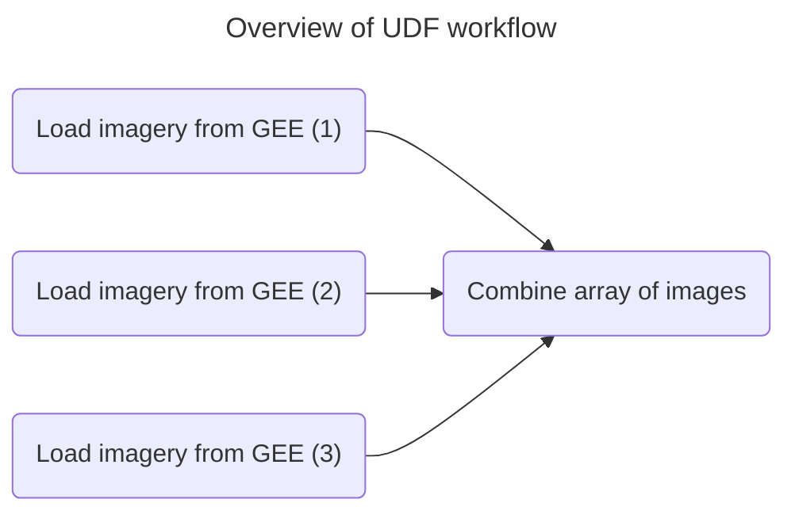

High-quality satellite imagery is essential to assess the emissions impact of nature-based forest conservation and restoration projects. Pachama recognized the need to create an accurate conservation baseline to estimate background deforestation rates in absence of a restoration project. This demands high-quality optical imagery in tropical forests to enhance visual monitoring and provide critical input for models such as canopy height mapping.

Consistent, year-to-year imagery allows Pachama to establish dynamic baselines. However, the existing HLS dataset published by NASA presented limitations, and generating their own imagery presented significant engineering challenges.

This blog post explores how Pachama's engineering team partnered with Fused to generate cloud-free seasonal composite images, enabling data analytics at spatiotemporal resolutions that were not possible before.

## The challenge

Tropical forests present a unique challenge for satellite imagery analysis due to persistent cloud cover, which often renders images unusable and creates data gaps. Pachama data scientists need clear optical imagery for monitoring and mapping canopy height at restoration sites, where cloud-free images are crucial for accurate forest carbon assessments. However, obtaining these images in tropical regions remains a significant challenge for analytics teams.

## Limitations of the Public HLS Dataset

One possible solution is to use HLS, which is advantageous because it provides consistent surface reflectance data and global observations every 2-3 days at a 30-meter resolution. [1]

However, the HLS dataset is available on Google Earth Engine (GEE) but has limited frequency due to low valid observations. Furthermore, while the methodology is public, users don't have visibility or control over the specific images that go into each composite image.

import ImageCloud from '/blog/2024-09-24-marie/clouds.png';

<div style={{textAlign: 'center'}}>

</div>

_Example scenes highlight how the HLS product can have annual gaps as fewer valid observations lead to incomplete coverage. The lower panels compare median composites of 2020 scenes with those from dry seasons between 2015 and 2020, which show a more uniform, cloud-free view compared to annual medians._

## Obstacles to creating custom HLS imagery

Pachama aimed to create seasonal composites from multiple images captured on different dates within a given season. To achieve this, they planned to use Landsat and Sentinel-2 data to develop a global dataset of surface reflectance, featuring a temporal resolution of two days and a spatial resolution of 30 meters. This approach would provide their analytics team with a comprehensive, cloud-free view of the forest canopy [2], enabling them to conduct analyses such as canopy height assessment and dynamic baselines at higher frequencies.

They needed to fetch images across multiple dates and then average them into composite images. This process removes clouds by minimizing the influence of cloud-covered pixels, which are typically present in only a few of the images.

However, creating these composite imagery presented data engineering challenges.

- The total catalog contains multiple petabytes of data.
- Data needs to be processed month by month.
- Iteration on compositing configurations is essential to quickly experiment and refine the process.

## With Fused

Pachama turned to Fused to create scalable workflows for generating HLS imagery. Fused's UDF model allowed Pachama to design algorithms that parallelize image processing, generate cloud-free composites, and run these workflows at scale.

### UDF workflow

Here's the workflow I created with a Fused UDF to generate cloud-free composite HLS imagery.

<div style={{ textAlign: 'center' }}>

</div>

### 1. Write a UDF to load imagery from GEE.

This sample UDF loads data for the Landsat and Sentinel2 data products in [GEE](/user-guide/in/gee/). It queries for a specific date range and filters out images with too many clouds.

```python showLineNumber
@fused.udf
def udf(bbox: fused.types.TileGDF=None, target_variable='TARGET_VARIABLE'):
    import ee
    import xarray

    # Authenticate to GEE
    fused.utils.common.ee_initialize(
        service_account_name='my_account@account.iam.gserviceaccount.com',
        key_path="/mnt/cache/gee_creds.json"
    )

    # Load ImageCollection
    ic = ee.ImageCollection("COLLECTION").filter(ee.Filter.date("2019-01-01", "2022-01-01"))

    # Filter the collection by cloud cover
    ic = ic.filter(ee.Filter.eq('CLOUD_COVER', 20))

    # Get the image for the `bbox` geometry
    ds = xarray.open_dataset(
        ic,
        engine='ee',
        geometry=ee.Geometry.Rectangle(*bbox.total_bounds),
        scale=1/2**max(0,bbox.z[0])
    ).isel(time=0)

    return ds[target_variable].values.astype('uint8').T
```

### 2. Call the UDF asynchronously and combine an array of images

This UDF calls the previous one [asynchronously](/core-concepts/async/) in parallel to fetch multiple images across a set of parameters. It then combines the outputs, averaging them to create a cloud-free composite.

```python showLineNumber
@fused.udf
async def udf():
    import pandas as pd
    import asyncio

    # Parameter to loop through
    dates = ['2020-01-01', '2021-01-01', '2022-01-01']

    # Invoke the UDF as coroutines
    arr_promises = []
    for date in dates:
        arr = fused.run('UDF_TOKEN', date=date, engine='realtime', sync=False)
        arr_promises.append(df)

    # Run concurrently and collect the results
    arrs = await asyncio.gather(*arr_promises)

    # Combine the arrays
    return np.array([
        out[0].image.values[0, :, :].astype('uint8')*255,
        out[1].image.values[0, :, :].astype('uint8')*255,
        out[2].image.values[0, :, :].astype('uint8')*255
    ])
```

## Benefits of using Fused

The best part about Fused's UDF Editor is that our Data Science team can design UDF while looking at a specific area, and run it for a different region by simply changing the input bounding box. The team can easily experiment and generate composites for different date ranges by adjusting the input parameters. Once we are happy with the UDF algorithm, we can easily create individual image tiles for any location worldwide.

- UDF calls UDF, Write the 2 UDFs in the same editor
- Easy parallelization with simple Python function calls, no need to manage clusters
- Instant feedback during algorithm development, no need to wait for pipelines to run
- Invoke UDF and load its data into a Jupyter Notebook with `fused.run` for downstream analysis

## Conclusion

Thanks to Fused, Pachama's data scientists can quickly iterate and experiment with different configurations to optimize their image composites. Fused also enables their engineering team to simplify data workflows to produce higher-resolution imagery. This improves model accuracy for forest carbon monitoring. The result is better insights and more efficient tracking of restoration projects.

## References

- [1] https://ntrs.nasa.gov/citations/20230017735
- [2] https://agu.confex.com/agu/fm23/meetingapp.cgi/Paper/1349051
- [3] https://pachama.com/blog/dynamic-reforestation-baselines/
