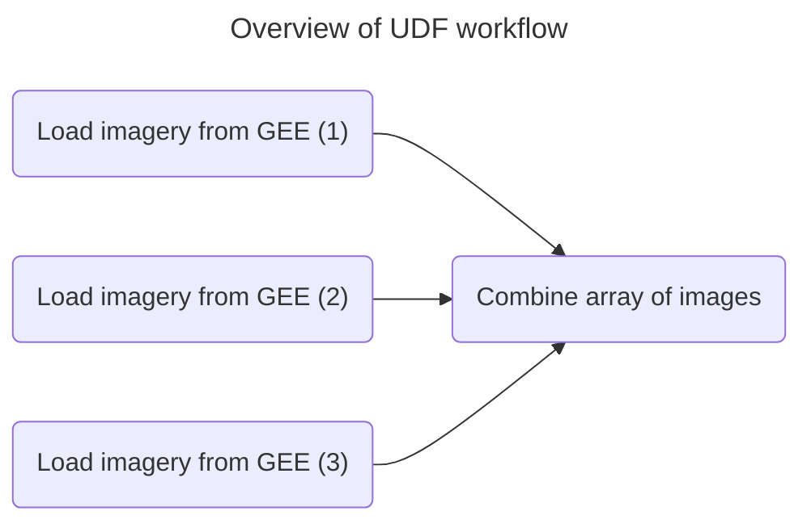

High-quality satellite imagery is essential to assess the carbon impact of nature-based forest conservation and restoration projects [1]. However, getting that high quality imagery is uniquely difficult in areas that need carbon financing the most: tropical forests. Tropical forests present a unique challenge for satellite imagery analysis due to persistent cloud cover, which often renders optical imagery unusable and creates data gaps.

import ReactPlayer from 'react-player'

<ReactPlayer className="video__player" playing={true} muted={true} controls height="100%" url="https://fused-magic.s3.us-west-2.amazonaws.com/blog-assets/marie_udf2.mp4" width="100%" />

{/* truncate */}


This blog post explores how Pachama's engineering team partnered with Fused to generate cloud-free seasonal composites using Harmonized Landsat Sentinel-2 (HLS) data, enabling higher quality optical imagery and better canopy height map creating ML model performance.


## Obstacles to create a cloud-free HLS image composite

The HLS dataset is an exciting development put forward by NASA’s Satellite Needs Working Group. It provides consistent surface reflectance data with global observations every 2-3 days at a 30-meter resolution. The dataset harmonizes data from Landsats 8 & 9 with the European Space Agency's Sentinel-2A & 2B satellites such that the results are high quality, standardized, and able to be combined [2].

The HLS dataset consists of scene-level harmonized data, and does not create any cloud-free composite images by default. A significant amount of compute power is needed to process and combine this data, which contains multiple petabytes of data. Iteration on the compositing algorithm is also essential to quickly experiment and refine the process.

One common solution to this problem is to use Google Earth Engine (GEE). However, only the Landsat portion of this dataset (HLS-L30) is available on GEE. Without the Sentinel-2 portion of this dataset (HLS-S30), we do not get a 2-3 day temporal resolution that is required for cloud-free imagery in frequently cloudy areas.


import ImageCloud from '/blog/2024-09-24-marie/clouds.png';

<div style={{textAlign: 'center'}}>

</div>

_Example composites highlight how the HLS-L30 product alone can have gaps when attempting to make a seasonal composite, as fewer cloud-free observations._


## With Fused

Pachama turned to Fused to create scalable workflows for quickly iterating on a compositing algorithm. Fused's UDF model allowed Pachama to design algorithms that parallelize image processing, generate cloud-free composites, and run these workflows at scale.


### Pachama’s UDF workflow

Here's the workflow we created with a Fused UDF to generate cloud-free composite HLS imagery.


<div style={{ textAlign: 'center' }}>

</div>

### 1. Write a UDF to load imagery from GEE.

This sample UDF loads data for the Landsat and Sentinel2 data products in [GEE](/user-guide/in/gee/). It queries for a specific date range and does a first pass at filtering out images with too many clouds.

```python showLineNumber
# To Get your username and password, Please visit https://urs.earthdata.nasa.gov
@fused.udf
def udf(
    bbox: fused.types.TileGDF,
    mask_url: str,
    band_url: str,
    username="<INSERT USERNAME>",
    password="<INSERT PASSWORD>",
    env="earthdata",
):
    import numpy as np
    utils = fused.load("https://github.com/fusedio/udfs/tree/f928ee1/public/common/").utils
    # Authenticate
    aws_session = utils.earth_session(cred={"env": env, "username": username, "password": password})
    cred = {"env": env, "username": username, "password": password}
    overview_level = max(0, 12 - bbox.z[0])

    # Read band data
    band_arr = utils.read_tiff(
        bbox,
        band_url,
        overview_level=overview_level,
        cred=cred,
    )

    # Read and apply cloud mask
    mask_arr = utils.read_tiff(
        bbox,
        mask_url,
        overview_level=overview_level,
        cred=cred,
    )
    mask = np.ma.masked_where(mask_arr > 0, mask_arr)
    band_arr = np.ma.masked_where(np.ma.getmask(mask), band_arr)

    # Filter nan's and convert to RGB values
    band_arr = np.where(band_arr == -9999, np.nan, band_arr)
    band_arr = band_arr / 10
    band_arr = band_arr.astype("uint8")

    return np.array(band_arr)
```

### 2. Call the UDF asynchronously

This UDF queries the LP DAAC STAC catalog for data that matches the time and location of interest. This UDF then calls the previous one in parallel [asynchronously](/core-concepts/async/) to fetch each cloud-free image in parallel. It then combines the outputs, taking the median of each band to create a cloud-free composite.


```python showLineNumber
import numpy as np
import asyncio
from pystac_client import Client
from collections import defaultdict

RGB_BANDS = ["B04", "B03", "B02"]
F_MASK_BAND = "Fmask"

@fused.cache
def get_band_urls(bbox, date_range):
    # Search STAC Catalog
    collection_names = ["HLSL30_2.0", "HLSS30_2.0"]
    catalog = Client.open("https://cmr.earthdata.nasa.gov/stac/LPCLOUD/")
    search = catalog.search(
        collections=collection_names,
        bbox=bbox.total_bounds,
        datetime=date_range,
        limit=100,
    )
    item_collection = search.get_all_items()

    # Collect S3 paths
    band_urls = defaultdict(list)
    for i in item_collection:
        for band in [F_MASK_BAND] + RGB_BANDS:
            if (
                i.collection_id in collection_names
                and band in i.assets
            ):
                # Convert URL => S3 path
                url = i.assets[band].href.replace(
                    "https://data.lpdaac.earthdatacloud.nasa.gov/", "s3://"
                )
                band_urls[band].append(url)
    return band_urls

@fused.udf
async def udf(
    bbox: fused.types.TileGDF,
    date_range="2023-05/2023-06"
):
    # Query STAC catalog
    band_urls = get_band_urls(bbox, date_range)

    # Call the image loading/masking UDF in parallel
    tasks = defaultdict(list)
    for band in RGB_BANDS:
        for mask_url, band_url in zip(band_urls[F_MASK_BAND], band_urls[band]):
            arr_task = fused.run(
                "fsh_...",
                bbox=bbox,
                sync=False,
                parameters={
                    "mask_url": mask_url,
                    "band_url": band_url,
                    "date_range": date_range,
                })
            tasks[band].append(arr_task)

    # Combine each band
    rgb = []
    for band in RGB_BANDS:
        composite_values = await asyncio.gather(*tasks[band])
        composite_values = [a.image.values.astype("uint8") for a in composite_values]
        band_composite = np.nanmedian(composite_values, axis=0)
        band_composite = band_composite.astype("uint8")
        rgb.append(band_composite)
    return np.array(rgb)
```

import ImageWb2 from '/blog/2024-09-24-marie/marie_workbench2.png';

<div style={{textAlign: 'center'}}>

</div>


## Benefits of using Fused

The best part is that Pachama’s Data Science team can design UDF while looking at a specific area, and to run it for a different region by simply changing the input bounding box (bbox). This flexibility allows Pachama to create individual image tiles for any location worldwide. They can easily experiment and generate composites for different date ranges by adjusting the input parameters.

- Easy parallelization with simple Python function calls, no need to manage clusters
- Iterate on both UDFs in the same editor
- Instant feedback during algorithm development, no need to wait for pipelines to run
- Invoke UDF and load its data into a Jupyter Notebook with `fused.run` for downstream analysis


## Conclusion

Thanks to Fused, Pachama’s scientists and engineers can quickly iterate and experiment with different algorithms to optimize their image composites. Scaling the algorithm to apply to a larger area also becomes trivial by using Fused. Pachama can more efficiently improve transparency into forest carbon projects through better data and better insights, faster.

## References

- [1] https://ntrs.nasa.gov/citations/20230017735
- [2] https://agu.confex.com/agu/fm23/meetingapp.cgi/Paper/1349051
- [3] https://pachama.com/blog/dynamic-reforestation-baselines/
