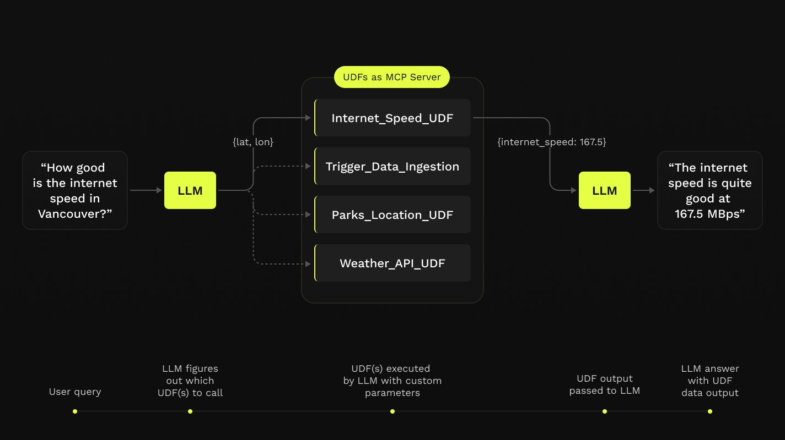

# Announcing Fused AI Builder

**Fused AI Builder let's you create LLM Agents that can directly interact with your Fused UDFs!**

## Give LLMs the ability the talk to your data & code

We're launching Fused AI Builder, a simple way for you to give an LLM access to any UDF you want

import ReactPlayer from 'react-player'

<ReactPlayer
    playsinline={true}
    className="video__player"
    playing={true}
    muted={true}
    controls
    style={{ height: '100% !important' }}
    width="100%"
    url="https://fused-magic.s3.us-west-2.amazonaws.com/workbench-walkthrough-videos/announcements/fused_ai_builder/demo_internet_speed_720p.mp4"
/>

## Fused UDFs meets MCP Server

[MCP (Modal Context Protocol) Servers](https://modelcontextprotocol.io/introduction) allow Large Language Models like Claude or ChatGPT to directly make HTTP queries. This means they can now access APIs and make all sorts of calls.

But a lot of the internet still doesn't have APIs, be it a new dataset you just discovered that's hosted on an FTP server or data on an S3 bucket that needs some processing before it's useful.

That's where Fused UDFs come into play. UDFs allow you to write Python code that can be executed from anywhere, and more importantly called from anywhere. 

By using UDFs with MCP Server you can now easily write any Python code and allow a LLM like Antrophic's Claude to execute it & use its output.

## Data, Python & LLMs all in one

You can now use LLM + Fused UDFs to do a whole host of tasks:

import Tabs from '@theme/Tabs';
import TabItem from '@theme/TabItem';
import WorkbenchToken from '@site/static/img/core-concepts/caching/workbench_token_caching.png';

<Tabs className="unique-tabs">
  <TabItem value="internet-speed" label="Internet Speed for any location" default>

    <ReactPlayer
        playsinline={true}
        className="video__player"
        playing={false}
        muted={true}
        controls
        style={{ height: '100% !important' }}
        width="100%"
        url="https://fused-magic.s3.us-west-2.amazonaws.com/workbench-walkthrough-videos/announcements/fused_ai_builder/internet_speed_test_demo.mov"
    />

  </TabItem>
  <TabItem value="website" label="Creating a Three.js website">

    <ReactPlayer
        playsinline={true}
        className="video__player"
        playing={false}
        muted={true}
        controls
        style={{ height: '100% !important' }}
        width="100%"
        url="https://fused-magic.s3.us-west-2.amazonaws.com/workbench-walkthrough-videos/announcements/fused_ai_builder/demo_building_website.mp4"
    />

  </TabItem>
  <TabItem value="combine-data" label="Combining Data">

    🚧 This section is under construction. Our non-AI Agents are still working on this 🚧

    {/* Todo: Passing data from 1 to another */}

  </TabItem>
</Tabs>
