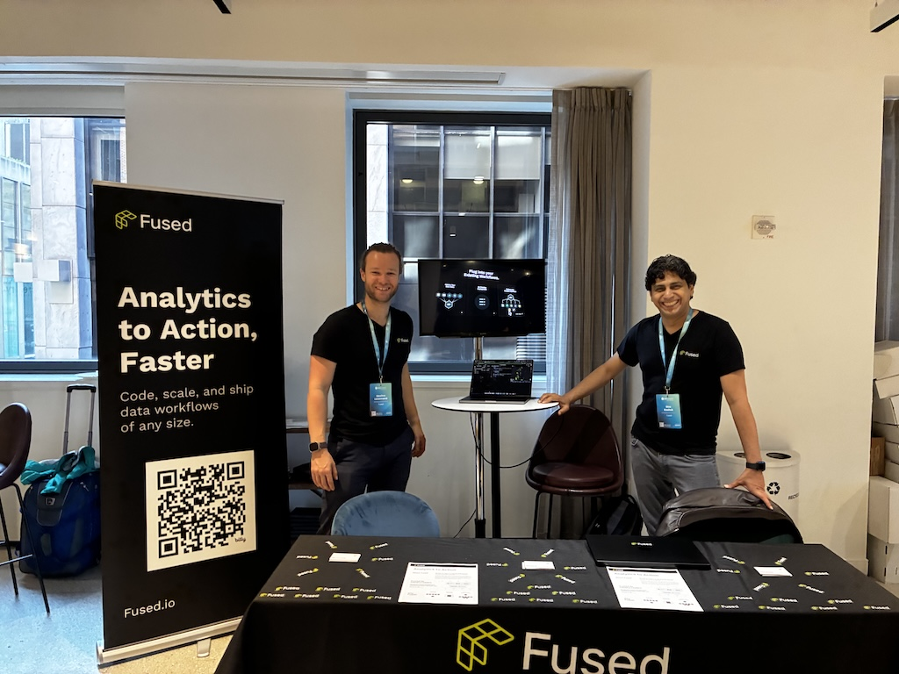

# Notes from EO Summit 2025

Last week, we were at EO Summit, [Fused](https://www.fused.io/) came out of beta, we officially launched our new site and are open for business! 

Our mission is to [help data teams get stuff done quickly](https://youtu.be/btIhyq2KbN0?si=xAScmWKokKsmRSI8), which is relevant for the people we talked to at EO Summit.

{/* truncate */}
{/* TODO: Add image */}

Here are some of our takeaways:

### 1. AI makes writing code simpler, but executing it at scale is still hard

A lot of us are going through a bit of an existential crisis, while realising that damn, yep, AI can help us write code to glue datasets together quickly. Knowing the intricacies of a Python library isn’t a competitive advantage for individuals and companies to build the best analytics anymore. 

That’s all well and good when working on a small, one-off project. But conferences like EO Summit keep showing that there’s more data than ever before. Archives of imagery, 3D point clouds and any dataset keeps growing in scale, resolution & time backlog. Problems aren’t always local,nor limited to a small time & place. 

AI is changing what it means to build software & products, there’s not doubt about that. But executing it at scale is still a dark arts. 

### 2. So much data, yet we still struggle to get things done in a timely manner

At CNG last month [Brianna Pagán shared her story of the Los Angeles fires taking down her home](https://www.linkedin.com/pulse/when-our-community-burned-where-satellite-information-pag%C3%A1n-phd-8rxwf/?trackingId=PGMihonBbG7ShNl4LvW20g%3D%3D), and while having so much data available, so little was actually accessible in a helpful manner quickly. This topic came again at this conference, wildfires being the prime example of the complexity of making timely and updated use of data in times of need despite having so much.

A few months ago, our own Milind Soni [made a quick interactive dashboard](https://www.linkedin.com/posts/milind-soni-314075175_emergencyresponse-datascience-opendata-activity-7285803354876735489-lqJe?utm_source=share&utm_medium=member_desktop&rcm=ACoAABr4AqABaP1Bbk9D9gnGvRmXSaYnn0II3fg) in a few hours as a proof of concept of what rapid tools could look like for wildfire updates using Fused.

These conversations are directly going into our internal product development discussion; as we write this, we're developing tools to build these dashboard for rapid iteration. Stay tuned for more on that soon! 

### 3. The gap between data & applications

[Nadine Alameh](https://www.linkedin.com/in/nadinealameh/), at the head of the Taylor Geospatial Institute & former CEO of the OGC, the consortium in charge of standards for all things geospatial, mentioned the lack of companies in the middle solving problems between data providers and companies building analytics products. This is something Aravind, head of Terrawatch -who organised this conference- [has been saying for a while](https://newsletter.terrawatchspace.com/the-state-of-earth-observation-platforms/).  

That’s why we were excited about being at EO Summit, we think we can make a difference tackling these problems!

We’re building tools that make getting data from all types of places & formats together, execute code (however it was written) at any scale with a few lines of code and sharing it all to whomever needs it, be it interactive dashboard, CSVs or tile servers. 

If you’d like to learn more about Fused, [book some time with Max](https://calendly.com/max-fused/30min), our Developer Advocate right here to get a demo!