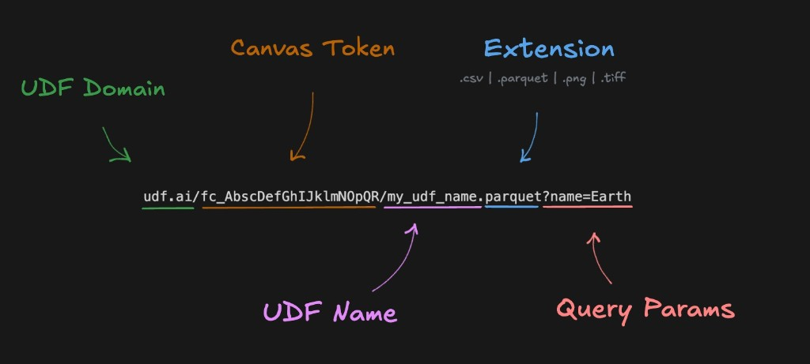
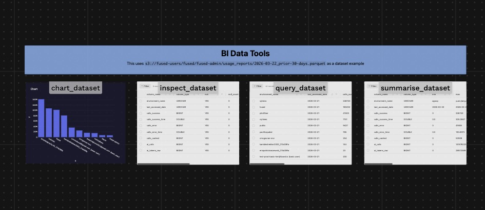
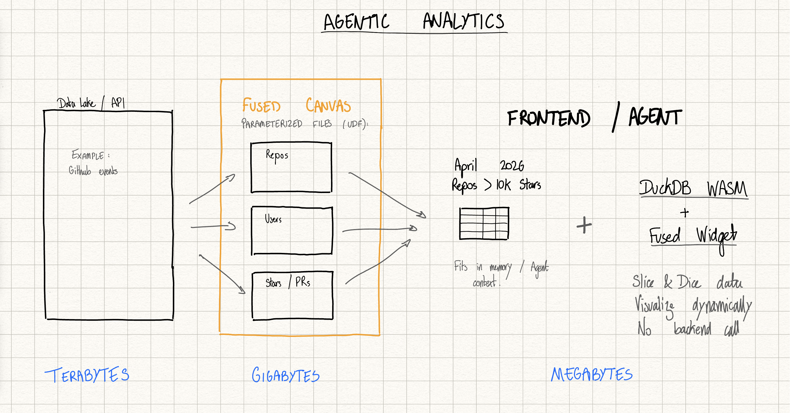
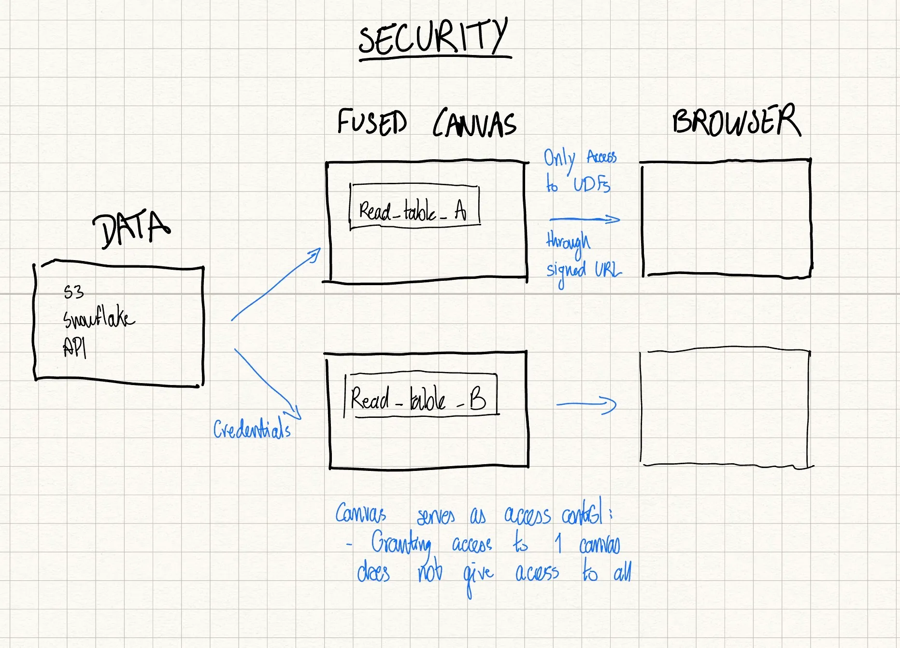

# Building the runtime for Agentic Analytics

*We're building an MCP-native analytics runtime: tools an agent can call that return real data artifacts, not just text. Fused runs serverless compute and hands back tables/charts/files you can inspect and iterate on.*

## 1) Why now: Agentic Analytics is possible

Claude Code & OpenAI Codex are making agentic workflows the norm. We're moving away from humans writing code & SQL queries to spinning up agents to write code, push commits & build for us.

We think today is the time for "Agentic Analytics."

The key is that analytics doesn't stop at a single answer. Follow-up questions come up and data gets updated regularly, requiring updates. That's why we need better ways to let agents work with data.

So why now?

- **The hard part is no longer writing a SQL query or a Python machine learning pipeline.** LLMs are making that simpler than ever. It's building the infrastructure to run these analyses, in a secure and repeatable manner.
- **Users' expectations changed.** It's not "one question → one chart." Real analysis is interactive. You want to drill down, change filters, compare cohorts, sanity-check outliers, and visualize the same data five different ways before you trust it. LLMs convert your questions into queries but you still need to run them against the data.
- **The browser got powerful.** DuckDB-WASM makes it practical to load a relevant slice of data into the frontend and run analytics there. You still go back to the backend for new data, but many follow-ups can be answered locally.

In other words: LLMs made asking questions trivial. The competitive advantage is building the runtime that can answer them safely, quickly, and repeatedly with real-world, always-changing data.

### What's required to build Agentic Analytics (for real)

To make Agentic Analytics work outside of demos, you need two things at the same time:

- **Secure ways for LLMs to access data** — least-privilege, tenant-aware access: an agent for Customer A should not be able to reach Customer B.
- **Direct access "in context" to a small amount of data** — you can't pass a 1TB dataset to an LLM and say "here you go, find insights."

Here's how we're suggesting to solve this at Fused:

{/* truncate */}

## 2) A runtime for agentic analytics beyond endpoints: Parameterised Files

Agentic analytics isn't "one question → one response." It's a loop: ask, inspect, follow up. That loop breaks if your only interface to data is either (a) dashboards or (b) traditional APIs designed for small JSON payloads.

Fused takes a different approach: *UDFs are parameterised files*.

A UDF is Python code that runs when you call it and returns a file as the output artifact (e.g., a table file, an HTML view, JSON, etc.).

- Instead of shipping dashboards, you ship callable UDFs with explicit parameters (customer, date range, filters).
- Instead of returning tiny payloads, you return the right file for the next step: a table, an HTML view, or a shareable widget.
- Access stays scoped (tenant-aware + short-lived links), so agents can consume outputs without getting raw warehouse access.

All these are then organised in the Fused Canvas: a freeform canvas where you can write & manage each of your UDFs.

Once it's in a Canvas, it's callable by humans and agents.

## 3) Canvas as an MCP Server

The core idea behind Fused is to repeatedly "shrink the world" from large sources into small, usable files so follow-up questions are fast and analytics becomes an interactive workflow, not a one-off query.

- **Large (TB):** where the data lives
  - Data lakes, warehouses, internal APIs, logs
  - Too big (and too sensitive) to hand directly to an agent or a browser
- **Medium (GB / seconds):** server-side compute near the data
  - UDFs do the heavy lifting (join, filter, aggregate, map-reduce across partitions)
  - Produce a smaller artifact in seconds
- **Small (MB):** what you bring to the front-end / agent loop
  - A file that fits in browser memory (and can be visualized in a widget). This can be any file format (parquet, CSV, HTML, PNG, etc.)
  - Or a bounded, inspectable result you can send back to an agent for fast iteration

**This basically turns the Fused Canvas into an MCP Server.**

### This allows for a hybrid data execution model: server (backend) + browser (frontend)

- **Backend (parallel + scalable):**
  - Run many jobs at once to summarize or materialize large datasets into fast file artifacts.
  - Each UDF becomes a tool that can be exposed to the agent to call.
- **Frontend (interactive):**
  - Once the file is small enough, slice/dice + validate instantly in-browser (DuckDB WASM + Widgets).

## 4) Isolation & security (safe-by-default)

To make this work properly, access control needs to be scoped correctly. Agents run "locally," so you shouldn't hand them raw access to your warehouse or data lake — especially when working across multiple customers' data or projects.

In Fused, Canvas is where you manage access. UDFs have credential access to your data but only return a signed-URL file; the browser/agent only interacts with scoped UDF outputs.

- **Canvas-scoped access:** granting access to one Canvas doesn't grant access to everything else.
- **Least-privilege UDFs:** agents are only exposed to the specific reads/queries you intend (tenant-scoped, parameterized, and sandboxed) through the UDFs you write.
- **Output-only to the client:** the browser/agent gets files (via signed URLs / short-lived session tokens), not upstream credentials.
- **Auditable + time-bounded:** access is shareable and expires (passcodes / short-lived tokens), so the system stays safe-by-default.

## 5) Widgets as a non-hallucinating UI layer (JSON UI spec)

While DuckDB WASM lets you iterate on data in the browser without re-running backend jobs, Widgets let you instantly visualize each iteration (chart/map/table) and share it as a link.

The result is faster convergence: question → data slice → visualize → adjust → repeat.

A Widget is a small, constrained JSON spec that renders a predictable, interactive UI. That constraint is the point: it's easy for agents to generate and modify reliably, and easy for humans to inspect and edit when something looks off. Because widgets are addressable by URL, you can embed the exact same live chart/map/table anywhere (docs, chat, internal tools, product UIs) without building custom frontend code.

This has the added benefit of keeping iterations low on token usage — you only need to return a small JSON blob compared to what it would take to create the same in HTML.

:::note
🚧 Demo coming soon 🚧
:::

## 6) Walkthrough: one end-to-end agentic workflow

:::note
🚧 This section is a work in progress — end-to-end example coming soon 🚧
:::

---

## Want to try it out? Reach out!

You can [sign up to Fused](https://www.fused.io/) right now to try it out yourself, or directly [book a demo](https://www.fused.io/contact).
