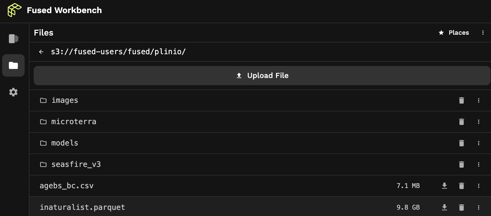

# File systems

The Fused runtime has two file systems to persist and share artifacts across UDF runs: an S3 bucket and a disk file system. These are used to store downloaded or generated objects, environment variables, and auxiliary files.

:::warning
Access to the file systems is tightly scoped at the organization level, so files stored in either system can only be accessed by accounts in the same organization. 

Given the flexibility of Fused to run any Python code on files in the file system, users should take precautions standard to working with sensitive files.
:::

## `fd://` S3 bucket

The `fd://` bucket file system serves as a namespace for an S3 bucket provisioned by Fused Cloud for your organization. It provides a unified interface for accessing files and directories stored within the bucket, abstracting away the complexities of direct interaction with S3. Fused helper functions access it like an object on S3.



In this image, the bucket path `s3://fused-users/fused/plinio/dir-name/file.parquet` is conveniently aliased as `fd://dir-name/file.parquet`.

For example, to fetch a file:
```python
fused.get("fd://dir-name/file.parquet")
```

Or, for example, to ingest a table:
```python
job = fused.ingest(
    input="https://www2.census.gov/geo/tiger/TIGER_RD18/STATE/06_CALIFORNIA/06/tl_rd22_06_bg.zip",
    output="fd://dir-name/census/ca_bg_2022/",
).run_remote()
```

## `/mnt/cache` disk

The `/mnt/cache` disk file system is the UDF runtime's local directory that persists across UDF runs. Use it store downloaded files, the output of cached functions, access keys, and to set environment variables with `.env` files.

To list files in the directory, run this in a UDF.

```python
import os

for each in os.listdir('/mnt/cache/'):
    print(each)
```

