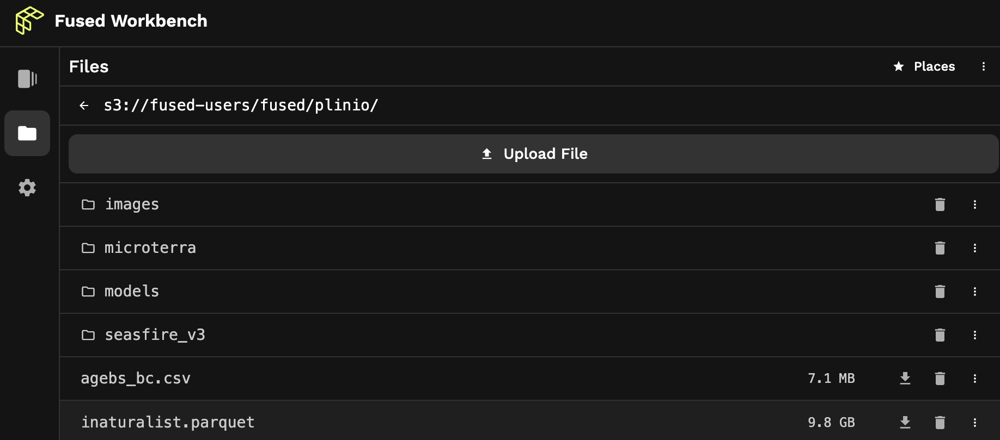

import Tag from '@site/src/components/Tag'

## <Tag color="#D1E550" fontColor="#141414" >🚧 Under Construction</Tag>

The Fused runtime has two file systems to persist and share artifacts across UDF runs: an S3 bucket and a disk file system. These can be used to save downloaded files, objects created by the UDF, environment variables, and auxiliary files.

:::warning
Access to the file systems is tightly scoped at the organization level, so files stored in either system can only be accessed by accounts in the same organization. 

Given the flexibility of Fused to run any Python code on files in the file system, users should take precautions standard to working with sensitive files.
:::

## `fd://` S3 bucket

Fused Cloud provisions an S3 bucket for each organization to store files and objects. The bucket is accessible through the `fd://` file system, which provides a unified interface to access files and directories stored within the bucket.

Fused helper functions access it like an object on S3 with the `fd://` as a shorthand prefix specific to the user account. The full path is shown in the [Fused File explorer](/workbench/file-explorer/). In this image, for example, the bucket path `s3://fused-users/fused/plinio/dir-name/file.parquet` is conveniently aliased as `fd://dir-name/file.parquet`.




For example, to fetch a file:
```python
fused.get("fd://dir-name/file.parquet")
```

Or, for example, to ingest a table:
```python
job = fused.ingest(
    input="https://www2.census.gov/geo/tiger/TIGER_RD18/STATE/06_CALIFORNIA/06/tl_rd22_06_bg.zip",
    output="fd://dir-name/census/ca_bg_2022/",
).run_remote()
```

## `/mnt/cache` disk

The `/mnt/cache` disk file system is the UDF runtime's local directory that persists across UDF runs. In fact, the `/mnt/cache` directory is where the [`@fused.cache` decorator](/basics/core-concepts/write/#fusedcache-decorator) writes its cache files. Use it to store:

- downloaded files
- the output of cached functions
- access keys
- environment variables with `.env` files
- ML model weight files

You can interact it through UDFs as you would with a local file system. For example, you can list files in the directory with this in a UDF.

```python
import os

for each in os.listdir('/mnt/cache/'):
    print(each)
```

