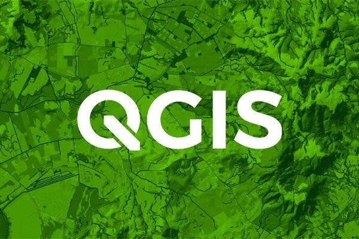
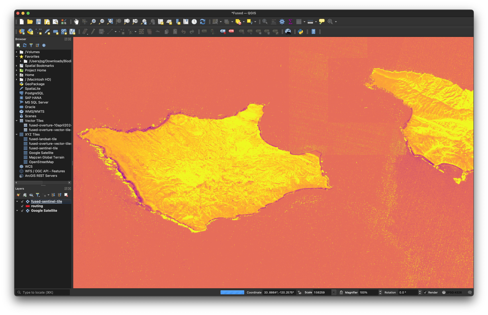
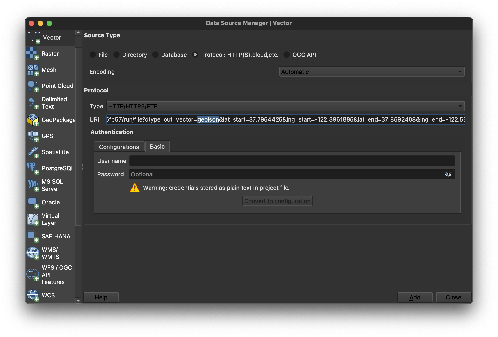

# QGIS



[QGIS](https://www.qgis.org/en/site/) is an Open Source Desktop GIS platform. Since its inception in 2002, it's become a staple in the geospatial data stack.

Fused UDFs can be configured to return raster tile and vector data in formats that QGIS can load. This walkthrough sows how to generate URL endpoints to easily load data into QGIS.

To follow along, you'll need to download QGIS, which can be done from the [homepage](https://www.qgis.org/en/site/index.html).

To load data from Fused, you'll first generate a signed UDF URL.

## 1. Generate a signed URL for a UDF

First, on Workbench, create and save a UDF. Under the "Settings" tab, click "Share" to [generate a signed URL](/basics/core-concepts/#generate-endpoints-with-workbench) that can be called via HTTP requests. 

Modify the generated `HTTP` URL depending on the data type, as detailed below. You can optionally pass UDF parameters as URL-encoded strings, which can be configured to change based on query input.

## 2. Load data into QGIS

There's 2 ways to load data from Fused into QGIS, depending on whether the UDF returns a raster or vector data type. Each requires a particular URL structure and loading mechanism. Read the [QGIS User Guide](https://docs.qgis.org/3.34/en/docs/user_manual/index.html) for a deeper dive into how QGIS handles each data type.

### Raster Tiles

Dynamically render XYZ raster tiles on the QGIS map.

As an example, the ["Sentinel Tile Example"](https://github.com/fusedio/udfs/tree/main/public/Sentinel_Tile_Example) public UDF returns an XYZ tile URL of NDVI from the Sentinel dataset. Create a new instance of it on your workbench, generate a shared URL, then modify the URL query parameters:

- Set `dtype_out_raster` to `png`.
- Set replace the values after `/run/tiles` with the `/{z}/{x}/{y}` template.
- Set UDF parameters as needed.

For example:


```bash
https://www.fused.io/server/v1/realtime-shared/da71c7bf79376f2e88b37be9ecd2679f2e40a5b79f9b0f2c75e7ea9a3f0c5171/run/tiles/{z}/{x}/{y}?dtype_out_raster=png
```

Open the modal to create a new raster XYZ layer by right-clicking: `XYZ Tiles` -> `New Connection`. Now paste the UDF URL in the URI field and configure the layer as shown.


This should render the raster output tiles on the map. This example shows NDVI on the area surrounding the Santa Rosa Island, off the coast of Southern California.



Note that the QGIS client is liable to timeout errors if it encounters a high number of concurrent requests and might show a warning similar to this one. Issues generally resolve after waiting some time.

```bash
2024-04-12T12:10:06     WARNING    Network request https://www.fused.io/server/v1/realtime-shared/da71c7bf79376f2e88b37be9ecd2679f2e40a5b79f9b0f2c75e7ea9a3f0c5171/run/tiles/14/2722/6554?dtype_out_raster=png timed out`
```

### Vector

Load vector data in a one-off manner onto the QGIS map.

As an example, the ["Single Route"](https://github.com/fusedio/udfs/tree/main/public/single_route) public UDF returns a composite vector line of driving directions between an origin and destination locations. Create a new instance of it on your workbench, generate a shared URL, then modify the URL query parameters:

- Set `dtype_out_vector` to `geojson`.
- Set UDF parameters as needed.

For example:
```bash
https://www.fused.io/server/v1/realtime-shared/4f8fe6b81811ce011d7045b9fffbcfb43663637a4c626955821566fe62e6fb57/run/file?dtype_out_vector=csv&lat_start=37.7954425&lng_start=-122.3961885&lat_end=37.8592408&lng_end=-122.5349321
```

Open the modal to create a new vector layer by clicking: `Layer` -> `New Layer` -> `Add Vector Layer`. Now paste the UDF URL in the URI field and configure the layer as shown.



This should load the data and render it on the map.


Note that once the data is loaded, it's cached in QGIs so it won't be affected by modifications to the UDF.


