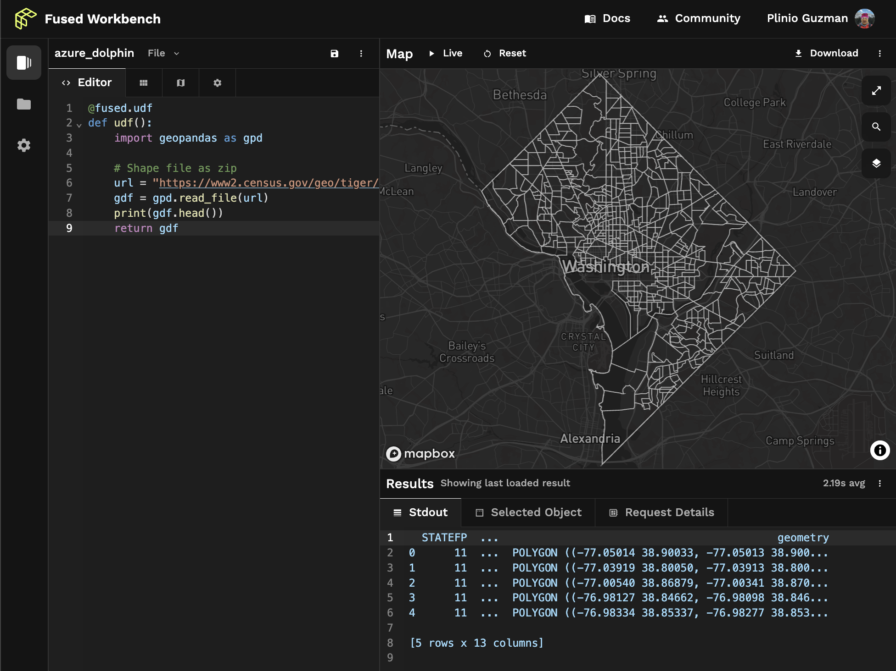

# Get started with Fused!

Fused makes working with geospatial data easy. Fused UDFs are the building blocks of
composable geospatial operations. Use them to fuse any data, with any tool, at any scale. You can create and edit UDFs in the Fused map editor IDE. 

Once you are happy with your UDF, use the [Fused app builder](/workbench/app-builder/) to create and share an app in no time, the [Fused API](/basics/core-concepts/call/#create-a-udf-endpoint) to integrate it into your stack, and the [Fused Python SDK](/python-sdk) to run it from your favorite Python IDE, Jupyter Notebook, or orchestrator. 


###############
- overview: make bullet points shorter than 1 line, and single sentence. change emojis to not have blank background.
  - bullet: 
    - Build and ship data apps in no time using Fused.
    - write and run. a modularized udf.
    - out-of-box api should link to HTTP on run page
    - vibrant community (discord) and public udfs (github)
    - 
  - nuke patterns section


- as if it's a merfo af write udf and run udf, and remove other stuff .don't mention tilefile nor http.
- ok if example, as code that can be copypastable on workbench, is long. must have parameters. 
- caching
- what's a udf and convince me why it's great
- be concise and single page, almost no scroll, link to other pages (write udf and run udf)


## Fast Track ⏱️

Understand Fused in 5 interactive minutes!

This quick tutorial introduces key concepts and basic features of Fused to help you get
started with your workflows!

## Concepts

UDFs are Python functions that, thanks to the the `@fused.udf` decorator, Fused enhances with the ability to spatially filter access datasets of any size, run in a serverless cloud, and other benefits you'll learn about as you deepen in the ecosystem.

In this tutorial, you'll first create a UDF in your Workbench, then create a simple app to interact with it.

### Your first UDF

Click [here](https://www.fused.io/workbench) to jump into the Fused UDF explorer and click the "New UDF" button to open a new UDF as a map layer. You'll be able to visualize the UDF's output on the map and get instant feedback as you iterate on your UDF's code.


As a starting point, the new UDF shows a basic tiled pattern on the map. Acquaint yourself with the editor by trying the following modifications the UDF's code:
- Write a print statement such as `print("Hello World")` to see the output in the console.
- Change the value of the `n` parameter to see the pattern change based on UDF inputs.

### Read data

Now, we need some data.

Fused runs any Python code, so you can leverage popular open source libraries like [GeoPandas](https://geopandas.org/en/stable/index.html) to interact with data.

This UDF shows an easy way to create a GeoDataFrame with census data hosted in a public catalog. Copy this snippet and paste it into your UDF to see the data on the map.


```python
@fused.udf
def udf():
    import geopandas as gpd

    # Shape file as zip
    url = "https://www2.census.gov/geo/tiger/TIGER_RD18/STATE/11_DISTRICT_OF_COLUMBIA/11/tl_rd22_11_bg.zip"
    gdf = gpd.read_file(url)
    print(gdf.head())
    return gdf
```


It should create a `GeoDataFrame` with the census data, print the first rows of the dataset in the console, and display the data on the map.




### Load a public UDF

To play with a more complex UDF, browse the UDF catalog and clone a UDF into your editor. A good beginner example is the "NSI Overture" UDF, which performs a [point-in-polygon](/basics/transform/geospatial/point-in-polygon/) operation between the NSI (National Structures Inventory) point and the Overture building footprints datasets. 

### Create an app

Now that you have a UDF you're happy with, you can create an app to interact with it. Copy the UDF's token and navigate to the "App builder". You can customize the app's appearance and behavior with the [Streamlit Python API](https://docs.streamlit.io/develop/api-reference), and share it with others by clicking the "Copy shareable link" button.


## What's next?

Congratulations! You're off to a great start with Fused. 🎉

With Fused you can do much more than what has been introduced so far, from loading data
from [Google Earth Engine](/basics/in/gee/) and [DuckDB](/basics/in/duckdb/), operations
like [buffer analysis](/basics/transform/geospatial/buffer/), to exporting data into [Lonboard](/basics/out/lonboard/) or [Streamlit](/basics/out/streamlit/), and [much more](/basics/tutorials/). Head over to
the [Python SDK documentation](/python-sdk/) to learn more about what's possible and
join the community on [Discord](https://bit.ly/fused-discord).

Once you feel ready, we invite you to [share the UDFs you create with the community](/python-sdk/contribute/)!

Welcome aboard! 🚢

