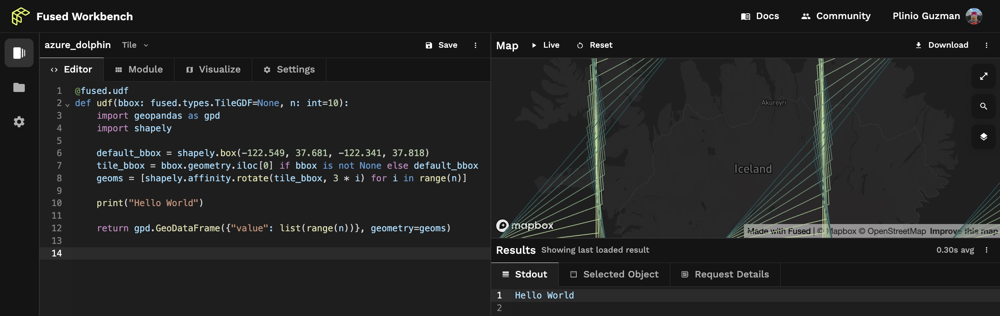

# Utilities 

## Saving UDFs

UDFs are saved as a directory of associated files containing the UDF's code, utility modules, and metadata, and documentation. This section explains how to save UDFs and load UDFs.

For example, the following snippet saves a UDF in a local directory, `Sample_UDF`.

```python
import fused

@fused.udf
def my_udf():
    return "Hello from Fused!"

# Save locally
my_udf.to_directory('Sample_UDF')
```

The directory contains the UDF's documentation, code, metadata, and utility function code.

```
└── Sample_UDF
    ├── README.MD
    ├── Sample_UDF.py
    ├── meta.json
    └── utils.py
```

Files relevant to each UDF are:

- `README.md` Provides details of the UDF's purpose and how it works.
- `Sample_UDF.py` This eponymous Python file contains the UDF's business logic as a Python function decorated with `@fused.udf`.
- `meta.json` This file contains metadata needed to render the UDF in the Fused explorer and for the UDF to run correctly.
- `utils.py` This Python file contains helper functions the UDF (optionally) imports and references.


## Utility modules

Utility modules enhance the functionality and maintainability of UDFs.

As UDFs grow in complexity, it's useful to modularize the code to make it reusable and composable. It's also a good practice to keep only the essential "business logic" in the decorated UDF function - this makes it easy to know what a UDF does at a glance.

With this in mind, a Fused UDF can optionally reference a module to import Python objects from it, with an import statement as if importing from a Python package. These modules are reusable Python functions that promote code reuse and speed up development time. UDFs can import from a variety of sources: from the local environment, from GitHub, and from other UDFs. This section shows how to import modules into UDFs form each of these sources.

### From local

Local modules are Python files in the same environment as the UDF.


In the Workbench, the "module" code editor tab is the place for helper functions and other associated Python objects for the UDF to import. Keep in mind that the module's name is configurable in order to avoid naming collisions. In this example, UDF imports the function `arr_to_plasma` from its module, which is named `utils`. The function contains support logic the UDF uses it to transform an array.

```python
@fused.udf
def udf(bbox):
    from utils import arr_to_plasma
    ...
    return arr_to_plasma(arr.values, min_max=(0, .8))
```


When importing a module from a Python environment other than Workbench, the module must be specified as the locally-scoped file name in the `headers` argument of the `@fused.udf` decorator. This lets Fused know how to complete the reference.

```python
@fused.udf(
    headers=['utils.py']
)
def udf(bbox):
    from utils import arr_to_plasma
    ...
    return arr_to_plasma(arr.values, min_max=(0, .8))
```


### From GitHub

Fused UDFs can import utility modules from other UDFs. This enables the community and teams to share and reuse version controlled helper functions. Once a module is loaded, it can be used as a standard Python module to reference functions and objects using dot notation.

Load a UDF with [fused.load](/python-sdk/top-level-functions/#load) then reference its utilities module. The utilities modules is referenced by its file name - in this example, the [file](https://github.com/fusedio/udfs/blob/0dcc8/public/common/utils.py) is named `utils`, it's found within the UDF named `common`, and it contains the `table_to_tile` helper function. Notice how the commit sha `0dcc8` is included in the URL to ensure the UDF is loaded from a specific commit.


```python
my_utilities = fused.load(
    "https://github.com/fusedio/udfs/blob/0dcc8/public/common/"
    ).utils

my_utilities.table_to_tile(...)
```


## Cache

Fused runs UDFs from top to bottom each time. This execution model makes development easy, but can be encumbered if long-running helper functions are called again and again.

Sometimes a UDF might take a while to download or process data. When this happens, developers can take advantage of Fused's built-in caching. Caching stores the results of slow function calls so they only need to run once.

All a developer must do is place slow code inside a helper function, decorate the function with `@fused.cache`, and assign the returned data object to a variable. The object will persist across runs. This empowers users to quickly iterate on downstream code without having to wait for the slow code to run each time.

Fused caches the function's output using a unique hash identifier generated based on the function's code, the value of its parameters, and the `_cache_id` argument.

#### Minimal example

To illustrate, this function accepts an argument and a keywork argument. When the function is called to set `output_1` and `output_2`, Fused caches the output of each call as separate objects. That way, the UDF only runs the function once for each set of passed arguments.

```python
@fused.cache
def sample_function(name, company="Fused"):
    # Function logic
    return f"{name}, at {company}, cached this function's output."

@fused.udf
def udf(bbox):
    ...
    output_1 = sample_function("Sina")
    output_2 = sample_function("Plinio", company="Fused.io")
    ...

```

#### Intermediate example

At this point, ony might ask: if UDFs run for each tile in the viewport, how does Fused distinguish the cache for each tile?

UDFs give spatial awareness to the cache decorator by setting `_cache_id` as string identifier unique to the tile's `bbox`. This can for example be a string such as `str(bbox.to_json())`, or something more complex that could include a date to distinguish cached outputs by.

Note that a custom caching directory can be set with the optional `path` parameter.

```python
@fused.cache(path='optional_cache_dir')
def sample_function(name, company="Fused"):
    # Function logic
    return f"{name}, at {company}, cached this function's output."

@fused.udf
def udf(bbox):
    ...
    output = sample_function("Plinio", company="Fused.io", _cache_id=str(bbox.to_json())")
    ...
```

## Download

Fused Workbench runs UDFs from top to bottom each time code changes. This means objects in the UDF are recreated each time, which can slow down a UDF that downloads files from a remote server.

> 💡 Downloaded files are written to a mounted volume shared across all UDFs in an organization. This means that a file downloaded by one UDF can be read by other UDFs.

Fused addresses the latency of downloading files with the `download` utility function. It stores files in the mounted filesystem so they only download the first time.

> 💡 Because a Tile UDF runs multiple chunks in parallel, the `download` function sets a signal lock during the first download attempt, to ensure the download happens only once.

### Example: download `.zip` file

To download a file to disk, call `fused.core.download`. The function downloads the file only on the first execution, and returns the file path for downstream functions to reference.

This example downloads a `.zip` file then returs it as a GeoDataFrame. Note how GeoPandas reads the local file path returned by `download`.

```python
@fused.udf
def udf(url='https://www2.census.gov/geo/tiger/TIGER_RD18/STATE/11_DISTRICT_OF_COLUMBIA/11/tl_rd22_11_bg.zip'):
    import fused
    import geopandas as gpd

    # Download zip file
    out_path = fused.core.download(url=url, file_path='out.zip')

    # Show path to file
    print(out_path)

    return gpd.read_file(out_path)
```


## File systems

The Fused runtime has two file systems to persist and share artifacts across UDF runs: an S3 bucket and a disk file system. These are used to store downloaded or generated objects, environment variables, and auxiliary files.

:::warning
Access to the file systems is tightly scoped at the organization level, so files stored in either system can only be accessed by accounts in the same organization. 

Given the flexibility of Fused to run any Python code on files in the file system, users should take precautions standard to working with sensitive files.
:::

### `fd://` S3 bucket

The `fd://` bucket file system serves as a namespace for an S3 bucket provisioned by Fused Cloud for your organization. It provides a unified interface for accessing files and directories stored within the bucket, abstracting away the complexities of direct interaction with S3. Fused helper functions access it like an object on S3.



In this image, the bucket path `s3://fused-users/fused/plinio/dir-name/file.parquet` is conveniently aliased as `fd://dir-name/file.parquet`.

For example, to fetch a file:
```python
fused.get("fd://dir-name/file.parquet")
```

Or, for example, to ingest a table:
```python
job = fused.ingest(
    input="https://www2.census.gov/geo/tiger/TIGER_RD18/STATE/06_CALIFORNIA/06/tl_rd22_06_bg.zip",
    output="fd://dir-name/census/ca_bg_2022/",
).execute()
```

### `/mnt/cache` disk

The `/mnt/cache` disk file system is the UDF runtime's local directory that persists across UDF runs. Use it store downloaded files, the output of cached functions, access keys, and to set environment variables with `.env` files.

To list files in the directory, run this in a UDF.

```python
import os

for each in os.listdir('/mnt/cache/'):
    print(each)
```

## Environment variables

Save constants and secrets to an `.env` file to make them available to your UDFs via environment variables.

First, run a UDF that sets variables in an `.env` file.

:::note
To be accessible to all UDF run events, the file must be placed on the runtime's mount path `/mnt/cache/`.
:::

```py
@fused.udf
def udf():
    env_vars = """
    MY_ENV_VAR=123
    DB_USER=username
    DB_PASS=******
    """

    # Path to .env file in disk file system
    env_file_path = '/mnt/cache/.env'

    # Write the environment variables to the .env file
    with open(env_file_path, 'w') as file:
        file.write(env_vars)
```

Then, in a different UDF, load the variables into the environment.

```py
@fused.udf
def udf():
    from dotenv import load_dotenv

    # Load environment variable
    env_file_path = '/mnt/cache/.env'
    load_dotenv(env_file_path, override=True)
    print(f"Updated MY_ENV_VAR: {os.getenv('MY_ENV_VAR')}")
```

## Hosted API 

Fused automatically creates HTTP endpoints for every UDF saved in the Fused cloud.

Using the Fused Hosted API supercharges your stack with the ability to trigger and load the output of any scale workflows. API calls automatically provision serverless compute resources to run workflows in parallel using advanced caching and geo partitioning - without your team needing to spend time on setup.

Endpoints created with Fused Hosted API seamlessly integrate with tools such as:

- Tile-based maps: Simply pass the endpoint into tile-based maps such as open source JavaScript tools (e.g. leaflet, Deck.gl, and Kepler.gl), proprietary web-based apps (such as Felt and Foursquare Studio), or desktop based tools such as ArcGIS, ESRI, and QGIS.
- Apps that make HTTP requests: Load data into low-code app builders such as Streamlit & Retool.
- Apps that render embeddable maps: Embed responsive maps to significantly enhance the utility and interactivity of documentation sites and apps, such as Notion.


The following sections describes how to create a UDF endpoint either in Workbench or with the Fused Python SDK, and how to authenticate requests to call the endpoint. They also describe how to make authenticated calls to these endpoints. Browse the ["Get data out"](/basics/out/) section for examples of how to use them to load data into specific tools.

:::note
    Endpoints can be called with "private" or "shared" authentication tokens. Shared tokens are easy to create and revoke. Use shared tokens to call UDFs from 3rd party applications or to share them with others.
:::

### Generate endpoints with Workbench

Once a UDF is saved in Workbench, the "Settings" tab of the editor shows code snippets that can be used to call the UDF from different environments. 

#### Shareable public endpoints

The "Share" subsection contains snippets with shared tokens and signed URLs. 
- `HTTP` is the URL to call the UDF endpoint.
- `cURL` is the command to call the UDF endpoint from the terminal.
- `Python` is the code to call the UDF endpoint from a Python environment using the token.
- `Token` is the shared token, which you'll notice appears in the above snippets. 


#### Private endpoints

The "Snippets" subsection below it contains snippets that can only be called with the authoring account's authentication.
- `cURL` is the command to call the UDF endpoint from the terminal, which requires the authoring account's private token.
- `Python` is the code to call the UDF endpoint from a Python environment using the token.
- `Load this UDF` is loads the UDF into a Python environment where it can be modified, chained with other UDFs, or called. 


### Generate endpoints with `fused-py`


#### Get an account's private token

Python environments where the authentication flow completed successfully store a credentials key in the default location ` ~/.fused/credentials`. Calls to UDFs from those environments will use that key, unless a token for a different account is explicitly set in the call. Making calls to endpoints from a non-authenticated environment will need the authenticated account's access token, which can be retrieved with the following commands.

```python
from fused._auth import CREDENTIALS

CREDENTIALS.credentials.access_token
```


:::danger

Note that the "private" token can access all UDFs and should be kept private. The recommended approach is instead to use "shared" tokens with tightly scoped permissions, as detailed below.

Remember that tokens are tied to the account that created them and requests to their corresponding endpoints will accrue charges on that account.
:::


This is how to call UDF endpoints via HTTP requests with the token.

```bash
curl -XGET https://app.fused.io/server/v1/realtime-shared/$SHARED_TOKEN/run/file
```

#### Create and manage shared tokens (recommended)

Shared tokens are tightly scoped to a single UDF, and can easily be revoked. Creating a shared token for a UDF returns a token object that, among other attributes, contains the token as a string and sample endpoint URLs.

This is how to to call UDF endpoints in Python with signed token URLs.
```python
from fused.api import FusedAPI
api = FusedAPI()

token_object = api.create_udf_access_token(udf_email="user@fused.io", udf_name="caltrain_live_location")
output = fused.core.run_shared_file(token=token_object.token, my_param="...")
```

#### Manage shared tokens

Fetch a specific UDF token object using its unique token string:
```python
token_object = api.get_udf_access_token(token=token.token)
```

Fetch all UDF tokens:
```python
token_objects = api.get_udf_access_tokens()
```

Update a specific UDF token using its unique token string:
```python
token_object = api.update_udf_access_token(token=token.token, enabled=True)
```

Delete a specific UDF token using its unique token string:
```python
api.delete_udf_access_token(token=token.token, enabled=True)
```


Similarly, signed URLs endpoints can be created that can be called from another application via HTTP requests.

#### Single File HTTP endpoints

Single file HTTP endpoints are suitable for handling individual requests, ideal for scenarios where a single resource is required, such as loading data into [Google Sheets](/basics/out/googlesheets/).


```python
from fused.api import FusedAPI
api = FusedAPI()

# URL for single call
api.create_udf_access_token(udf_email="user@fused.io", udf_name="caltrain_live_location").get_file_url()
```

#### Tile HTTP endpoints

Tile HTTP endpoints are designed for serving map applications that consume Tiles, such as [Lonboard](/basics/out/lonboard/) or [geemap](/basics/out/geemap/).

```python
from fused.api import FusedAPI
api = FusedAPI()

# URL for XYZ tiles
api.create_udf_access_token(udf_email="user@fused.io", udf_name="caltrain_live_location").get_tile_url()
```

### Call UDFs

UDFs can be triggered via the Python SDK or HTTP requests, and they can return data in different formats depending on how they're called. The following sections describe how to call UDFs and how to configure calls to return data in different formats.

#### Call UDFs with Python


The Fused Python SDK exposes methods to call UDFs. In Python environments authenticated to Fused, the UDF be called or imported in these 3 ways:


##### Call UDF and return its output

```python
fused.run("user@fused.io", "Overture_Maps", x=2808, y=6542, z=14, my_udf_parameter=5)
```

##### Call UDF asynchronously and return its output

:::note
    [nest_asyncio](https://pypi.org/project/nest-asyncio/) might be required to run UDFs async from Jupyter Notebooks.
    ```python
    !pip install nest-asyncio -q
    import nest_asyncio
    nest_asyncio.apply()
    ```
:::

```python
import asyncio
import fused

# Run the UDF in an async function
async def main():
    return await fused.run("user@fused.io", "Overture_Maps", x=2808, y=6542, z=14, sync=False)

# Run the coroutine and capture the result
gdf = asyncio.run(main())

# Use the returned value outside the event loop
gdf.head()

```

##### Import as a UDF object

```python
my_udf = fused.core.load_udf_from_fused("user@fused.io", "caltrain_live_location")
```

:::note
Did you know UDFs can also call other UDFs? It's an easy way to chain UDFs together or even run them in parallel.
:::

#### Call UDFs with HTTP requests

Beyond Python, other frameworks can call the UDF endpoint via HTTP requests and receive output data in the response. This makes it easy to load data from UDFs into Tile-based mapping tools such as [DeckGL](https://deck.gl/docs/api-reference/geo-layers/tile-layer), [Mapbox](https://docs.mapbox.com/mapbox-gl-js/example/vector-source/), and [Felt](https://felt.com/), or no-code data analytics environments like [Google Sheets](https://support.google.com/docs/answer/3093335?hl=en) and [Retool](https://docs.retool.com/apps/web/guides/components/custom). Read the ["Get data out"](/basics/out/) section of the documentation for example integrations with your favorite tools. 


##### Shared token

To run a UDF via HTTP request, generate a [signed UDF endpoint](/basics/core-concepts/#generate-endpoints-with-workbench) then modify the provided URL. 

Structure the URL with the `file` path parameter to run as a single batch operation.

```
https://www.fused.io/server/v1/realtime-shared/******/run/file?dtype_out_raster=png
```

To integrate with a tiling service, structure the URL with the `tiles` path paramater, followed by templated `/{z}/{x}/{y}` path parameters. See [Lonboard](/basics/out/lonboard/) for an example.

```
https://www.fused.io/server/v1/realtime-shared/******/run/tiles/{z}/{x}/{y}?dtype_out_raster=png
```

##### Private token

Calling UDFs with [Bearer authentication](https://swagger.io/docs/specification/authentication/bearer-authentication/) requires an account's [private token](/basics/utilities/#get-an-accounts-private-token). The URL structure to run UDFs with the private token varies slightly, as the URL specifies the UDF's name and the owner's user account. 

```bash
curl -XGET "https://app.fused.io/server/v1/realtime/fused/api/v1/run/udf/saved/user@fused.io/caltrain_live_location?dtype_out_raster=png" -H "Authorization: Bearer $ACCESS_TOKEN"
```

#### Response formats

The response data format is configured with the `dtype_out_vector` and `dtype_out_raster` parameter. Because the UDF's returned object determines whether response is a vector or raster, both parameters can be specified simultaneously, which the sample snippets show in query parameters like: `?dtype_out_raster=png&dtype_out_vector=csv`.

Vector:
- parquet 
- geojson
- json 
- feather 
- csv 
- mvt 
- html 
- excel 
- xml

Raster:
- png 
- gif 
- jpg 
- jpeg
- webp 
- tif 
- tiff


import Tag from '@site/src/components/Tag'

## GitHub Integration

<Tag color="#3399ff">Enterprise</Tag> _This feature is only accessible to organizations with a Fused Enterprise subscription._

Use Fused's built-in GitHub integration to load UDFs and helper functions directly from your team's private GitHub repository.

As you progress through this section, you'll benefit from learning how to [publish a UDF](/contribute/#publish-a-udf-to-a-github-repository) to your team's GitHub repository and how to [load modules](/basics/utilities/#from-github) from the repo into a new UDF.

You can configure one or multiple GitHub repositories for your organization - which means all accounts under that organization will have read access to the UDFs. UDFs will appear under the "Team UDFs" tab of the UDF explorer. Because those UDFs are read-only, users must first "duplicate" them in order to make changes.

import gh1 from '/img/gh1.png';

<div style={{textAlign: 'center'}}>

</div>

:::info
At the moment, the GitHub integration is one-way. Fused can read from the GitHub repository. Managing UDFs in the repository involves direct interaction via git, as explained below.
:::

### Connect your GitHub repository

The Fused GitHub app places a webhook on the target repository that listens for changes to the `main` branch. When a change is detected, Fused scans the repository for UDFs and their helper functions, then loads them into the Workbench UDF explorer.

1. Create a repo where UDFs will be stored. There's no enforced repo structure because Fused will scan the entire repo for UDFs, although the [Public UDFs repo](https://github.com/fusedio/udfs) can serve as a guideline.

2. Install the Fused GitHub app for your organization. Navigate to [this GitHub URL](https://github.com/apps/fused-io), click "Configure", and select the GitHub organization that contains the repository.  

import gh2 from '/img/gh2.png';

<div style={{textAlign: 'center'}}>

</div>

3. Scope the app to the target repository. It's recommended to select only the specific repo.

import gh3 from '/img/gh3.png';

<div style={{textAlign: 'center'}}>

</div>


4. Once the above is complete, get in touch with the Fused team to enable the GitHub integration for your organization. 

5. Confirm the integration is enabled by checking the "Team UDFs" tab in the UDF explorer. UDFs from the GitHub repository will appear in the Workbench UDF explorer under the "Team UDFs" tab.

