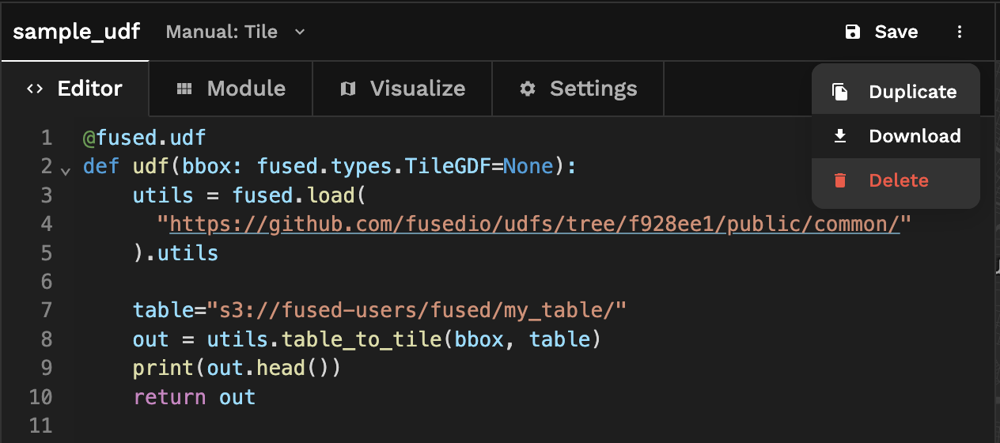

# Contribute to Fused 🍪 

## Overview

Fused welcomes your skills and enthusiasm in support of the geospatial community!

There are numerous opportunities to get involved, from contributing code to engaging the community on Discord, LinkedIn, and other social media platforms. 

## Where to start?

A good place to start is to acquaint yourself with Fused by reading this documentation site and joining the conversation in the [Fused Discord channel](https://bit.ly/fused-discord).

If you are brand new to Fused or open-source development, we recommend going through the [Fused UDFs GitHub](https://github.com/fusedio/udfs). There you'll be able to run sample UDFs in your local Python environment and familiarize yourself with how to write geospatial operations.

## Share a UDF with the community

Once you get acquainted, we encourage you to write a UDF and share it with the world by submitting a Pull Request into the repo. Publishing a UDF this way will allow others to reproduce and reuse your code, and even provide insight into improving it. 

When you contribute a UDF to the community, it will appear in the Fused UDF catalog. Your GitHub handle will be listed as the author and will link back to your GitHub profile.


:::info

Coming soon: A button to submit UDFs with one click from Fused Workbench. For now, follow the GitHub workflow below.

:::

Once you write a UDF, follow these steps to share it with the community.

### Publish a UDF to a GitHub repository

This section shows how to publish a UDF to a GitHub repository. The same workflow can be used to modify or delete UDFs, but instead performing the corresponding actions on step 3. 

To keep your code organized with a readable history, and make it easy for the community or your toam to see what you've done and why you did it, we recommend this workflow:

1. Create an account on GitHub if you do not already have one.

2. You will need your own fork to work on the code. Go to the [UDFs](https://github.com/fusedio/udfs) repo page and hit the Fork button near the top of the page. This creates a copy of the code under your account on the GitHub server.

3. Clone your fork to your machine:

```
git clone https://github.com/your-user-name/udfs.git
cd udfs
git remote add upstream https://github.com/fusedio/udfs.git
```

This creates the directory fused and connects your repository to the upstream (main project) udfs repository.

Follow the next steps to contribute a UDF to the Fused UDFs repository.

#### 1. Update the main branch

Before starting on new changes to your own UDF code, fetch all changes from upstream/main, and start a new feature branch from that. From time to time you should fetch the upstream changes from GitHub: 

```
git fetch upstream
git merge upstream/main
```

#### 2. Create a new feature branch

Create a branch to save your changes, even before you start making changes. You want your main branch to contain only production-ready code:

```
git checkout -b your-new-feature-branch
```

#### 3. Introduce a UDF to the repository

In the repository, create a directory with the UDF and its associated files.

To add a UDF that was created on Fused Workbench, click ["Download"](http://localhost:3000/workbench/udf-editor/#toolbar) to download the UDF `.zip` to a local directory, then unzip the file. Place the resulting directory in the repo. Each UDF should have its own directory.



#### 4. Commit and push your changes
Make intended modifications, commit the changes to your branch, and push the latest to your repo.

```
git add .
git commit -m"Create neat UDF"
git push origin your-new-feature-branch
```

#### 5. Open a Pull Request (PR)

[PRs](https://docs.github.com/en/pull-requests/collaborating-with-pull-requests/proposing-changes-to-your-work-with-pull-requests/about-pull-requests) are the mechanism to contribute to the Fused UDFs repo to share them with the world.

When you're ready to bring your UDF into the public repo, open a PR from your repo to the Fused repo so the Fused UDFs project maintainers can give feedback and oventually include your suggested UDF into the `main` branch. 

To open a pull request, click "New pull request" in the [Fused UDFs repo](https://github.com/fusedio/udfs/pulls), then click "compare across forks". Review the PR code looks like you intend and click submit. The Fused team will review to ensure the UDF runs successfully and reach out with next steps. Once the PR is approved, the UDF will be part of the community!


