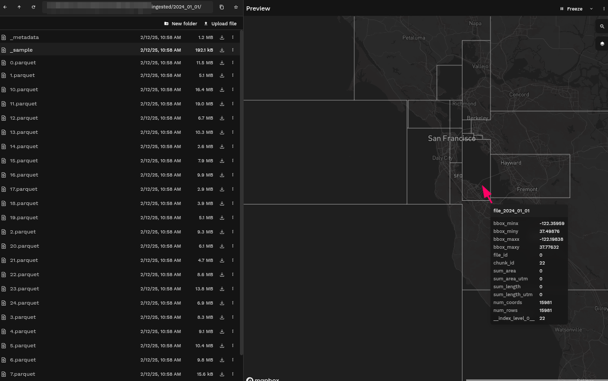
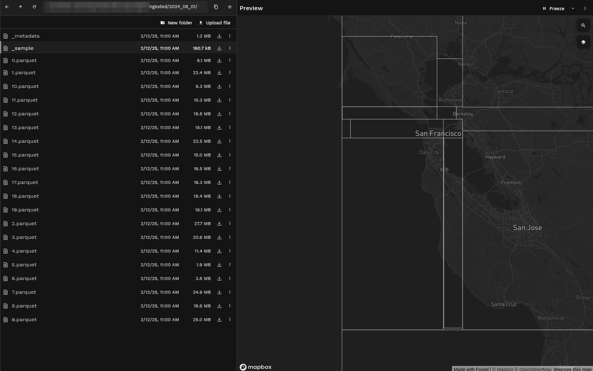
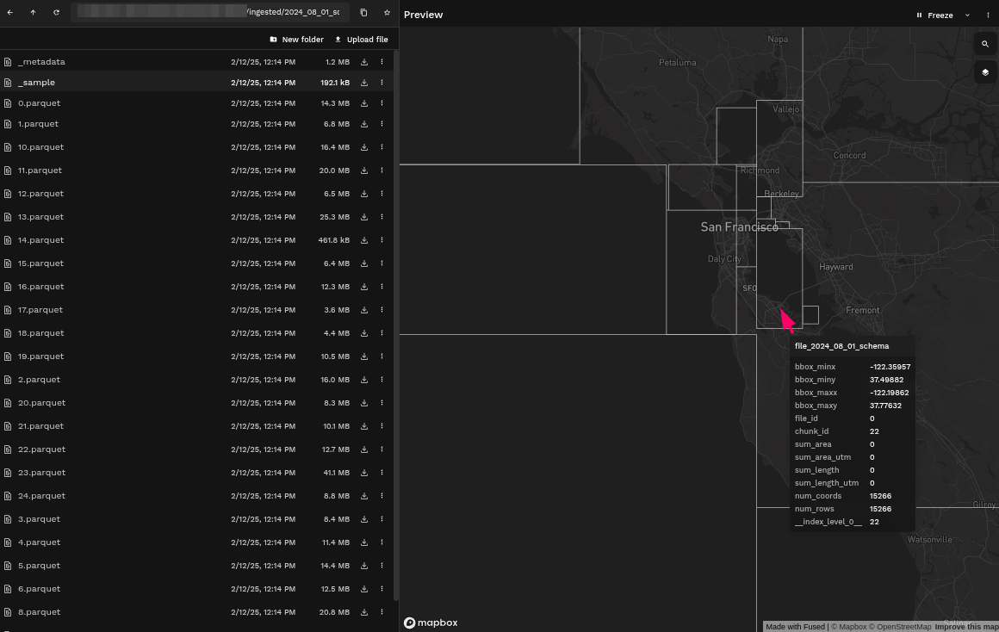

import LinkButtons from "@site/src/components/LinkButtons.jsx";
import CellOutput from "@site/src/components/CellOutput.jsx";
import {BokehFigure, PlotlyFigure} from "@site/src/components/Plotting.jsx";
import Tag from '@site/src/components/Tag'

_This guide explains how to use `fused.ingest` to geopartition and load vector tables into an S3 bucket so they can quickly be queried with Fused._

## Ingest geospatial table data

To run an ingestion job on vector data we need:
1. **Input data** - This is could be CSV files, a `.zip` containing shapely files or any other sort of non partitioned data
2. **A cloud directory** - This is where we will save our ingested data and later access it through UDFs

We've built our own ingestion pipeline at Fused that partitions data based on dataset size & location.
Our ingestion process:

1. Uploads the `input`
2. Creates geo-partitions of the input data

This is defined with [`fused.ingest()`](/python-sdk/top-level-functions/#fusedingest):

```python showLineNumbers
job = fused.ingest(
    input="https://www2.census.gov/geo/tiger/TIGER_RD18/LAYER/TRACT/tl_rd22_11_tract.zip",
    output=f"fd://census/dc_tract/",
)
```

Ingestion jobs often take more than a few seconds and require a lot of RAM (we open the whole dataset & re-partition it), which makes [this a large run](/core-concepts/run-udfs/run_large/#defining-large-jobs) so we're going to use `run_remote()` so our ingestion job can take as long as needed.

To start an ingestion job, call [`run_remote`](/python-sdk/top-level-functions/#jobrun_remote) on the job object returned by [`fused.ingest`](/python-sdk/top-level-functions/#fusedingest).

```python showLineNumbers
job_id = job.run_remote()
```

:::tip
    Refer to the [dedicated documentation page for `fused.ingest()`](/python-sdk/top-level-functions/#fusedingest) for more details on all the parameters
:::

{/* TODO: This is a tip on how to read ingested data, useful but should come after */}
Ingested tables can easily be read with the Fused utility function `table_to_tile`, which spatially filters the dataset and reads only the chunks within a specified polygon.

```python showLineNumbers
@fused.udf
def udf(bounds, table="s3://fused-asset/infra/building_msft_us/"):
    utils = fused.load("https://github.com/fusedio/udfs/tree/eda5aec/public/common/").utils
    return utils.table_to_tile(bounds, table)
```

The following sections cover common ingestion implementations. It's recommended to run ingestion jobs from a Python Notebook or [this web app](https://www.fused.io/workbench#app/s/i/fa_3sY9SPDK9sqyHoR8NYm14H).

### Ingest a table from a URL

Ingests a table from a URL and writes it to an S3 bucket specified with [`fd://`](/core-concepts/content-management/file-system/#fd-s3-bucket).

```python showLineNumbers
import fused

job_id = fused.ingest(
    input="https://www2.census.gov/geo/tiger/TIGER_RD18/LAYER/TRACT/tl_rd22_11_tract.zip",
    output=f"fd://census/dc_tract/",
).run_remote()
```

Get access to the logs:

```python showLineNumbers
job_id
```

:::info

If you encounter the message
`HTTPError: {'detail': 'Quota limit: Number of running instances'}`, please contact Fused to increase the number of workers in your account.

:::


### Ingest multiple files

```python showLineNumbers
import fused

job_id = fused.ingest(
    input=["s3://my-bucket/file1.parquet", "s3://my-bucket/file2.parquet"],
    output=f"fd://census/dc_tract",
).run_remote()
```

:::warning

To ingest multiple local files, first upload them to S3 with [fused.upload](/python-sdk/top-level-functions/#fusedupload) then specify an array of their S3 paths as the input to ingest.

:::

### Row-based ingestion

Standard ingestion is row-based, where the user sets the maximum number of rows per chunk and file.

Each resulting table has one or more _files_ and each file has one or more _chunks_, which are spatially partitioned. By default, ingestion does a best effort to create the number of files specified by `target_num_files` (default `20`), and the number of rows per file and chunk can be adjusted to meet this number.

```python showLineNumbers
job_id = fused.ingest(
    input="https://www2.census.gov/geo/tiger/TIGER_RD18/LAYER/TRACT/tl_rd22_11_tract.zip",
    explode_geometries=True,
    partitioning_method="rows",
    partitioning_maximum_per_file=100,
    partitioning_maximum_per_chunk=10,
).run_remote()
```

### Area-based ingestion

Fused also supports area-based ingestion, where the number of rows in each partition is
determined by the sum of their area.

```python showLineNumbers
job_id = fused.ingest(
    input="https://www2.census.gov/geo/tiger/TIGER_RD18/LAYER/TRACT/tl_rd22_11_tract.zip",
    output=f"fd://census/dc_tract_area",
    explode_geometries=True,
    partitioning_method="area",
    partitioning_maximum_per_file=None,
    partitioning_maximum_per_chunk=None,
).run_remote()
```

### Geometry subdivision

Subdivide geometries during ingestion. This keeps operations efficient when geometries have many vertices or span large areas.

```python showLineNumbers
job_id = fused.ingest(
    input="https://www2.census.gov/geo/tiger/TIGER_RD18/LAYER/TRACT/tl_rd22_11_tract.zip",
    output=f"fd://census/dc_tract_geometry",
    explode_geometries=True,
    partitioning_method="area",
    partitioning_maximum_per_file=None,
    partitioning_maximum_per_chunk=None,
    subdivide_start=0.001,
    subdivide_stop=0.0001,
    subdivide_method="area",
).run_remote()
```

### Ingest GeoDataFrame

Ingest a [GeoDataFrame](https://geopandas.org/en/stable/docs/reference/api/geopandas.GeoDataFrame.html) directly.

```python showLineNumbers
job_id = fused.ingest(
    input=gdf,
    output="s3://sample-bucket/file.parquet",
).run_remote()
```

### Ingest Shapefile

We recommend you `.zip` your shapefile and ingest it as a single file:

```python showLineNumbers
job_id = fused.ingest(
    input="s3://my_bucket/my_shapefile.zip",
    output="s3://sample-bucket/file.parquet",
).run_remote()
```

### Ingest non-geospatial: `ingest_nongeospatial`

Ingest a table that doesn't have a spatial component.

```python showLineNumbers
job_id = fused.ingest_nongeospatial(
    input=df,
    output="s3://sample-bucket/file.parquet",
).run_remote()
```

### Ingest with a predefined bounding box schema: `partitioning_schema_input`

Here is an example of an ingestion using an existing partition schema which comes from a previously ingested dataset. This assumes you've already ingested a previous dataset with [`fused.ingest()`](/python-sdk/top-level-functions/#fusedingest).
This may be useful if you are analyzing data across a time series and want to keep the bounding boxes consistent throughout your analysis.

```python showLineNumbers
@fused.udf
def read_ingested_parquet_udf(path: str = "s3://sample-bucket/ingested_data/first_set/"):
    import fused
    import pandas as pd

    # Built in fused method to reach the `_sample` file and return the bounding boxes of each parquet
    df = fused.get_chunks_metadata(path)

    # Since we want our `partitioning_schema_input` specified in `ingest()` to be a link to a parquet file containing bounds coordinates, we will save this metadata as a parquet file
    partition_schema_path = path + 'boxes.parquet'
    df.to_parquet(partition_schema_path)

    return partition_schema_path

partition_schema_path = fused.run(read_ingested_parquet_udf)

job_id = fused.ingest(
    input="s3://sample-bucket/file.parquet",
    output="s3://sample-bucket/ingested_data/second_set/",
    partitioning_schema_input=partition_schema_path
).run_remote()
```

import Tabs from '@theme/Tabs';
import TabItem from '@theme/TabItem';

<details>
  <summary>Example: Comparing bounding boxes from [ingested AIS](/use-cases/dark-vessel-detection/#3-ingesting-ais-data) data on different days </summary>

    <Tabs className="unique-tabs">
    <TabItem value="first-parquet" label="First Ingestion" default>
        
    </TabItem>
    <TabItem value="second-parquet" label="Second Ingestion" default>
        
    </TabItem>
    <TabItem value="second-parquet-schema" label="Second Ingestion with Defined Partition Schema" default>

        

        :::info
            Some of the bounding boxes have changed sizes because of the absence of data in certain areas.
        :::

    </TabItem>
    </Tabs>
</details>


{/*
TODO: Still need to show people how to read their ingested data
For now we're showing how to ingest, but not how to read ingested data
*/}


## Troubleshooting

As with other Fused batch jobs, ingestion jobs require server allocation for the account that initiates them. If you encounter the following error message, please contact the Fused team to request an increase.

```text
Error: `Quota limit: Number of running instances`
```
