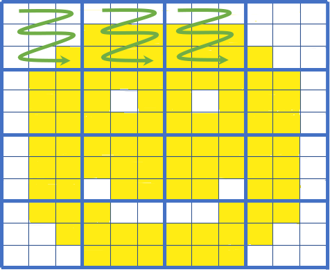

# File Formats

_This page specifies which File Formats for both raster & vector data we prefer working with at Fused, and why_

## What this page is about

Fused works with any file formats you might have, as all [UDFs](/core-concepts/write/) are running pure Python. This means you can use any file formats you want to process your data.
That being said the goal of Fused is to significantly speed up the workflow for data scientists, by leveraging modern cloud compute infrastructure and simplify it.

Some formats like Shapefile, CSV, JSON, while incredibly versatile, aren't the most appropriate for large datasets (even above a few Gb) and are slow to read / write (we consider anything above 10s of seconds to read to be extremely slow).

:::note
Take a look at [our benchmark](/core-concepts/data-ingestion/why-ingestion/#benchmark--demo) to see a comparison between loading a CSV, GeoParquet & Fused-partitioned GeoParquet to see a concrete example of this
:::

To make the most out of Fused, we recommend [ingesting your data](/core-concepts/data-ingestion/ingestion-your-data/) into the following file formats:

### For rasters (images): Cloud Optimized GeoTIFF

For images (like satellite images) we recommend using **Cloud Optimized GeoTIFFs** (COGs). To paraphrase [the Cloud Native Geo guide on them](https://guide.cloudnativegeo.org/cloud-optimized-geotiffs/intro.html):

> Cloud-Optimized GeoTIFF (COG), a raster format, is a variant of the TIFF image format that specifies a particular layout of internal data in the GeoTIFF specification to allow for optimized (subsetted or aggregated) access over a network for display or data reading

:::warning
    Fused does not (yet) have a build-in tool to ingest raster data. We suggest you create COGs yourself, for example by using `gdal`'s [built-in options](https://gdal.org/en/stable/drivers/raster/cog.html#examples) or [`rio-cogeo`](https://cogeotiff.github.io/rio-cogeo/)
    {/* TODO: Link to how to run CLI commands in Fused once we have this up and running */}
:::

Cloud Optimized GeoTIFFs have multiple different features making them particularly interesting for cloud native applications, namely:
- **Tiling**: Images are split into smaller tiles that can be individually accessed, making getting only parts of data a lot faster.
- **Overviews**: Pre-rendered images of lower zoom levels of images. This makes displaying images at different zoom levels a lot faster

_A simple visual of COG tiling: If we only need the top left part of the image we can fetch only those tiles (green arrows). Image courtesy of [Element 84's blog on COGs](https://element84.com/software-engineering/remote-sensing/cloud-optimized-geotiff-vs-the-meta-raster-format)_

- Element84 wrote a [simple explainer of what Cloud Optimized GeoTiffs are](https://element84.com/software-engineering/remote-sensing/cloud-optimized-geotiff-vs-the-meta-raster-format) with great visuals
- [Cloud Optimized Geotiff spec dedicated website](https://cogeo.org/)
- [Cloud Optimized Geotiff page on Cloud Native Geo guide](https://guide.cloudnativegeo.org/cloud-optimized-geotiffs/intro.html)

### For vectors (tables): GeoParquet

To handle vector data such as `pandas` `DataFrames` or `geopandas` `GeoDataFrames` we recommend using **[GeoParquet](https://github.com/opengeospatial/geoparquet)** files. To (once again) paraphrase the [Cloud Native Geo guide](https://guide.cloudnativegeo.org/geoparquet/):

> GeoParquet is an encoding for how to store geospatial vector data (point, lines, polygons) in Apache Parquet, a popular columnar storage format for tabular data.

_Image credit from the [Cloud Native Geo slideshow](https://guide.cloudnativegeo.org/overview.html#/geoparquet)_

:::tip
    Refer to the [next section](/core-concepts/data-ingestion/ingestion-your-data/) to see all the details of how to ingest your data with Fused's built-in `fused.ingest()` to make the most out of geoparquet
:::

- [`geoparquet` Github repo](https://github.com/opengeospatial/geoparquet)
- [`geoparquet` 1 page website](https://geoparquet.org/#intro) with a list of companies & projects involved
- [GeoParquet page on Cloud Native Geo guide](https://guide.cloudnativegeo.org/geoparquet/)

You can explore some of the uses of GeoParquet in some of our examples:
- [Ingesting](/examples/dark-vessel-detection/#34---ingest-1-month-of-ais-data-into-a-geo-partitioned-format) AIS point data from NOAA into GeoParquet format
- Explore the Overture Buildings dataset [in this public UDF](https://github.com/fusedio/udfs/tree/main/public/Overture_Maps_Example), which we repartitioned into GeoParquet. Read more [about how we're leveraging this](/blog/partnering-with-overture/) with the Overture Maps Foundation.

### Additional resources

- Read the [Cloud-Optimized Geospatial Formats Guide](https://guide.cloudnativegeo.org/) written by the [Cloud Native Geo Org](https://cloudnativegeo.org/) about why we need Cloud Native formats
- Friend of Fused Kyle Barron did an [interview about Cloud Native Geospatial Formats](https://cloudnativegeo.org/blog/2024/12/interview-with-kyle-barron-on-geoarrow-and-geoparquet-and-the-future-of-geospatial-data-analysis/). Kyle provides simple introductions to some cloud native formats like `GeoParquet`
