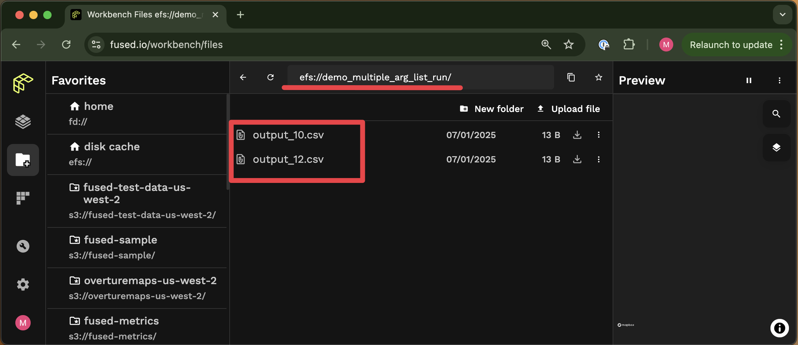
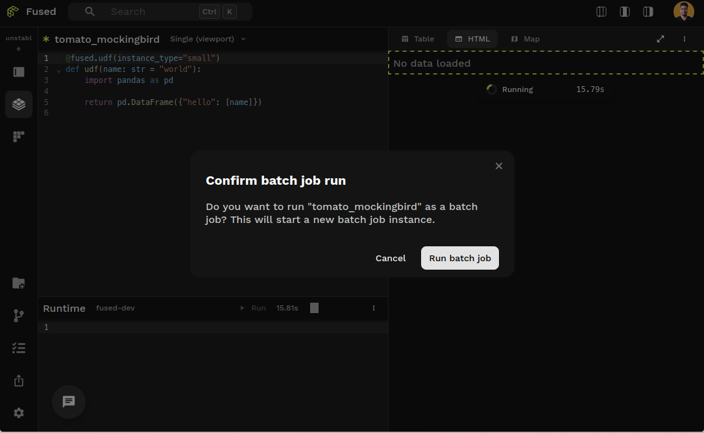
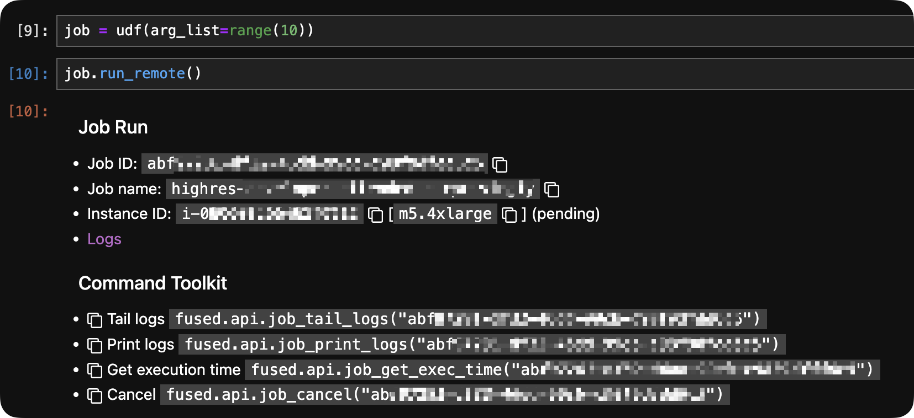
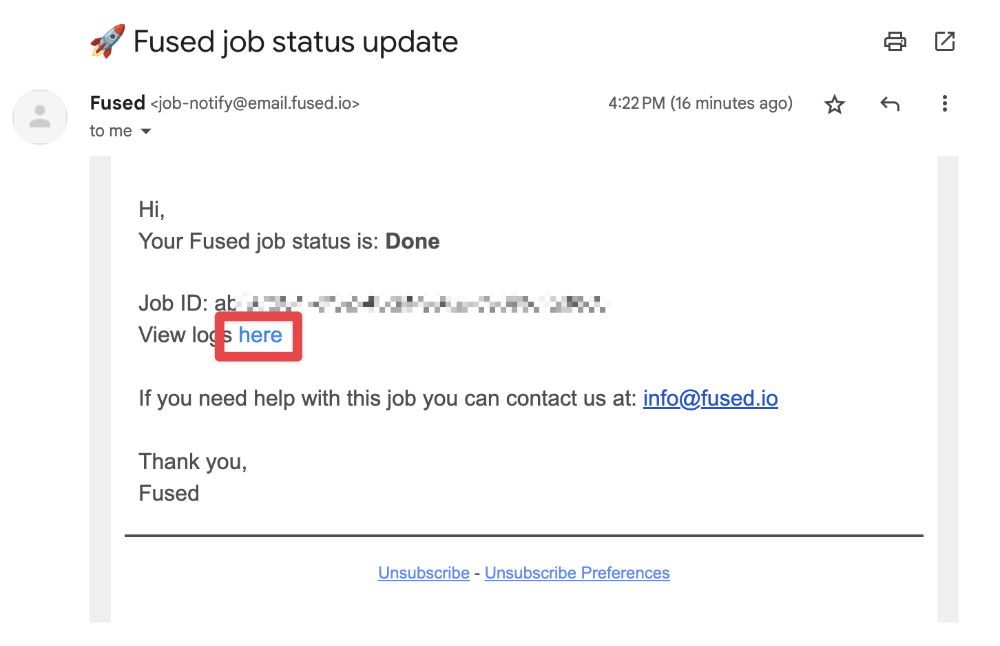

Some UDFs require more resources than a few Gb of RAM or take more than a few seconds to run. For these cases, you can run them as jobs instead.
{/* TODO: This should link to a "Best Practices" section about how big should the data processed by a single UDF be: 1 big job, or many UDF runs? */}

### Defining Batch Jobs

Batch jobs are for running UDFs that:
- Take longer than 120s to run
- Require large resources (more than a few Gb of RAM)
{/* TODO: Do these also include GPU instances with `run_batch`? */}

To run these we use higher-latency instances than regular UDF runs, but with the ability to specify RAM, CPU count & storage depending on the needs.

This is useful for example when running ingestion jobs which can require a lot of RAM & storage
{/* TODO: Link to ingestion page once we have it up */}

### A Simple UDF to demonstrate

We'll use the same UDF as in the [running multiple UDFs section](/core-concepts/run-udfs/run-small-udfs/#running-jobs-in-parallel-fusedsubmit):

```python showLineNumbers
@fused.udf
def udf(val):
    import pandas as pd
    return pd.DataFrame({'val':[val]})
```

As mentioned in the [Run UDFs section](/core-concepts/run-udfs/run-small-udfs/#fusedrun), to call it 1 time we can use `fused.run()`:

```python showLineNumbers
# Run this locally in notebook - not in Workbench (no need to do fused.run() in Workbench)
fused.run(udf, val=1)
```

{/* We then have 2 options to run this multiple times: */}


{/* ## Using "offline" instances (`run_batch()`)

_When to use: This is for high-latency (anything more than a few seconds) parallel processing of longer or more complex jobs_ */}


## Running `job.run_batch()` from notebook

Running a UDF as a job from a notebook is done in 2 steps:
1. Creating a job with the UDF to run and [passing input parameters](/core-concepts/run-udfs/run_large/#passing-udf-parameters-with-arg_list) to run the UDF over
2. Send the job to a remote instance and (optionally) [defining the instance arguments](/core-concepts/run-udfs/run_large/#run_batch-instance-arguments)

```python showLineNumbers
# Run this locally in notebook - not in Workbench
job = udf(arg_list=[0,1,2,3,4])
job.run_batch()
```

### Passing UDF parameters with `arg_list`

**Single Parameter**

As mentioned [above](/core-concepts/run-udfs/run_large/#running-a-job-jobrun_batch) to pass UDF arguments to a remote job, use `arg_list` to specify a `list` of inputs to run your job over:

```python showLineNumbers
# Run this locally in notebook - not in Workbench
job = udf(arg_list=[0,1,2,3,4])
job.run_batch()
```

**Multiple Parameters**

Currently `arg_list` only supports giving 1 input variables to each UDF. We can work around this by aggregating multiple variables into a `dict` and having a UDF take a `dict` as input:

```python showLineNumbers
@fused.udf
def udf(variables: dict = {'val1':1, 'val2':2}):
    import pandas as pd
    import fused

    # Retrieving each variables from the dictionary
    val1 = variables['val1']
    val2 = variables['val2']

    # Some simple boilerplate logic
    output_value = int(val1)*int(val2)
    df = pd.DataFrame(data={'output':[output_value]})

    # Saving output to shared file location to access results later
    # `/mnt/cache` is the shared file location for all UDF runs & jobs
    df.to_csv(f"/mnt/cache/demo_multiple_arg_list_run/output_{str(output_value)}.csv")

    return df
```

:::note
  You do need to type the input variable for this to work. If we had defined `variables` without typing it as a `dict`:
  ```python showLineNumbers
  @fused.udf
  def udf(variables = {}):
    # Notice the lack of `variables: dict = {}`
    ...
    return df
  ```
  our remote job run would have fail as Fused server has no way of knowing what to expect from `variables`
:::

We can then call this UDF as a remote job by passing a list of dictionaries to `arg_list`:
```python showLineNumbers
# Run this locally in notebook - not in Workbench
job = udf(arg_list=[{"val1": 5, "val2": 2}, {"val1": 3, "val2": 4}])
job.run_batch()
```

We can confirm this worked by viewing our results by browsing [File Explorer](/workbench/file-explorer/):



### `run_batch` instance arguments

{/* NOTE: Realized this is a bit of a repeat over dedicated section in Python SDK section: /python-sdk/top-level-functions/#jobrun_batch */}

With `job.run_batch()` you also have access to a few other arguments to make your remote job fit your needs:

- `instance_type`: Decide which type of machine to run your job on (see below for which ones we support)
- `disk_size_gb`: The amount of disk space in Gb allocated to your instance (between `16` and `999` Gb)

For example if you want a job with 16 vCPUs, 64Gb of RAM and 100Gb of storage you can call:
```python showLineNumbers
# Run this locally in notebook - not in Workbench
job.run_batch(instance_type="m5.4xlarge", disk_size_gb=100)
```

<details>
  <summary>Currently supported `instance_type`</summary>

  Fused `run_batch()` `instance_type` are based around [AWS General Purpose instance types](https://aws.amazon.com/ec2/instance-types/). We do support the following:

  ```python showLineNumbers
  supported_instance_types = [
    "m5.large",
    "m5.xlarge",
    "m5.2xlarge",
    "m5.4xlarge",
    "m5.8xlarge",
    "m5.12xlarge",
    "m5.16xlarge",
    "r5.large",
    "r5.xlarge",
    "r5.2xlarge",
    "r5.4xlarge",
    "r5.8xlarge",
    "r5.12xlarge",
    "r5.16xlarge",
  ]
  ```

</details>


## Running a job from workbench

To run a job from workbench, you can simply add an instance type parameter to the [UDF decorator](/python-sdk/top-level-functions/#fusedudf) and run the UDF as usual from the udf builder page.



:::note
  UDFs with `instance_type` paramter will not be run automatically as other UDFs. You will need to manually run them with `Shift+Enter` and a confirmation modal.
:::


## Accessing job logs

While your job is running you can access monitor & manage it with the following:

```python showLineNumbers
# Run this locally in notebook - not in Workbench

# View the job status
job.status

# Follow the job logs
job.tail_logs()

# Get the job logs
job.print_logs()

# Cancel the job
job.cancel()
```

These logs can also be accessed:

import ReactPlayer from 'react-player';

<details>
  <summary>In a notebook</summary>

    Running `job.run_batch()` in a notebook gives you a clickable link:

    

</details>

<details>
  <summary>In Fused Workbench</summary>

    Under the "Jobs" tab, on the bottom left of Workbench:

    <ReactPlayer className="video__player" playing={false} muted={true} controls height="100%" url="https://fused-magic.s3.us-west-2.amazonaws.com/workbench-walkthrough-videos/docs_rewrite/run-remote-job-logs_edit2.mp4" width="100%" />

</details>

<details>
  <summary>By email (you'll receive 1 email for each job)</summary>

    Each job leads to an email summary with logs upon completion:

    

</details>


## Getting results

To get data back from your `run_batch()` jobs is a bit more complicated than for ["regular UDF runs"](/core-concepts/run-udfs/run-small-udfs/#real-time-logs). Our recommendation is to have your UDF write data directly to shared storage `/mount/` or cloud storage and access it after

<details>
  <summary>Example job: saving to shared storage `/mount/`</summary>

    A common use case for offline jobs is as a "pre-ingestion" process. You can find a real-life example of this in our [dark vessel detection example](/tutorials/Geospatial%20with%20Fused/use-cases/dark-vessel-detection/#32---writing-a-udf-to-open-each-ais-dataset)

    Here all we're returning is a status information in a pandas dataframe, but the our data in unzipped, read and saved to S3:

    ```python showLineNumbers
    import fused

    @fused.udf()
    def read_ais_from_noaa_udf(datestr='2023_03_29'):
        import os
        import requests
        import io
        import zipfile
        import pandas as pd

        url=f'https://coast.noaa.gov/htdata/CMSP/AISDataHandler/{datestr[:4]}/AIS_{datestr}.zip'
        # This is our local mount file path,
        path=f'/mount/AIS_demo/{datestr[:7]}/'
        daily_ais_parquet = f'{path}/{datestr[-2:]}.parquet'

        # Download ZIP file to mounted disk
        r=requests.get(url)
        if r.status_code == 200:
            with zipfile.ZipFile(io.BytesIO(r.content), 'r') as z:
                with z.open(f'AIS_{datestr}.csv') as f:
                    df = pd.read_csv(f)

                    # highlight-next-line
                    df.to_parquet(daily_ais_parquet)
            return pd.DataFrame({'status':['Done']})
        else:
            return pd.DataFrame({'status':[f'read_error_{r.status_code}']})
    ```

    Data written to `/mount/` can be accessed by any other instance used by anyone on your team so it can be used by any other UDF you run after.

    :::tip
      You can use [File Explorer](/workbench/file-explorer/) to easily see your outputs! In this case of the above example typing `efs://AIS_{datestr}.csv` (and replacing `datestr` with your date) will show the results directly in File Explorer!
    :::

</details>

{/* TODO: Need example here */}
{/* TODO: Show output on File Explorer */}


### Jobs trade-offs

- Takes a few seconds to startup machine
- Can run as long as needed

## Example use cases

You can explore examples of how we're using `run_batch()` in some of our other examples:
- [Scaling an ingestion job](/tutorials/Geospatial%20with%20Fused/use-cases/dark-vessel-detection/#34---ingest-1-month-of-ais-data-into-a-geo-partitioned-format) of AIS point data
- [Ingesting a large amount of cropland data](/tutorials/Geospatial%20with%20Fused/use-cases/zonal-stats/#2-bring-in-your-data) for zonal statistics.