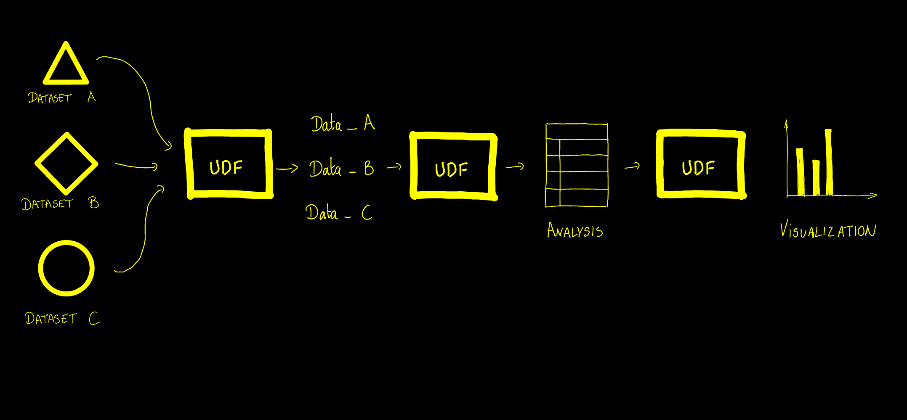

At Fused, our mission is to help get things done, fast. We want every team to be able to get from **Analytics to Action** as quickly as they can. 

## Our core believes

We believe every Analytics team should have the tools to:
- 🌍 Answer the big picture problems first;
- 💡 Iterate on their analysis when new data & algorithms becomes available;
- 🏃 Ship a first version rather than getting it perfect;
- 📊 Visualize & report their work to anyone in their team.

## User Defined Functions

A lot of the tools Analytics teams have today slow the process down:
- Python dependency management gets in the way of getting work done.
- A lot of the scientific Python tooling focused more on getting the result down to 10 decimals places rather than answering the big picture

That's why we built Fused around [User Defined Functions, UDFs](/core-concepts/write/). 

UDFs are the DNA of analytics. They are Python functions that can be called from anywhere:
- 🐍 No environment setup: Just start writing Python immediately.
- 🔗 Shareable as [HTTPS endpoints](/core-concepts/run-udfs/run-small-udfs/) in 2 clicks: Ship your work to the rest of the team
- 🔄 Iterable: Edit your code, Save, and see the results downstream immediately.
- 🚀 Scales with your hardware requirements: From running a subset of data to analyzing the entire world.

## UDFs are the DNA of analytics

Making every process of your Analytics a UDF makes it faster:

- **Data needs to be ingested constantly**: UDFs can be edited as datasets change & evolve. They get updated when you save them. 
- **New algorithms come and go**: UDFs allow you to iterate on existing data and swap out just what you need.
- **Reporting & Visualization evolve**: UDFs can take your analysis and render it in dynamic ways.

## From your laptop to the World

Look, we know that many Analytics project start in a notebook on a laptop. 

- 💻 Start by running UDFs locally, then in 2 lines of code scale to datasets the size of the world
- 🌍 UDFs can be called from anywhere: From a notebook, a [frontend application](/tutorials/Geospatial%20with%20Fused/other-integrations/#deckgl) or integration platforms
- 🔀 Work locally or in [Workbench](/workbench/), our browser based IDE interchangeably  

## Efficiently Scaling

Because Fused is built 
- ☁️ [Serverless computing](/core-concepts/run-udfs/): Only pay for the processing you actually use
- ⚡️ [Caching](/core-concepts/cache/) makes recurring calls faster & cheaper

## Get started using UDFs right now

Check out:
- ⚡️ The [Quickstart guide](/quickstart): Learn how to use UDFs in 5 minutes
- 📚 UDF [Core Concepts](/core-concepts/): Everything you need to know about building & using UDFs
- 🎓 Our [Examples](/tutorials/Geospatial%20with%20Fused/geospatial-use-cases/): Real world examples of how to use UDFs
{/* - 🚀 Our [Pricing](https://fused.ai/pricing): See how much it costs to use Fused */}