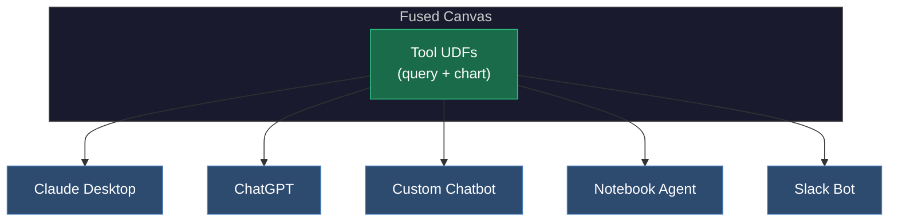

This example shows how to turn Fused UDF pipelines into agentic workflows: ask questions over massive datasets while compute stays behind the scenes and agents see only the scoped outputs needed to query, compare, and visualize results.

[](https://unstable.fused.io/canvas/fc_1OKBYKbEo1nab5A4aE2ezb?bounds=4640%2C-804%2C10148%2C2903)

Overture Maps ships frequent global building-footprint releases, but the data is huge: multiple gigabytes of geometry per release, far too much for anyone to manually diff across versions. With agentic workflows, we can flip the approach: instead of building one-off analyses for every question about data quality, expose the dataset to an agent that can query, compare, and visualize changes across releases on demand.

The key is to give the agent scoped analytics: structured summaries and interactive widgets that are easy to parse and render, while the heavy geometry and compute stay behind the scenes. By packaging these analytics as bounded MCP tools, the agent does the analytical lifting and humans stay in the loop through shareable visualizations.

This example will help you:

- Scope UDFs as agent-friendly MCP tools with clear parameters and bounded outputs
- Join together multiple UDFs, turning a [Fused Canvas](https://docs.fused.io/workbench/udf-builder/canvas) into an MCP server
- Build a shareable chatbot that answers analytical questions with interactive widgets

## Getting Data

We compare two data sources across Philadelphia:

- **Philadelphia's official building footprints** — the city's authoritative layer, served from [Philadelphia's ArcGIS Feature Server](https://services.arcgis.com/fLeGjb7u4uXqeF9q/arcgis/rest/services/LI_BUILDING_FOOTPRINTS/FeatureServer/0/query): polygons with height, address, and name.
- **[Overture Maps Foundation building footprints](https://docs.overturemaps.org/guides/buildings/#14/32.58453/-117.05154/0/60)** — the open dataset maintained by the Overture Maps Foundation. We pull data from 7 releases (December 2024 through February 2026) to track how the dataset evolves. This builds on our earlier work [Partnering with Overture](https://docs.fused.io/blog/partnering-with-overture/). Each release contains millions of building polygons globally, so we filter down to the same Philadelphia bounding boxes.

To measure how well Overture buildings match the city's ground truth, we compute Intersection over Union (IoU):

```
IoU = area(intersection) / area(union)
```

The logic is simple: for each Philadelphia building, we find its best-matching Overture building via polygon overlay, compute the intersection area, and derive IoU. A perfect overlap gives IoU = 1.0; no overlap gives 0.0.


For this demo, to show how to build an agentic workflow in Fused, we focus on nine representative Philadelphia neighborhoods and compare each Overture release against the city's official building-footprint layer. This provides a consistent way to evaluate quality across both neighborhoods and releases.

<iframe
  src="https://unstable.udf.ai/fc_1OKBYKbEo1nab5A4aE2ezb/philly_locations_map.html"
  width="100%"
  height="500px"
  style={{border: 'none'}}
  title="Nine Philadelphia neighborhood locations for analysis"
/>

We build the pipeline as a chain of UDFs, where each step does one job and passes its result downstream.

We'll leverage a few benefits of Fused for this:

- [Parallel processing](https://docs.fused.io/guide/working-with-udfs/udf-best-practices/scaling-out): Fused scales UDF execution horizontally, it runs the same function across many inputs at once (for example, one worker per release and one per neighborhood).
- [Efficient caching](https://docs.fused.io/guide/working-with-udfs/udf-best-practices/caching/): If the agent calls the same location again, the results will be cached and thus served faster.

We compute IoU for each Philadelphia building against its best Overture match, run that across 7 releases and 9 neighborhoods in parallel, and collapse the result into a compact summary table that can later be exposed to agents as tools.

## UDFs as Composable Building Blocks for Agents

Since each UDF is a [standalone Python function with a stable HTTPS endpoint](https://docs.fused.io/guide/working-with-udfs/writing-udfs), it can be exposed as an LLM tool. But, the goal is to make UDFs agent-callable without overwhelming the context window. Fused can process large datasets (multi-GB geometry, millions of rows) inside UDFs, but it rarely makes sense to pass those raw intermediates back to an agent.

Instead, we scope tools: create downstream "tool UDFs" that call upstream pipeline UDFs, but return only the small, bounded result needed for a specific question or visualization. Internal pipeline UDFs handle the heavy lifting so the raw geometry never has to be passed to an agent directly.

**Why "small outputs" matter:**

- LLMs work best when tool responses are compact and structured.
- Large payloads quickly consume LLM context and slow down tool calling.
- Practical rule of thumb: keep tool outputs to a few MB at most (and ideally far smaller), returning summaries, aggregates, IDs, and links instead of raw features.

**Size and shape guidelines for agent-facing UDFs:**

- Return tables with tens to hundreds of rows, not millions.
- Prefer aggregations (by neighborhood, release, metric) over raw geometries.
- If geometry is required, return small samples or pre-rendered artifacts (tiles, images, widgets) rather than full feature collections.
- Make responses deterministic and bounded: clear limits, pagination, and explicit max rows / max bytes.

Pipeline UDFs remain internal; agent-facing tool UDFs act as the safe, small, stable interface.


## Exposing Results to Agents

The final agent can then have access to:

- **Query / summary tools:** Runs a structured query over the precomputed summary table (filter, group, sort, limit) and returns a bounded result. Used for questions like "which release improved most?" and "rank neighborhoods by match rate."
- **Widget tools:** Return interactive charts/maps the agent can embed and share, instead of streaming raw data.
- **Inspect tool:** Returns a one-row schema summary (row count, column count, column names) for quick validation.


Fused Canvas then exposes all of these UDFs through an MCP Server that can be easily passed to any Agent / LLM. Each UDF has a short description explaining what it does, which parameters it takes and what it returns:

```json
{
    "udf_name": "query_release_summary",
    "link": "https://udf.ai/<canvas_id>/<udf-name>/run",
    "description": "Query the Overture release summary data for Philadelphia neighborhoods across Overture releases using DuckDB SQL. The data is aliased as table 't'.",
    "parameters": {
        "bounds_map": "str"
    }
}
```

The Fused Canvas itself becomes a shared MCP server, a single source of truth for data tools that any agent can call.



These tools can be called from any client.

This is the agentic development workflow: data engineers write UDFs that shrink the world, and every team — from analysts to product managers — asks questions through whatever interface they prefer. The answers are always interactive, always current, and always shareable.

## Connecting MCP Server to AI

We can now connect our MCP server to any chatbot. The below images show us asking questions regarding our Overture building data set for all the releases. It fetches and processes the data and then gives us the answer. [Try it out](https://unstable.udf.ai/fc_1OKBYKbEo1nab5A4aE2ezb/ai_chat.html)


If you're logged in to Fused, you can now connect your Canvas MCP server to external agents like Claude Code, ChatGPT, or your own custom AI frontend. Just point your client at the Canvas MCP endpoint, authenticate, and the agent will be able to discover and call the same scoped tools (query, inspect, and widget UDFs) to answer questions and render shareable outputs.
