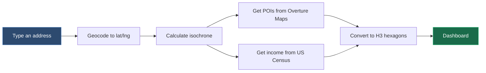

This example builds an interactive site selection dashboard that answers: **"What amenities and income levels surround a given address within a certain travel time?"**

We'll chain together multiple UDFs on a [Canvas](/workbench/udf-builder/canvas) to geocode an address, compute a travel-time boundary (isochrone), pull Points of Interest from [Overture Maps](https://overturemaps.org/) and median income from the [US Census](https://www.census.gov/programs-surveys/acs), aggregate everything into H3 hexagons, and display the results on a map with interactive [Widgets](/guide/data-input-outputs/import-connection/widgets).

[](https://www.fused.io/canvas/fc_fused/Dashboard_Overture_Census_Isochrone)

*Interactive dashboard showing POI density, isochrones, and income distribution for San Francisco. [Try it out](https://www.fused.io/canvas/fc_fused/Dashboard_Overture_Census_Isochrone) ->*

## How to run

Open the [Canvas](https://www.fused.io/canvas/fc_fused/Dashboard_Overture_Census_Isochrone), fill in the **Travel Settings** form (address, travel mode, POI category, travel time), and click **Submit**. The dashboard re-runs and shows a map with hexagons colored by POI density, the isochrone boundary, and the geocoded location for the address you entered, along with a bar chart of income distribution across the area.

## What we're building

The dashboard chains multiple UDFs together using [`fused.load()`](/python-sdk/api-reference/fused-load) — geocoding an address, computing an [isochrone](https://valhalla.github.io/valhalla/api/isochrone/api-reference/) (travel-time boundary), querying [Overture Maps](https://docs.overturemaps.org/) POIs, pulling [Census ACS](https://www.census.gov/programs-surveys/acs) income data, and aggregating everything into [H3 hexagons](/guide/h3-analytics/h3-overview) for visualization.



:::info Why H3 hexagons?
We convert POIs, census polygons, and the isochrone into [H3 hexagons](/guide/h3-analytics/h3-overview) so that every cell covers the same area, making counts and averages directly comparable across the map.
:::

### What is an isochrone?

An isochrone is a polygon that represents all the area reachable from a point within a given travel time. A 15-minute driving isochrone around a store shows everywhere a customer could drive from in 15 minutes. Different travel modes (walking, cycling, driving) produce very different shapes — walking isochrones are small and roughly circular, while driving ones stretch along highways.

We use the open-source [Valhalla routing engine](https://valhalla.github.io/valhalla/api/isochrone/api-reference/) to compute these.

## Step 1: Get the Area of Interest

We first define the area of interest to geocode the address to get coordinates, then compute an isochrone around that point.

### Geocode the address

The `geocode_point` UDF takes a plain-text address and returns a point geometry using [Nominatim](https://nominatim.openstreetmap.org/), the geocoder behind OpenStreetMap.

<details>
<summary>geocode_point UDF</summary>

```python showLineNumbers
@fused.udf
def udf(manual_address: str = "401 Haltom Rd, Fort Worth, TX 76117, USA"):  # Change this to any address
    import pandas as pd
    import geopandas as gpd
    from geopy.geocoders import Nominatim
    from shapely.geometry import Point

    geolocator = Nominatim(user_agent="fused_geocoding_udf")
    result = geolocator.geocode(manual_address)

    if result:
        df = pd.DataFrame({
            'location': [manual_address],
            'lat': [result.latitude],
            'lng': [result.longitude],
            'address': [result.address]
        })
        gdf = gpd.GeoDataFrame(
            df,
            geometry=[Point(result.longitude, result.latitude)],
            crs="EPSG:4326"
        )
        return gdf
```

</details>

The `manual_address` parameter will be wired to the form widget later — the user types an address and this UDF resolves it to coordinates.

### Calculate the isochrone

The `isochrone_chosen_site_overture` UDF chains the geocoder with the Valhalla isochrone API. It loads the geocode UDF with [`fused.load()`](/python-sdk/api-reference/fused-load), extracts the lat/lng, and passes them to `latlng_isochrone_simplified`:

<details>
<summary>isochrone_chosen_site_overture UDF</summary>

```python showLineNumbers
@fused.udf
def udf(
    manual_address: str = 'Manhattan, New York, NY',
    time_steps: str = '15',  # Travel time in minutes
    costing: str = 'truck',  # Travel mode: pedestrian, bicycle, auto
):
    # Load and run the geocode UDF to get coordinates
    geocode_udf = fused.load("geocode_point")
    geocoded = geocode_udf(manual_address=manual_address, engine='local')
    lat = geocoded.lat.values[0]
    lng = geocoded.lng.values[0]

    # Pass coordinates to the Valhalla isochrone UDF
    isochrone_udf = fused.load('latlng_isochrone_simplified')
    gdf = isochrone_udf(lat=lat, lng=lng, costing=costing, time_steps=time_steps)
    return gdf
```

</details>

Under the hood, `latlng_isochrone_simplified` calls the [Valhalla public API](https://valhalla.github.io/valhalla/api/isochrone/api-reference/) and returns the isochrone as a GeoDataFrame.

<details>
<summary>latlng_isochrone_simplified UDF</summary>

```python showLineNumbers
@fused.udf
def udf(
    lat: float = 34.0522,
    lng: float = -118.2437,
    costing: str = "bicycle",
    time_steps: str = "15",
):
    import geopandas as gpd
    import pandas as pd
    import requests

    steps = [int(t.strip()) for t in time_steps.split(",")]

    @fused.cache
    def _get_isochrone(lat, lng, costing, time_steps_tuple):
        url = "https://valhalla1.openstreetmap.de/isochrone"
        params = {
            "locations": [{"lon": lng, "lat": lat}],
            "contours": [{"time": t} for t in list(time_steps_tuple)],
            "costing": costing,
            "polygons": 1,
        }
        response = requests.post(url, json=params)
        response.raise_for_status()
        return gpd.GeoDataFrame.from_features(response.json())

    gdf = _get_isochrone(lat, lng, costing, tuple(steps))
    gdf["contour_minutes"] = gdf["contour"].astype(int)
    return gdf
```

</details>

## Step 2: Load data in the Area of Interest

With the isochrone defined, we pull two datasets into that boundary.

### Points of Interest from Overture Maps

[Overture Maps](https://overturemaps.org/) is an open dataset of millions of POIs globally (restaurants, cafes, schools, parks, etc.) stored as Parquet files on S3. The `query_overture_pois` UDF:
- Gets the isochrone bounding box
- Queries Overture tiles within that area
- Filters by POI category

<details>
<summary>query_overture_pois UDF</summary>

```python showLineNumbers
@fused.udf
def udf(
    manual_address: str = 'Manhattan, New York, NY',
    poi_category: str = "cafe",  # Change to: restaurant, grocery, school, park, etc.
    time_steps: str = '5',
    costing: str = 'pedestrian',
    overture_release: str = "2026-02-18-0",  # Overture Maps release version
):
    # Get the isochrone boundary to determine the search area
    parent_udf = fused.load('isochrone_chosen_site_overture')
    result = parent_udf(
        time_steps=time_steps,
        costing=costing,
        manual_address=manual_address,
    )

    # Query Overture Maps POIs within the isochrone bounding box
    overture_udf = fused.load("Overture_Maps_Example")
    gdf = overture_udf(
        bounds=list(result.total_bounds),
        release=overture_release,
        theme="places",
    )

    # Filter by selected POI category
    if gdf is not None and poi_category != "all":
        if "categories" in gdf.columns:
            gdf = gdf[gdf["categories"].apply(
                lambda x: poi_category in str(x).lower() if x is not None else False
            )]

    return gdf
```

</details>

### Median income from Census

Income data comes from the [American Community Survey (ACS) 5-Year Estimates](https://www.census.gov/programs-surveys/acs) at the block group level. The `iso_census_intersect` UDF:
- Loads Census ACS block groups covering the isochrone extent via a [community UDF](https://github.com/fusedio/udfs)
- Clips them to the isochrone boundary with `gpd.overlay`

<details>
<summary>iso_census_intersect UDF</summary>

```python showLineNumbers
@fused.udf
def udf(
    manual_address: str = 'Manhattan, New York, NY',
    costing: str = "auto",
    time_steps: str = "15",
    census_variable: str = "Median Household Income in the Past 12 Months (in 2022 Inflation-Adjusted Dollars)",  # Swap for any ACS variable
    year: int = 2022,
):
    import geopandas as gpd

    # Get the isochrone boundary
    iso_udf = fused.load("isochrone_chosen_site_overture")
    df_iso = iso_udf(manual_address=manual_address, costing=costing, time_steps=time_steps)

    # Load Census ACS block groups from a community UDF
    acs = fused.load("https://github.com/fusedio/udfs/tree/c9bc8a2/community/sina/Census_ACS_5yr/")
    df_acs = acs(bounds=df_iso.total_bounds, year=year, census_variable=census_variable)

    df_acs["orig_area"] = df_acs.geometry.area

    # Clip census block groups to the isochrone boundary
    iso_union = df_iso.dissolve().geometry.values[0]
    iso_gdf = gpd.GeoDataFrame(geometry=[iso_union], crs=df_iso.crs)
    result = gpd.overlay(df_acs, iso_gdf, how="intersection")
    return result
```

</details>

## Step 3: Convert everything to H3 hexagons

We now have three layers with different geometries: an isochrone polygon, POI points, and census block group polygons. To combine them, we convert each to [H3 hexagons](/guide/h3-analytics/converting) at resolution 9 (~174m edge length, ~0.1 km2 per hex) — fine enough to show neighborhood-level variation while keeping the total cell count manageable for a city-scale isochrone.

### Isochrone to hex

Converts the isochrone polygon into a set of H3 hex cell IDs using `gdf_to_hex` from the Fused [common utilities](https://github.com/fusedio/udfs/tree/main/public/common). These hex IDs become the base layer that POI and income data are joined onto.

<details>
<summary>isochrone_to_hex_overture UDF</summary>

```python showLineNumbers
@fused.udf
def udf(manual_address: str = 'Manhattan, New York, NY', time_steps: str = '15', costing: str = 'truck'):
    import geopandas as gpd

    common = fused.load("https://github.com/fusedio/udfs/tree/507b2a3/public/common/")

    parent_udf = fused.load('isochrone_chosen_site_overture')
    result = parent_udf(time_steps=time_steps, costing=costing, manual_address=manual_address)

    gdf = common.gdf_to_hex(result[['geometry', 'contour']], res=9)
    gdf = gdf[['hex']].drop_duplicates()
    return gdf
```

</details>

### POIs to hex

Aggregates POI point locations into hex cells with a count per cell using [DuckDB's H3 extension](/guide/h3-analytics/converting):

<details>
<summary>pois_to_hex UDF</summary>

```python showLineNumbers
@fused.udf
def udf(hex_res: int = 9, poi_category: str = "cafe", manual_address: str = "Manhattan, New York, NY",
        time_steps: str = "10", costing: str = "pedestrian", overture_release: str = "2026-02-18-0"):
    common = fused.load("https://github.com/fusedio/udfs/tree/9bad664/public/common/")
    con = common.duckdb_connect()

    query_pois = fused.load("query_overture_pois")
    gdf = query_pois(manual_address=manual_address, poi_category=poi_category,
                     time_steps=time_steps, costing=costing, overture_release=overture_release, preview=False, engine='local')

    gdf['lat'] = gdf.geometry.y
    gdf['lon'] = gdf.geometry.x
    df_simple = gdf[['lat', 'lon']].copy()

    result = con.sql(f"""
        SELECT h3_latlng_to_cell(lat, lon, {hex_res}) as hex, COUNT(*) as count_pois
        FROM df_simple
        GROUP BY hex
        ORDER BY count_pois DESC
    """).df()
    return result
```

</details>

### Census income to hex

Uses `gdf_to_hex` from the Fused [common utilities](https://github.com/fusedio/udfs/tree/main/public/common) to convert census polygons into hexagons, weighting the income value by area overlap:

<details>
<summary>iso_census_to_hex UDF</summary>

```python showLineNumbers
@fused.udf
def udf(manual_address: str = 'Manhattan, New York, NY', costing: str = 'auto', time_steps: str = '15',
        census_variable: str = 'Median Household Income in the Past 12 Months (in 2022 Inflation-Adjusted Dollars)',
        year: int = 2022):
    parent_udf = fused.load('iso_census_intersect')
    result = parent_udf(manual_address=manual_address, costing=costing, time_steps=time_steps,
                        census_variable=census_variable, year=year, engine='local')

    del result["GEOID"]

    common = fused.load("https://github.com/fusedio/udfs/tree/507b2a3/public/common/")
    hex_gdf = common.gdf_to_hex(result, res=9)
    hex_gdf.rename(columns={'metric': 'median_income_12_months'}, inplace=True)
    hex_gdf = hex_gdf[hex_gdf['median_income_12_months'] >= 0]
    return hex_gdf[['hex', 'median_income_12_months']]
```

</details>

Read more about polygon-to-hex conversion in the [H3 Converting guide](/guide/h3-analytics/converting) and aggregation strategies in [H3 Aggregations](/guide/h3-analytics/aggregations).

## Step 4: Merge and visualize

### Merge all hex layers

The `merge_poi_census_data` UDF joins the three hex layers — isochrone boundary, POI counts, and census income — on the hex ID using DuckDB:

<details>
<summary>merge_poi_census_data UDF</summary>

```python showLineNumbers
@fused.udf
def udf(manual_address: str = "Manhattan, NY", poi_category: str = "cafe",
        time_steps: str = "5", costing: str = "pedestrian", overture_release: str = "2026-02-18-0"):
    common = fused.load("https://github.com/fusedio/udfs/tree/507b2a3/public/common/")
    con = common.duckdb_connect()

    isochrone_hex_df = fused.load("isochrone_to_hex_overture")(
        manual_address=manual_address, time_steps=time_steps, costing=costing)
    poi_df = fused.load("pois_to_hex")(
        manual_address=manual_address, poi_category=poi_category,
        time_steps=time_steps, costing=costing, overture_release=overture_release)
    census_df = fused.load("iso_census_to_hex")(
        manual_address=manual_address, costing=costing, time_steps=time_steps)

    merged_df = con.sql("""
        WITH poi_dedup AS (
            SELECT hex, SUM(count_pois) AS count_pois FROM poi_df GROUP BY hex
        ),
        census_dedup AS (
            SELECT hex, AVG(median_income_12_months) AS median_income_12_months FROM census_df GROUP BY hex
        )
        SELECT i.hex, p.count_pois, c.median_income_12_months
        FROM isochrone_hex_df i
        LEFT JOIN poi_dedup p ON i.hex = p.hex
        LEFT JOIN census_dedup c ON i.hex = c.hex
    """).df()
    return merged_df
```

</details>

### Building the dashboard with Widgets

The dashboard uses [Widgets](/guide/data-input-outputs/import-connection/widgets) to connect user input to UDF outputs. The **form widget** acts as an input — its `param` fields [broadcast values to UDFs on the canvas](/guide/data-input-outputs/import-connection/widgets#step-2-connect-it-to-a-udf). The **big-number** and **bar-chart** widgets are outputs that query UDF results via SQL. The map is a regular UDF (`selected_poi_map`) that renders deck.gl layers as HTML.

### Wiring widgets to UDFs

For the dashboard to re-run correctly when you click **Submit**, each node on the Canvas needs to be connected to the right upstream nodes via edges:

- The **form widget** must be connected to all data UDFs and output widgets so its parameter values propagate downstream
- Each **data UDF** must be connected to the UDF it depends on (e.g. `pois_to_hex` connects to `query_overture_pois`, which connects to `isochrone_chosen_site_overture`)
- Each **output widget** (big-number, bar-chart) must be connected to the data UDF it queries

If a widget or UDF isn't connected, it won't re-run when inputs change. If a UDF is connected to too many nodes, the dashboard may take longer than necessary. You can toggle nodes on/off in the Canvas to see how the edges are wired. See the [Widgets guide](/guide/data-input-outputs/import-connection/widgets#step-2-connect-it-to-a-udf) for a walkthrough on connecting UDFs to widgets.


*Toggle nodes on/off to inspect which edges connect the form widget to data UDFs and output widgets.*

<details>
<summary>Form widget JSON (input)</summary>

```json showLineNumbers
{
  "type": "form",
  "props": {"submitLabel": "Submit", "title": "Travel Settings"},
  "children": [
    {"type": "dropdown", "props": {"label": "Overture Release", "param": "overture_release",
      "options": [{"value": "2024-08-20-0", "label": "2024-08-20"}, {"value": "2026-02-18-0", "label": "2026-02-18 (Latest)"}]}},
    {"type": "dropdown", "props": {"label": "POI Category", "param": "poi_category",
      "options": [{"value": "restaurant", "label": "Restaurants"}, {"value": "cafe", "label": "Cafes & Bars"},
        {"value": "grocery", "label": "Grocery & Markets"}, {"value": "school", "label": "Schools"}, {"value": "park", "label": "Parks & Recreation"}]}},
    {"type": "input", "props": {"label": "Enter Address", "param": "manual_address", "defaultValue": "San Francisco, CA"}},
    {"type": "dropdown", "props": {"label": "Travel Mode", "param": "costing",
      "options": [{"value": "pedestrian", "label": "Pedestrian"}, {"value": "bicycle", "label": "Bicycle"}, {"value": "auto", "label": "Auto"}]}},
    {"type": "dropdown", "props": {"label": "Travel Time (minutes)", "param": "time_steps",
      "options": [{"value": "5", "label": "5"}, {"value": "10", "label": "10"}, {"value": "15", "label": "15"}, {"value": "20", "label": "20"}, {"value": "30", "label": "30"}]}}
  ]
}
```

</details>

<details>
<summary>selected_poi_map UDF (map)</summary>

```python showLineNumbers
@fused.udf
def udf(
    time_steps: str='20',
    costing: str='auto',
    poi_category: str='cafe',
    overture_release: str='2026-02-18-0',
    manual_address: str = 'San Francisco',
):
    import geopandas as gpd

    # Load merged POI + Census hex data
    merge_udf = fused.load('merge_poi_census_data')
    poi_hex_data = merge_udf(
        manual_address=manual_address, poi_category=poi_category,
        time_steps=time_steps, costing=costing,
        overture_release=overture_release, engine='local')
    dynamic_col = f"number of '{poi_category}' POIs"
    poi_hex_data = poi_hex_data.rename(columns={"count_pois": dynamic_col})
    poi_hex_data[dynamic_col] = poi_hex_data[dynamic_col].fillna(0)

    # Load isochrone boundary and geocoded point
    isochrone_gdf = fused.load("isochrone_chosen_site_overture")(
        manual_address=manual_address, time_steps=time_steps, costing=costing)
    geocoded_gdf = fused.load("geocode_point")(
        manual_address=manual_address, engine='local')

    # Build deck.gl layers and render as HTML
    map_utils = fused.load("https://github.com/fusedio/udfs/tree/3ada22d/community/milind/map_utils/")
    layers = [
        {"type": "vector", "data": geocoded_gdf, "name": "Chosen Location",
         "config": {"style": {"fillColor": [0, 188, 212], "pointRadius": 10, "opacity": 1}}},
        {"type": "hex", "data": poi_hex_data, "name": f"POI ({poi_category}) + Census (H3 Hex)",
         "config": {"style": {"fillColor": {"type": "continuous", "attr": dynamic_col,
                    "domain": [0, 10], "palette": "OrYel"}, "opacity": 0.9}}},
        {"type": "vector", "data": isochrone_gdf, "name": "Isochrone",
         "config": {"style": {"fillColor": [191, 64, 64], "lineWidth": 2, "opacity": 0.3}}},
    ]
    return map_utils.deckgl_layers(layers=layers, basemap="dark", theme="dark")
```

</details>

<details>
<summary>Big-number widgets (output)</summary>

```json showLineNumbers
{"type": "big-number", "props": {"sql": "SELECT SUM(count_pois) FROM {{merge_poi_census_data}}", "label": "Total Points of Interest"}}
```

```json showLineNumbers
{"type": "big-number", "props": {"sql": "SELECT ROUND(PERCENTILE_CONT(0.5) WITHIN GROUP (ORDER BY median_income_12_months) / 1000) FROM {{merge_poi_census_data}}", "label": "Median Average Income (thousand USD)"}}
```

</details>

<details>
<summary>Bar chart widget (output)</summary>

```json showLineNumbers
{"type": "bar-chart", "props": {"sql": "SELECT income_bin as label, count as value FROM {{chart_data_income}}", "title": "Distribution of Median Income"}}
```

</details>

### Live map preview

Interact with the POI map below — hexagons are colored by POI density, with the isochrone boundary and geocoded point overlaid. [Try it out](https://www.fused.io/canvas/fc_fused/Dashboard_Overture_Census_Isochrone) ->

<iframe
  src="https://unstable.udf.ai/fc_4fUqKOCoKL0gIX4YwgCk7z/selected_poi_map.html"
  width="100%"
  height="500px"
  style={{border: 'none'}}
  title="POI Site Selection Map"
/>

## Performance

- **First run** (~30s): all UDFs execute end-to-end — geocoding, isochrone calculation, Overture queries, Census overlay, and hex aggregation
- **Subsequent runs with the same inputs** (near-instant): Runs with pre-executed parameters are [cached](/guide/working-with-udfs/udf-best-practices/caching) so the dashboard loads immediately

This gives you the best of both worlds — if you change a UDF, you don't need to redeploy anything; but if multiple people open the same dashboard with the same inputs, they get cached results with no wait.

### See also

- Expose this Canvas as an [MCP server](/guide/data-input-outputs/import-connection/ai-data-connection) so an AI agent can query the dashboard
