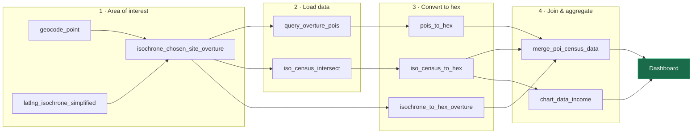

This example builds an interactive site selection dashboard that answers: **"What amenities and income levels surround a given address within a certain travel time?"**

A [Canvas](/workbench/udf-builder/canvas) chains small UDFs together. They geocode an address, compute a travel-time boundary (isochrone), pull Points of Interest from [Overture Maps](https://overturemaps.org/) and median household income from the [US Census](https://www.census.gov/programs-surveys/acs), aggregate everything into H3 hexagons, and show the result on a map with interactive [Widgets](/guide/data-input-outputs/import-connection/widgets).

<ClickZoomImage src="https://fused-magic.s3.us-west-2.amazonaws.com/workbench-walkthrough-videos/poi-dashboard-hero.gif" alt="POI Site Selection Dashboard" />

*Interactive dashboard showing POI density, isochrones, and income distribution for San Francisco. [Try it out](https://www.fused.io/canvas/fc_fused/Dashboard_Overture_Census_Isochrone) ->*

## How to run

Open the [Canvas](https://www.fused.io/canvas/fc_fused/Dashboard_Overture_Census_Isochrone), fill in the **Travel Settings** form (address, POI category, travel mode, travel time, Overture release), and click **Submit**. The dashboard re-runs and shows:

- a map with hexagons colored by POI density, the isochrone boundary, and the geocoded address
- the total number of matching POIs and the median household income inside the isochrone
- a bar chart of how household income is distributed across the area

The first run for a new address takes about 30 seconds. Repeat runs with the same inputs are [cached](/guide/working-with-udfs/udf-best-practices/caching) and load almost instantly.

## How the canvas is organized

The Canvas is laid out in four steps, left to right, with the dashboard on top. Each UDF does one thing and loads the UDF before it with [`fused.load()`](/python-sdk/api-reference/fused-load):


```mermaid
flowchart LR
    subgraph S1["1 · Area of interest"]
        A["geocode_point"] --> C["isochrone_chosen_site_overture"]
        B["latlng_isochrone_simplified"] --> C
    end
    subgraph S2["2 · Load data"]
        D["query_overture_pois"]
        E["iso_census_intersect"]
    end
    subgraph S3["3 · Convert to hex"]
        F["isochrone_to_hex_overture"]
        G["pois_to_hex"]
        H["iso_census_to_hex"]
    end
    subgraph S4["4 · Join & aggregate"]
        I["merge_poi_census_data"]
        J["chart_data_income"]
    end
    C --> D --> G --> I
    C --> E --> H --> I
    C --> F --> I
    H --> J
    I --> K["Dashboard"]
    J --> K

    style K fill:#1a6b4a,stroke:#2dbf7e,color:#fff
```

Every UDF takes the same inputs as the form (`manual_address`, `poi_category`, `costing`, `time_steps`, `overture_release`) and has the same defaults (San Francisco, cafes, 20 minutes by car). So any single node previews the same area when you run it on its own, and the cache is shared across the whole chain.

To work on the canvas from your editor or an AI agent, pull it to a local folder with `fused canvas pull <canvas_name>` ([CLI reference](/cli/canvas)). Each UDF is one `.py` file and each widget is one `.json` file:

```text
Dashboard_Overture_Census_Isochrone/
├── canvas.toml                        # node positions + edges
│
├── geocode_point.py                   # Step 1: area of interest
├── latlng_isochrone_simplified.py
├── isochrone_chosen_site_overture.py
│
├── Overture_Maps_Example.py           # Step 2: load data
├── query_overture_pois.py
├── iso_census_intersect.py
│
├── isochrone_to_hex_overture.py       # Step 3: convert to hex
├── pois_to_hex.py
├── iso_census_to_hex.py
│
├── merge_poi_census_data.py           # Step 4: join & aggregate
├── chart_data_income.py
│
├── overture_poi_selector.json         # Dashboard: input form
├── selected_poi_map.py                #   map
├── total_pois.json                    #   metric
├── median_income.json                 #   metric
├── income_distribution_chart.json     #   bar chart
└── note_*.md                          # canvas section headings
```

Edit any file, then push it back with `fused canvas push <folder> --canvas <canvas_name>`. See [AI coding tools](/guide/working-with-udfs/udf-best-practices/ai-coding-tools) for the full pull, edit, push loop.

:::info Why H3 hexagons?
POIs are points, census block groups are irregular polygons, and the isochrone is a single polygon. Converting all three to [H3 hexagons](/guide/h3-analytics/h3-overview) gives them a shared key, so they can be joined with plain SQL, and every cell covers the same area, so counts are directly comparable across the map.
:::

## Step 1: Get the area of interest

### Geocode the address

`geocode_point` turns a plain-text address into a point using [Nominatim](https://nominatim.openstreetmap.org/), the geocoder behind OpenStreetMap. The lookup is wrapped in [`@fused.cache`](/guide/working-with-udfs/udf-best-practices/caching) because several UDFs in the chain geocode the same address, and Nominatim rate-limits repeated requests.

<details>
<summary>geocode_point UDF</summary>

```python showLineNumbers
@fused.udf
def udf(manual_address: str = "San Francisco, CA"):
    import geopandas as gpd
    from shapely.geometry import Point

    @fused.cache
    def geocode(address):
        from geopy.geocoders import Nominatim

        result = Nominatim(user_agent="fused_geocoding_udf").geocode(address)
        if result is None:
            raise ValueError(f"Could not geocode address: {address!r}")
        return result.latitude, result.longitude, result.address

    lat, lng, address = geocode(manual_address.strip())
    return gpd.GeoDataFrame(
        {"location": [manual_address], "lat": [lat], "lng": [lng], "address": [address]},
        geometry=[Point(lng, lat)],
        crs="EPSG:4326",
    )
```

</details>

### Calculate the isochrone

An isochrone is a polygon covering everywhere you can reach from a point within a given travel time. Walking isochrones are small and roughly circular, while driving ones stretch along highways. `latlng_isochrone_simplified` calls the public [Valhalla routing API](https://valhalla.github.io/valhalla/api/isochrone/api-reference/):

<details>
<summary>latlng_isochrone_simplified UDF</summary>

```python showLineNumbers
@fused.udf
def udf(
    lat: float = 37.7792588,
    lng: float = -122.4193286,
    costing: str = "auto",
    time_steps: str = "20",
):
    """Isochrone polygons around a point from the public Valhalla routing API.

    costing: auto, pedestrian, bicycle, truck, bus, motor_scooter
    time_steps: comma-separated minutes, e.g. "10" or "5,10,15"
    """
    import geopandas as gpd
    import pandas as pd
    import requests

    steps = [int(t.strip()) for t in time_steps.split(",")]

    @fused.cache
    def get_isochrone(lat, lng, costing, steps):
        # Valhalla returns at most 4 contours per request
        chunks = [steps[i:i + 4] for i in range(0, len(steps), 4)]
        results = []
        for chunk in chunks:
            response = requests.post(
                "https://valhalla1.openstreetmap.de/isochrone",
                json={
                    "locations": [{"lon": lng, "lat": lat}],
                    "contours": [{"time": t} for t in chunk],
                    "costing": costing,
                    "polygons": 1,
                },
            )
            response.raise_for_status()
            results.append(gpd.GeoDataFrame.from_features(response.json(), crs="EPSG:4326"))
        return pd.concat(results, ignore_index=True)

    gdf = get_isochrone(lat, lng, costing, tuple(steps))
    gdf["contour_minutes"] = gdf["contour"].astype(int)
    return gdf
```

</details>

`isochrone_chosen_site_overture` chains the two: address → lat/lng → isochrone. Every later step loads this UDF to get the area of interest.

<details>
<summary>isochrone_chosen_site_overture UDF</summary>

```python showLineNumbers
@fused.udf
def udf(
    manual_address: str = "San Francisco, CA",
    time_steps: str = "20",
    costing: str = "auto",
):
    # Address -> lat/lng
    geocoded = fused.load("geocode_point")(manual_address=manual_address, engine="local")
    lat, lng = geocoded.lat.iloc[0], geocoded.lng.iloc[0]

    # lat/lng -> travel-time polygon
    return fused.load("latlng_isochrone_simplified")(
        lat=lat, lng=lng, costing=costing, time_steps=time_steps
    )
```

</details>

## Step 2: Load data in the area of interest

### Points of Interest from Overture Maps

[Overture Maps](https://docs.overturemaps.org/) publishes millions of places (restaurants, cafes, schools, parks and more) as GeoParquet. `query_overture_pois` reads the places inside the isochrone's bounding box with the public [`Overture_Maps_Example`](https://github.com/fusedio/udfs/tree/main/public/Overture_Maps_Example) UDF, then keeps the ones whose `categories` mention `poi_category`.

<details>
<summary>query_overture_pois UDF</summary>

```python showLineNumbers
@fused.udf
def udf(
    manual_address: str = "San Francisco, CA",
    poi_category: str = "cafe",
    time_steps: str = "20",
    costing: str = "auto",
    overture_release: str = "2026-02-18-0",
    preview: bool = True,  # Return only 20 rows so the canvas preview stays light
):
    isochrone = fused.load("isochrone_chosen_site_overture")(
        manual_address=manual_address, time_steps=time_steps, costing=costing
    )

    # Overture places inside the isochrone bounding box
    gdf = fused.load("Overture_Maps_Example")(
        bounds=list(isochrone.total_bounds),
        release=overture_release,
        theme="places",
        min_zoom=5,  # Return individual POIs, not aggregated chunks
    )
    if gdf is None:
        return None

    # `categories` is a struct like {"primary": "coffee_shop", "alternate": [...]}
    if poi_category != "all":
        gdf = gdf[gdf["categories"].apply(lambda c: c is not None and poi_category in str(c).lower())]

    print(f"{len(gdf)} '{poi_category}' POIs from Overture {overture_release}")
    return gdf.head(20) if preview else gdf
```

</details>

`preview=True` returns 20 rows so the node on the canvas stays light. `pois_to_hex` passes `preview=False` to get every POI.

:::note Supported Overture releases
The form offers releases from `2024-08-20-0` to `2026-02-18-0`. Newer releases (`2026-03-18-0` and later) fail to load in the Overture reader with a pyarrow list-type error.
:::

### Median household income from the Census

Income comes from the [American Community Survey (ACS) 5-Year Estimates](https://www.census.gov/programs-surveys/acs) at block group level, loaded with a [community UDF](https://github.com/fusedio/udfs/tree/main/community/sina/Census_ACS_5yr). `iso_census_intersect` loads the block groups covering the isochrone, drops suppressed estimates, and clips them to the isochrone with `gpd.overlay`.

<details>
<summary>iso_census_intersect UDF</summary>

```python showLineNumbers
@fused.udf
def udf(
    manual_address: str = "San Francisco, CA",
    costing: str = "auto",
    time_steps: str = "20",
    census_variable: str = "Median Household Income in the Past 12 Months (in 2022 Inflation-Adjusted Dollars)",
    year: int = 2022,
):
    import geopandas as gpd
    from shapely.validation import make_valid

    isochrone = fused.load("isochrone_chosen_site_overture")(
        manual_address=manual_address, costing=costing, time_steps=time_steps
    )

    # Census ACS 5-year block groups covering the isochrone extent.
    # is_density=False + scale_factor=1000 makes `metric` the raw ACS value (metric = value * scale_factor / 1000).
    acs = fused.load("https://github.com/fusedio/udfs/tree/c9bc8a2/community/sina/Census_ACS_5yr/")
    # Shrink the bounds slightly: clipping block groups exactly on the bbox edge can raise topology errors.
    # If the small inset still fails, retry once with a larger one.
    xmin, ymin, xmax, ymax = isochrone.total_bounds
    for inset in (0.001, 0.011):
        bounds = [xmin + inset, ymin + inset, xmax - inset, ymax - inset]
        try:
            df_acs = acs(bounds=bounds, census_variable=census_variable, year=year, is_density=False, scale_factor=1000)
            break
        except Exception as e:
            if inset == 0.011:
                raise
            print(f"ACS clip failed with inset {inset}: {e}; retrying with a larger inset")

    # ACS marks suppressed estimates with negative sentinels (e.g. -666666666)
    df_acs = df_acs[df_acs["metric"] >= 0]
    df_acs["geometry"] = df_acs.geometry.apply(make_valid)

    # Clip block groups to the isochrone
    iso = gpd.GeoDataFrame(geometry=[make_valid(isochrone.union_all())], crs=isochrone.crs)
    return gpd.overlay(df_acs[["GEOID", "metric", "geometry"]], iso, how="intersection")
```

</details>

:::warning Get the raw ACS value
The Census UDF returns the selected variable in a `metric` column scaled as `value * scale_factor / 1000`, with `scale_factor=200` by default, which is built for map styling. Pass `is_density=False, scale_factor=1000` so `metric` is the actual income in dollars.
:::

## Step 3: Convert everything to H3 hexagons

Each layer is converted to [H3 cells](/guide/h3-analytics/converting) at resolution 9 (~200 m edge, ~0.1 km² per cell). That's fine enough to show variation between neighborhoods while keeping a city-scale isochrone to a few thousand cells. All three UDFs take a `hex_res` parameter if you want to change it.

### Isochrone to hex

`isochrone_to_hex_overture` lists every cell inside the isochrone using `gdf_to_hex` from the Fused [common utilities](https://github.com/fusedio/udfs/tree/main/public/common). These cells are the base layer that POIs and income are joined onto.

<details>
<summary>isochrone_to_hex_overture UDF</summary>

```python showLineNumbers
@fused.udf
def udf(
    manual_address: str = "San Francisco, CA",
    time_steps: str = "20",
    costing: str = "auto",
    hex_res: int = 9,
):
    common = fused.load("https://github.com/fusedio/udfs/tree/507b2a3/public/common/")

    isochrone = fused.load("isochrone_chosen_site_overture")(
        manual_address=manual_address, time_steps=time_steps, costing=costing
    )

    # Every H3 cell whose center falls inside the isochrone
    hexes = common.gdf_to_hex(isochrone[["geometry"]], res=hex_res)
    return hexes[["hex"]].drop_duplicates()
```

</details>

### POIs to hex

`pois_to_hex` counts POIs per cell with [DuckDB's H3 extension](/guide/h3-analytics/converting):

<details>
<summary>pois_to_hex UDF</summary>

```python showLineNumbers
@fused.udf
def udf(
    manual_address: str = "San Francisco, CA",
    poi_category: str = "cafe",
    time_steps: str = "20",
    costing: str = "auto",
    overture_release: str = "2026-02-18-0",
    hex_res: int = 9,
):
    import pandas as pd

    common = fused.load("https://github.com/fusedio/udfs/tree/507b2a3/public/common/")
    con = common.duckdb_connect()  # DuckDB with the H3 extension loaded

    gdf = fused.load("query_overture_pois")(
        manual_address=manual_address,
        poi_category=poi_category,
        time_steps=time_steps,
        costing=costing,
        overture_release=overture_release,
        preview=False,  # All POIs, not the 20-row preview
        engine="local",
    )
    if gdf is None or len(gdf) == 0:
        return pd.DataFrame({"hex": pd.Series(dtype="uint64"), "count_pois": pd.Series(dtype="int64")})

    points = pd.DataFrame({"lat": gdf.geometry.y, "lng": gdf.geometry.x})
    return con.sql(f"""
        SELECT h3_latlng_to_cell(lat, lng, {hex_res}) AS hex, COUNT(*) AS count_pois
        FROM points
        GROUP BY hex
        ORDER BY count_pois DESC
    """).df()
```

</details>

### Census income to hex

`iso_census_to_hex` gives each cell the income of the block group it falls in. Median household income is a per-household value, not a count, so a cell covering two block groups takes their **average**. Splitting it by area would be wrong.

<details>
<summary>iso_census_to_hex UDF</summary>

```python showLineNumbers
@fused.udf
def udf(
    manual_address: str = "San Francisco, CA",
    costing: str = "auto",
    time_steps: str = "20",
    census_variable: str = "Median Household Income in the Past 12 Months (in 2022 Inflation-Adjusted Dollars)",
    year: int = 2022,
    hex_res: int = 9,
):
    common = fused.load("https://github.com/fusedio/udfs/tree/507b2a3/public/common/")
    con = common.duckdb_connect()

    block_groups = fused.load("iso_census_intersect")(
        manual_address=manual_address,
        costing=costing,
        time_steps=time_steps,
        census_variable=census_variable,
        year=year,
        engine="local",
    )

    # Each hex takes the value of the block group(s) it falls in.
    # Median income is a per-household value, so hexes on a boundary average it rather than sum it.
    hexes = common.gdf_to_hex(block_groups[["metric", "geometry"]], res=hex_res, add_latlng_cols=None)
    return con.sql("""
        SELECT hex, AVG(metric) AS median_income_12_months
        FROM hexes
        GROUP BY hex
    """).df()
```

</details>

Read more about polygon-to-hex conversion in the [H3 Converting guide](/guide/h3-analytics/converting) and aggregation strategies in [H3 Aggregations](/guide/h3-analytics/aggregations).

## Step 4: Join and aggregate

### Merge all hex layers

`merge_poi_census_data` left-joins POI counts and income onto the isochrone cells, so the result has exactly one row per cell inside the isochrone:

<details>
<summary>merge_poi_census_data UDF</summary>

```python showLineNumbers
@fused.udf
def udf(
    manual_address: str = "San Francisco, CA",
    poi_category: str = "cafe",
    time_steps: str = "20",
    costing: str = "auto",
    overture_release: str = "2026-02-18-0",
):
    common = fused.load("https://github.com/fusedio/udfs/tree/507b2a3/public/common/")
    con = common.duckdb_connect()

    area = dict(manual_address=manual_address, time_steps=time_steps, costing=costing)
    isochrone_hex_df = fused.load("isochrone_to_hex_overture")(**area)
    poi_df = fused.load("pois_to_hex")(**area, poi_category=poi_category, overture_release=overture_release)
    census_df = fused.load("iso_census_to_hex")(**area)

    # One row per hex inside the isochrone; hexes with no POIs get 0
    return con.sql("""
        SELECT i.hex,
               COALESCE(p.count_pois, 0) AS count_pois,
               c.median_income_12_months
        FROM isochrone_hex_df i
        LEFT JOIN poi_df p ON i.hex = p.hex
        LEFT JOIN census_df c ON i.hex = c.hex
    """).df()
```

</details>

### Income distribution

`chart_data_income` splits the income range into 20 equal-width bins and counts the cells in each. `bin_order` keeps the bars in income order in the chart.

<details>
<summary>chart_data_income UDF</summary>

```python showLineNumbers
@fused.udf
def udf(
    manual_address: str = "San Francisco, CA",
    costing: str = "auto",
    time_steps: str = "20",
    n_bins: int = 20,
):
    import numpy as np
    import pandas as pd

    census_df = fused.load("iso_census_to_hex")(
        manual_address=manual_address, costing=costing, time_steps=time_steps
    )
    income = census_df["median_income_12_months"].dropna()

    # No income data, or every hex has the same value: equal-width bins would be degenerate
    if income.empty:
        return pd.DataFrame({"income_bin": pd.Series(dtype=str), "count": pd.Series(dtype="int64"), "bin_order": pd.Series(dtype="int64")})
    if income.min() == income.max():
        return pd.DataFrame({"income_bin": [f"${income.min():,.0f}"], "count": [len(income)], "bin_order": [0]})

    # Equal-width income bins; count = number of hexes in each bin
    edges = np.linspace(income.min(), income.max(), n_bins + 1)
    labels = [f"${edges[i]:,.0f} - ${edges[i + 1]:,.0f}" for i in range(n_bins)]
    bins = pd.cut(income, bins=edges, labels=labels, include_lowest=True)

    df = bins.value_counts(sort=False).rename_axis("income_bin").reset_index(name="count")
    df["income_bin"] = df["income_bin"].astype(str)
    df["bin_order"] = range(len(df))
    return df
```

</details>

## Build the dashboard

The dashboard is made of [Widgets](/guide/data-input-outputs/import-connection/widgets) plus one map UDF:

| Node | Type | Reads from |
|---|---|---|
| `overture_poi_selector` | [`form`](/widget-api/form) (input) | — |
| `total_pois` | [`metric`](/widget-api/metric) | `merge_poi_census_data` |
| `median_income` | [`metric`](/widget-api/metric) | `merge_poi_census_data` |
| `income_distribution_chart` | [`bar-chart`](/widget-api/bar-chart) | `chart_data_income` |
| `selected_poi_map` | UDF returning HTML | `merge_poi_census_data`, `isochrone_chosen_site_overture`, `geocode_point` |

### Input form

Each field's `param` matches a UDF parameter name. When you click **Submit**, the form [broadcasts every value to the UDFs it is connected to](/guide/data-input-outputs/import-connection/widgets#step-2-connect-it-to-a-udf).

<details>
<summary>overture_poi_selector (form widget)</summary>

```json showLineNumbers
{
  "type": "form",
  "props": {
    "title": "Travel Settings",
    "submitLabel": "Submit",
    "submitPosition": "bottom",
    "card": true,
    "centered": true
  },
  "children": [
    {
      "type": "text-input",
      "props": {
        "label": "Address",
        "param": "manual_address",
        "placeholder": "Type an address...",
        "defaultValue": "San Francisco, CA"
      }
    },
    {
      "type": "dropdown",
      "props": {
        "label": "POI Category",
        "param": "poi_category",
        "searchable": true,
        "defaultValue": "cafe",
        "options": [
          { "value": "restaurant", "label": "Restaurants" },
          { "value": "cafe", "label": "Cafes & Bars" },
          { "value": "retail", "label": "Retail" },
          { "value": "grocery", "label": "Grocery & Markets" },
          { "value": "pharmacy", "label": "Pharmacies" },
          { "value": "school", "label": "Schools" },
          { "value": "bank", "label": "Banks & Financial" },
          { "value": "hospital", "label": "Hospitals & Healthcare" },
          { "value": "park", "label": "Parks & Recreation" },
          { "value": "gym", "label": "Gyms & Fitness" }
        ]
      }
    },
    {
      "type": "dropdown",
      "props": {
        "label": "Travel Mode",
        "param": "costing",
        "defaultValue": "auto",
        "options": [
          { "value": "pedestrian", "label": "Pedestrian" },
          { "value": "bicycle", "label": "Bicycle" },
          { "value": "auto", "label": "Auto" }
        ]
      }
    },
    {
      "type": "dropdown",
      "props": {
        "label": "Travel Time (minutes)",
        "param": "time_steps",
        "defaultValue": "20",
        "options": [
          { "value": "5", "label": "5" },
          { "value": "10", "label": "10" },
          { "value": "15", "label": "15" },
          { "value": "20", "label": "20" },
          { "value": "25", "label": "25" },
          { "value": "30", "label": "30" }
        ]
      }
    },
    {
      "type": "dropdown",
      "props": {
        "label": "Overture Release",
        "param": "overture_release",
        "defaultValue": "2026-02-18-0",
        "options": [
          { "value": "2024-08-20-0", "label": "2024-08-20" },
          { "value": "2024-11-13-0", "label": "2024-11-13" },
          { "value": "2025-06-25-0", "label": "2025-06-25" },
          { "value": "2025-12-17-0", "label": "2025-12-17" },
          { "value": "2026-02-18-0", "label": "2026-02-18" }
        ]
      }
    }
  ]
}
```

</details>

### Metrics and chart

Output widgets query UDF results with DuckDB SQL. `{{udf_name}}` refers to that UDF's output table:

```json showLineNumbers
{
  "type": "metric",
  "props": {
    "sql": "SELECT SUM(count_pois) FROM {{merge_poi_census_data}}",
    "label": "Total Points of Interest",
    "format": "comma",
    "decimals": 0,
    "size": 90,
    "color": "#CDDC39"
  }
}
```

```json showLineNumbers
{
  "type": "metric",
  "props": {
    "sql": "SELECT MEDIAN(median_income_12_months) FROM {{merge_poi_census_data}}",
    "label": "Median Household Income",
    "prefix": "$",
    "format": "compact",
    "decimals": 0,
    "size": 90,
    "color": "#CDDC39"
  }
}
```

```json showLineNumbers
{
  "type": "bar-chart",
  "props": {
    "sql": "SELECT income_bin AS label, count AS value FROM {{chart_data_income}} ORDER BY bin_order",
    "title": "Distribution of Median Household Income (hex count)"
  }
}
```

### Map

`selected_poi_map` draws three [deck.gl](https://deck.gl/) layers (the address, the POI hexagons, and the isochrone) and returns the map as HTML. It runs `merge_poi_census_data` with `engine="local"` so the whole chain runs inside the map UDF, which keeps the map working when the canvas is shared.

<details>
<summary>selected_poi_map UDF</summary>

```python showLineNumbers
@fused.udf
def udf(
    manual_address: str = "San Francisco, CA",
    poi_category: str = "cafe",
    time_steps: str = "20",
    costing: str = "auto",
    overture_release: str = "2026-02-18-0",
):
    map_utils = fused.load("https://github.com/fusedio/udfs/tree/3ada22d/community/milind/map_utils/")

    # engine="local" runs the chain inside this UDF, so the map also works when the canvas is shared
    hex_df = fused.load("merge_poi_census_data")(
        manual_address=manual_address,
        poi_category=poi_category,
        time_steps=time_steps,
        costing=costing,
        overture_release=overture_release,
        engine="local",
    )
    isochrone_gdf = fused.load("isochrone_chosen_site_overture")(
        manual_address=manual_address, time_steps=time_steps, costing=costing
    )
    geocoded_gdf = fused.load("geocode_point")(manual_address=manual_address, engine="local")

    poi_col = f"number of '{poi_category}' POIs"
    hex_df = hex_df.rename(columns={"count_pois": poi_col})

    layers = [
        {
            "type": "vector",
            "name": "Chosen Location",
            "data": geocoded_gdf,
            "config": {"style": {"fillColor": [0, 188, 212], "lineColor": [255, 255, 255], "lineWidth": 2, "pointRadius": 10, "opacity": 1}},
        },
        {
            "type": "hex",
            "name": f"POI ({poi_category}) + Census (H3 Hex)",
            "data": hex_df,
            "config": {
                "style": {
                    "fillColor": {"type": "continuous", "attr": poi_col, "domain": [0, 10], "steps": 20, "palette": "OrYel"},
                    "stroked": False,
                    "opacity": 0.9,
                    "coverage": 0.9,
                },
                "tooltip": [poi_col, "median_income_12_months"],
            },
        },
        {
            "type": "vector",
            "name": "Isochrone",
            "data": isochrone_gdf,
            "config": {"style": {"fillColor": [191, 64, 64], "lineColor": [191, 64, 64], "lineWidth": 2, "opacity": 0.3}},
        },
    ]
    return map_utils.deckgl_layers(
        layers=layers,
        basemap="dark",
        theme="dark",
        widgets={
            "controls": "bottom-right",
            "scale": "bottom-left",
            "basemap": "bottom-right",
            "layers": {"position": "top-right", "expanded": False},
            "legend": {"position": "top-right", "expanded": True},
            "filter": "top-right",
        },
    )
```

</details>

### Wire the nodes together

A node re-runs when one of its upstream nodes changes, so edges decide what refreshes when you click **Submit**:

- The **form** connects to `merge_poi_census_data`, `chart_data_income`, `selected_poi_map`, and each output widget.
- Each **data UDF** connects to the UDF it loads (for example `query_overture_pois` → `pois_to_hex` → `merge_poi_census_data`).
- Each **output widget** connects to the UDF its SQL reads.

A node that isn't connected won't refresh when the inputs change. Extra edges make the dashboard slower than it needs to be. Toggle nodes on and off in the Canvas to see how they're wired, or read the `edges` list in `canvas.toml`.


*Toggle nodes on/off to inspect which edges connect the form widget to data UDFs and output widgets.*

### Live map preview

The POI map below colors hexagons by POI density, with the isochrone boundary and the geocoded point on top. [Try it out](https://www.fused.io/canvas/fc_fused/Dashboard_Overture_Census_Isochrone) ->

<iframe
  src="https://unstable.udf.ai/fc_4fUqKOCoKL0gIX4YwgCk7z/selected_poi_map.html"
  width="100%"
  height="500px"
  style={{border: 'none'}}
  title="POI Site Selection Map"
/>

## See also

- [H3 analytics](/guide/h3-analytics/h3-overview): converting and aggregating data on hexagons
- [Widgets guide](/guide/data-input-outputs/import-connection/widgets): connecting input and output widgets to UDFs
- Expose this Canvas as an [MCP server](/guide/data-input-outputs/import-connection/ai-data-connection) so an AI agent can query the dashboard
