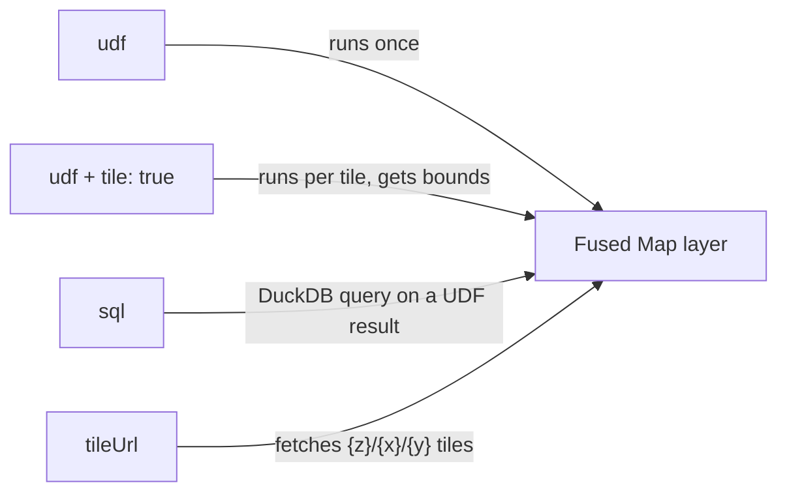

# Fused Map

Fused Map is the map widget of Fused. It draws geospatial data from a UDF, a SQL query, or a tile URL: points, polygons, H3 hexagons, and raster tiles, with many layers on one map.

Its type is `fused-map`. It works like every other [widget](/guide/data-input-outputs/import-connection/widgets): configure it in JSON, connect UDFs with edges, and share it as a URL. For every prop, see the [Fused Map API reference](/widget-api/fused-map).

This live map draws a Bay Area seismic hazard raster under the San Francisco Airbnb listings:

<iframe
  src="https://www.fused.io/share/fc_fused%2Fmap_widget_canvas/combined_layers_map"
  width="100%"
  height="500px"
  loading="lazy"
  style={{border: 'none', borderRadius: '8px'}}
  title="Fused Map with a raster layer and a point layer"
/>

Every example on this page is on the [Fused Map example canvas](https://www.fused.io/canvas/fc_fused/map_widget_canvas).

## Add a Fused Map widget

1. In the Workbench canvas, select the **Widget** icon in the toolbar.
2. In the **Widget configuration** panel, select **Preset**, then **Maps and geo**, then **Fused map**.
3. Connect the UDF node to the widget node with an edge.
4. In the JSON, set `udf` to the name of the UDF in double braces, for example `{{my_udf}}`.

The smallest Fused Map widget has one layer.

<details>
<summary>Show the widget JSON</summary>

```json
{
  "type": "fused-map",
  "props": {
    "layers": [
      { "id": "my_layer", "type": "geojson", "udf": "{{my_udf}}", "tooltip": true }
    ]
  }
}
```

</details>

:::note
The UDF must be on the same canvas. The name in `{{ }}` must match the UDF name exactly, with the same case.
:::

## Layer types and data sources

Set the `type` of each layer to `geojson`, `h3`, `raster`, `mvt`, `heatmap`, `scatterplot`, `arc`, or `deck-geojson`. Each layer reads its data in one of four ways:



| Property | What the map does |
|---|---|
| `udf` | Runs the UDF one time and draws the whole result. |
| `udf` and `tile: true` | Runs the UDF for each map tile. The UDF gets the tile `bounds`. |
| `sql` | Runs a DuckDB query on a UDF result, then draws the rows. |
| `tileUrl` | Reads tiles from a URL with `{z}`, `{x}`, and `{y}` placeholders. |

The UDF returns a GeoDataFrame for `geojson` layers, a DataFrame with an H3 column for `h3` layers, and an image array for `raster` layers. A DataFrame with latitude and longitude columns also works for `geojson` layers: set `latColumn` and `lngColumn`. Every other column is a property of the feature. The tooltip, the filters, and the data-driven colors use these properties.

If `tile` is `true`, the map sends the tile area to the UDF in the `bounds` argument, as `[west, south, east, north]` in `EPSG:4326`. Add `bounds: fused.types.Bounds` to the UDF and return only the rows inside `bounds`.

:::warning
If the UDF has no `bounds` argument, every tile gets the same result.
:::

## Examples

Each example has the UDF code and the widget JSON in dropdowns.

### H3 hexagons without tiles

An H3 layer needs a column of H3 cell IDs as hex strings, for example `872830828ffffff`. If the ID is an integer, change it with `lower(printf('%x', hex))` in DuckDB.

This example uses a Source Coop file of US census data with 2.1 million cells. A map without tiles calls the UDF one time, so the UDF adds the cells into larger parent cells with `h3_cell_to_parent`. The result has about 6,000 rows.

<details>
<summary>Show the <code>hex_overview</code> UDF code</summary>

```python
@fused.udf
def udf(
    res: int = 4,
    path: str = "s3://us-west-2.opendata.source.coop/fused/hex/release_2025_04_beta/census/2020_partitioned_h7.parquet",
):
    import duckdb

    con = duckdb.connect()
    con.sql("INSTALL httpfs; LOAD httpfs; INSTALL h3 FROM community; LOAD h3;")
    con.sql("SET s3_region='us-west-2'; SET s3_url_style='path';")
    df = con.sql(f"""
        SELECT
            lower(printf('%x', h3_cell_to_parent(hex, {int(res)}))) AS hex,
            sum(POP20)::BIGINT AS POP20,
            sum(HOUSING20)::BIGINT AS HOUSING20,
            count(*) AS cells
        FROM read_parquet('{path}')
        GROUP BY 1
    """).df()
    return df
```

</details>

<details>
<summary>Show the widget JSON</summary>

```json
{
  "type": "fused-map",
  "props": {
    "basemap": "mapbox://styles/mapbox/dark-v11",
    "centerLng": -98,
    "centerLat": 39.5,
    "zoom": 3,
    "autoFit": false,
    "layers": [
      {
        "id": "hex",
        "name": "Census hex overview",
        "type": "h3",
        "udf": "{{hex_overview}}",
        "h3Column": "hex",
        "tooltip": ["hex", "POP20", "HOUSING20", "cells"],
        "legend": { "title": "POP20" },
        "style": {
          "fillColor": {
            "type": "continuous",
            "attr": "POP20",
            "palette": "Sunset",
            "domain": [0, 500000]
          },
          "opacity": 0.8,
          "coverage": 0.95
        }
      }
    ]
  }
}
```

</details>

:::note
The bucket name has dots in it. Set `s3_url_style` to `path` so that DuckDB can connect.
:::

### H3 hexagons with tiles

For more detail, use the resolution 7 cells and set `tile: true`. The UDF returns only the cells with a center inside `bounds`.

<details>
<summary>Show the <code>source_coop_hex</code> UDF code</summary>

```python
@fused.udf
def udf(
    bounds: fused.types.Bounds = [-122.5, 37.7, -122.3, 37.85],
    path: str = "s3://us-west-2.opendata.source.coop/fused/hex/release_2025_04_beta/census/2020_partitioned_h7.parquet",
):
    import duckdb

    west, south, east, north = [float(v) for v in bounds]
    con = duckdb.connect()
    con.sql("INSTALL httpfs; LOAD httpfs; INSTALL h3 FROM community; LOAD h3;")
    con.sql("SET s3_region='us-west-2'; SET s3_url_style='path';")
    df = con.sql(f"""
        SELECT lower(printf('%x', hex)) AS hex, state, county, POP20, HOUSING20
        FROM read_parquet('{path}')
        WHERE h3_cell_to_lng(hex) BETWEEN {west} AND {east}
          AND h3_cell_to_lat(hex) BETWEEN {south} AND {north}
    """).df()
    return df
```

</details>

<details>
<summary>Show the widget JSON</summary>

```json
{
  "type": "fused-map",
  "props": {
    "basemap": "mapbox://styles/mapbox/dark-v11",
    "centerLng": -122.4,
    "centerLat": 37.77,
    "zoom": 8,
    "autoFit": false,
    "layers": [
      {
        "id": "hex",
        "name": "Census hex (tiled)",
        "type": "h3",
        "udf": "{{source_coop_hex}}",
        "tile": true,
        "h3Column": "hex",
        "tooltip": ["hex", "state", "county", "POP20", "HOUSING20"],
        "legend": { "title": "POP20" },
        "style": {
          "fillColor": {
            "type": "continuous",
            "attr": "POP20",
            "palette": "Sunset",
            "domain": [0, 500]
          },
          "opacity": 0.8,
          "coverage": 0.9,
          "lineWidth": 0.5
        }
      }
    ]
  }
}
```

</details>

### Vector tiles

Use a `geojson` layer with `tile: true` to load a large vector dataset. This UDF reads [Overture](https://overturemaps.org/) building footprints and returns only the buildings in `bounds`, colored by height.

<details>
<summary>Show the <code>overture_buildings</code> UDF code</summary>

```python
@fused.udf
def udf(
    bounds: fused.types.Bounds = [-74.01, 40.74, -73.98, 40.77],
    release: str = "2026-09-23.1",
    index_path: str = "fd://overture_building_index/2026-09-23.1.parquet",
    limit: int = 20000,
):
    import duckdb
    import geopandas as gpd
    import pandas as pd
    import shapely

    minx, miny, maxx, maxy = bounds
    base = f"s3://overturemaps-us-west-2/release/{release}/theme=buildings/type=building/"

    con = duckdb.connect()
    con.sql("INSTALL httpfs; LOAD httpfs; INSTALL spatial; LOAD spatial;")
    con.sql("SET s3_region='us-west-2';")

    # The index has one row per release file with its bounding box,
    # so each tile reads only the few files that overlap it.
    idx = pd.read_parquet(fused.api.sign_url(index_path))
    hit = idx[(idx.xmin <= maxx) & (idx.xmax >= minx) & (idx.ymin <= maxy) & (idx.ymax >= miny)]
    files = hit["file_name"].tolist()
    if not files:
        return gpd.GeoDataFrame({"id": []}, geometry=[], crs="EPSG:4326")
    file_list = ", ".join(f"'{base}{f}'" for f in files)

    df = con.sql(f"""
        SELECT id, subtype, class, height, num_floors, ST_AsWKB(geometry) AS geometry
        FROM read_parquet([{file_list}])
        WHERE bbox.xmin <= {maxx} AND bbox.xmax >= {minx}
          AND bbox.ymin <= {maxy} AND bbox.ymax >= {miny}
        LIMIT {int(limit)}
    """).df()

    df["geometry"] = shapely.from_wkb(df["geometry"].apply(bytes))
    return gpd.GeoDataFrame(df, geometry="geometry", crs="EPSG:4326")
```

</details>

<details>
<summary>Show the widget JSON</summary>

```json
{
  "type": "fused-map",
  "props": {
    "basemap": "mapbox://styles/mapbox/dark-v11",
    "centerLng": -122.42,
    "centerLat": 37.78,
    "zoom": 15,
    "minZoom": 10,
    "autoFit": false,
    "layers": [
      {
        "id": "buildings",
        "name": "Overture Buildings",
        "type": "geojson",
        "udf": "{{overture_buildings}}",
        "tile": true,
        "minZoom": 13,
        "maxZoom": 18,
        "tooltip": ["subtype", "class", "height", "num_floors"],
        "legend": { "title": "Height (m)" },
        "style": {
          "fillColor": {
            "type": "continuous",
            "attr": "height",
            "palette": "Sunset",
            "domain": [0, 100]
          },
          "lineColor": "rgba(255, 255, 255, 0.3)",
          "lineWidth": 1,
          "opacity": 0.8
        }
      }
    ]
  }
}
```

</details>

:::note
The Overture release has more than 500 files and no spatial index. The UDF reads a small index file from Fused storage (`fd://`) to pick the files for each tile. To run the UDF in your own workspace, write an index with the columns `file_name`, `xmin`, `xmax`, `ymin`, and `ymax` to your storage and set `index_path`.
:::

If you already have vector tiles on a server, use an `mvt` layer with a `tileUrl`.

<details>
<summary>Show the <code>mvt</code> widget JSON</summary>

```json
{
  "type": "fused-map",
  "props": {
    "layers": [
      {
        "id": "counties",
        "type": "mvt",
        "tileUrl": "https://tiles.fused.io/public/my_tileset/{z}/{x}/{y}",
        "style": { "fillColor": [100, 150, 200], "opacity": 0.6 }
      }
    ]
  }
}
```

</details>

### Raster tiles

Use a `raster` layer with `tile: true` to show an image. The UDF reads the raster for `bounds` and returns an image array.

<details>
<summary>Show the <code>bay_area_seismic_raster</code> UDF code</summary>

```python
@fused.udf
def udf(
    bounds: fused.types.Bounds = [-122.6, 37.2, -121.7, 38.0],
    path: str = "s3://fused-asset/demos/seismic_data/v2023_1_pga_475_rock_3min.tif",
):
    common = fused.load("https://github.com/fusedio/udfs/tree/fbf5682/public/common/")
    tile = common.get_tiles(bounds, zoom=common.estimate_zoom(bounds))
    arr = common.read_tiff(tile, input_tiff_path=path)
    return common.arr_to_plasma(arr.filled(0), min_max=(0, 1.5))
```

</details>

<details>
<summary>Show the widget JSON</summary>

```json
{
  "type": "fused-map",
  "props": {
    "basemap": "mapbox://styles/mapbox/dark-v11",
    "centerLng": -122.2,
    "centerLat": 37.6,
    "zoom": 8.5,
    "autoFit": false,
    "layers": [
      {
        "id": "seismic",
        "name": "SF Bay Area seismic hazard (raster)",
        "type": "raster",
        "udf": "{{bay_area_seismic_raster}}",
        "tile": true,
        "minZoom": 0,
        "maxZoom": 19,
        "style": { "opacity": 0.8 }
      }
    ]
  }
}
```

</details>

For a raster layer, only `opacity` and `visible` apply. A raster layer can also read PNG tiles from a public `tileUrl` instead of a UDF.

### Raster tiles with an alpha band

A raster UDF can return four bands: red, green, blue, and alpha. Pixels with an alpha of `0` are transparent, so the basemap shows through where the raster has no data.

This example shows the 64-band [AlphaEarth](https://source.coop/tge-labs/aef) embeddings over a satellite basemap. Three `number-input` widgets set the canvas parameters `b1`, `b2`, and `b3`, and the UDF maps those bands to red, green, and blue.

<details>
<summary>Show the <code>aef_bands</code> UDF code</summary>

```python
@fused.udf(cache_max_age="30d")
def udf(
    bounds: fused.types.Bounds = [-122.4609375, 37.71859032558816, -122.34375, 37.8124],
    year: int = 2024,
    b1: str = "1",
    b2: str = "16",
    b3: str = "9",
    stretch: float = 0.25,
):
    import numpy as np

    empty = np.zeros((4, 256, 256), np.uint8)
    west, south, east, north = [float(v) for v in bounds]
    bands = [_band(v, d) for v, d in ((b1, 1), (b2, 16), (b3, 9))]
    if not (2017 <= year <= 2025) or (east - west) > 360 / 2 ** 5.5:
        return empty
    return _render((west, south, east, north), year, bands, min(max(float(stretch), 0.02), 1.0))


def _band(value, default):
    try:
        return min(max(int(float(value)), 0), 63)
    except (TypeError, ValueError):
        return default


@fused.cache
def _index(year: int):
    import fsspec
    import pyarrow.parquet as pq

    cols = ["path", "wgs84_west", "wgs84_south", "wgs84_east", "wgs84_north"]
    url = "https://data.source.coop/tge-labs/aef/v1/annual/aef_index.parquet"
    with fsspec.open(url).open() as f:
        t = pq.read_table(f, columns=cols + ["year"], filters=[("year", "=", year)])
    return t.select(cols).to_pandas()


@fused.cache
def _render(bounds, year, bands, stretch):
    import math
    import os
    from concurrent.futures import ThreadPoolExecutor

    import numpy as np
    import rasterio
    from rasterio.transform import from_bounds
    from rasterio.warp import Resampling, reproject, transform_bounds
    from rasterio.windows import Window

    os.environ.update(
        AWS_NO_SIGN_REQUEST="YES",
        AWS_REGION="us-west-2",
        GDAL_DISABLE_READDIR_ON_OPEN="EMPTY_DIR",
        GDAL_HTTP_MULTIPLEX="YES",
        VSI_CACHE="TRUE",
    )
    w, s, e, n = bounds
    R = 6378137 * math.pi
    mx0, mx1 = w / 180 * R, e / 180 * R
    my0 = math.log(math.tan(math.pi / 4 + math.radians(s) / 2)) * 6378137
    my1 = math.log(math.tan(math.pi / 4 + math.radians(n) / 2)) * 6378137
    dst_t = from_bounds(mx0, my0, mx1, my1, 256, 256)

    df = _index(year)
    sel = df[(df.wgs84_west < e) & (df.wgs84_east > w) & (df.wgs84_south < n) & (df.wgs84_north > s)]
    if sel.empty or len(sel) > 120:
        return np.zeros((4, 256, 256), np.uint8)

    ground = (mx1 - mx0) / 256 * math.cos(math.radians((s + n) / 2))
    lvl = -1
    while 2 ** (lvl + 2) * 10 <= ground and lvl < 11:
        lvl += 1
    idx = [v + 1 for v in bands]

    def read(path):
        kw = {} if lvl < 0 else {"overview_level": lvl}
        try:
            with rasterio.open("/vsis3/" + path[5:], **kw) as ds:
                b = transform_bounds("EPSG:3857", ds.crs, mx0, my0, mx1, my1)
                inv = ~ds.transform
                cs, rs = zip(*[inv * (bx, by) for bx in (b[0], b[2]) for by in (b[1], b[3])])
                c0, c1 = max(0, int(min(cs)) - 1), min(ds.width, int(max(cs)) + 2)
                r0, r1 = max(0, int(min(rs)) - 1), min(ds.height, int(max(rs)) + 2)
                if c1 <= c0 or r1 <= r0:
                    return None
                win = Window(c0, r0, c1 - c0, r1 - r0)
                a = ds.read(idx, window=win)
                src_t, crs = ds.window_transform(win), ds.crs
        except Exception:
            return None
        out = np.full((3, 256, 256), -128, np.int8)
        reproject(a, out, src_transform=src_t, src_crs=crs, src_nodata=-128,
                  dst_transform=dst_t, dst_crs="EPSG:3857", dst_nodata=-128,
                  resampling=Resampling.nearest)
        return out

    with ThreadPoolExecutor(32) as ex:
        parts = [p for p in ex.map(read, sel.path.tolist()) if p is not None]
    if not parts:
        return np.zeros((4, 256, 256), np.uint8)
    q = parts[0]
    for p in parts[1:]:
        hole = (q[0] == -128) & (p[0] != -128)
        q[:, hole] = p[:, hole]
    v = q.astype(np.float32)
    v = np.sign(v) * (v / 127.5) ** 2
    rgba = np.zeros((4, 256, 256), np.uint8)
    rgba[:3] = (np.clip((v + stretch) / (2 * stretch), 0, 1) * 255).astype(np.uint8)
    # Alpha band: opaque where AlphaEarth has data, transparent elsewhere
    rgba[3] = np.where(q[0] != -128, 255, 0)
    return rgba
```

</details>

<details>
<summary>Show the input widget JSON</summary>

```json
{
  "type": "div",
  "props": { "style": "display:flex;flex-direction:column;gap:12px;padding:12px" },
  "children": [
    {
      "type": "number-input",
      "props": { "label": "Band 1 (red)", "param": "b1", "min": 0, "max": 63, "step": 1, "defaultValue": 1 }
    },
    {
      "type": "number-input",
      "props": { "label": "Band 2 (green)", "param": "b2", "min": 0, "max": 63, "step": 1, "defaultValue": 16 }
    },
    {
      "type": "number-input",
      "props": { "label": "Band 3 (blue)", "param": "b3", "min": 0, "max": 63, "step": 1, "defaultValue": 9 }
    }
  ]
}
```

</details>

<details>
<summary>Show the map widget JSON</summary>

```json
{
  "type": "fused-map",
  "props": {
    "basemap": "mapbox://styles/mapbox/satellite-v9",
    "centerLng": -122.3,
    "centerLat": 37.8,
    "zoom": 12,
    "autoFit": false,
    "showLegend": false,
    "showSidebar": false,
    "layers": [
      {
        "id": "aef_bands",
        "name": "AlphaEarth bands",
        "type": "raster",
        "udf": "{{aef_bands}}",
        "tile": true,
        "minZoom": 6,
        "maxZoom": 18,
        "style": { "opacity": 1 }
      }
    ]
  }
}
```

</details>

On the canvas, connect the input widget to `aef_bands` and `aef_bands` to the map with edges.

### SQL on a UDF result

Use `sql` to filter or reshape a UDF result before the map draws it. Use `{{udf_name}}` in the query. The map runs the query in the browser with DuckDB.

<details>
<summary>Show the <code>sf_listings</code> UDF code</summary>

```python
@fused.udf
def udf(path: str = "s3://fused-sample/demo_data/airbnb_listings_sf.parquet"):
    import pandas as pd

    df = pd.read_parquet(path)
    df = df.dropna(subset=["latitude", "longitude", "price_in_dollar"])
    return df[["name", "latitude", "longitude", "price_in_dollar", "room_type"]]
```

</details>

<details>
<summary>Show the widget JSON</summary>

```json
{
  "type": "fused-map",
  "props": {
    "basemap": "mapbox://styles/mapbox/dark-v11",
    "centerLng": -122.43,
    "centerLat": 37.76,
    "zoom": 11,
    "autoFit": true,
    "layers": [
      {
        "id": "listings",
        "name": "SF listings (SQL)",
        "type": "geojson",
        "sql": "SELECT name, room_type, latitude, longitude, price_in_dollar FROM {{sf_listings}}",
        "latColumn": "latitude",
        "lngColumn": "longitude",
        "tooltip": ["name", "room_type", "price_in_dollar"],
        "style": { "fillColor": [232, 255, 89], "pointRadius": 2 }
      }
    ]
  }
}
```

</details>

### Combine a raster and a vector layer

The map draws `layers` in order, so the first layer is at the bottom. The map at the top of this page uses the `bay_area_seismic_raster` and `sf_listings` UDFs from the examples above; connect both to the widget.

<details>
<summary>Show the widget JSON</summary>

```json
{
  "type": "fused-map",
  "props": {
    "basemap": "mapbox://styles/mapbox/dark-v11",
    "centerLng": -122.3,
    "centerLat": 37.7,
    "zoom": 9.5,
    "autoFit": false,
    "layers": [
      {
        "id": "seismic",
        "name": "Bay Area seismic hazard (raster)",
        "type": "raster",
        "udf": "{{bay_area_seismic_raster}}",
        "tile": true,
        "minZoom": 0,
        "maxZoom": 19,
        "style": { "opacity": 0.6 }
      },
      {
        "id": "sf_listings",
        "name": "SF Airbnb listings",
        "type": "geojson",
        "udf": "{{sf_listings}}",
        "latColumn": "latitude",
        "lngColumn": "longitude",
        "tooltip": ["name", "price_in_dollar", "room_type"],
        "legend": true,
        "style": {
          "fillColor": { "type": "categorical", "attr": "room_type", "palette": "Bold" },
          "pointRadius": 4,
          "opacity": 0.85
        }
      }
    ]
  }
}
```

</details>

## Sync maps with `stateParam`

Set `stateParam` to the name of a canvas parameter, and the map writes its state to that parameter: the camera, and the style, filter, and SQL changes from the sidebar. Maps with the same `stateParam` read the same state, so they move together.

These three maps show [VIIRS](https://eogdata.mines.edu/products/vnl/) night lights over India for 2010, 2016, and 2018, and all set `"stateParam": "nl_view"`. Pan one map and the others follow.

<iframe
  src="https://www.fused.io/share/fc_fused%2Fmap_widget_canvas/nightlights_compare"
  width="100%"
  height="500px"
  loading="lazy"
  style={{border: 'none', borderRadius: '8px'}}
  title="VIIRS night lights over India for three years, in synced maps"
/>

Each map calls the `nightlights` UDF with a different `year`, set in the layer as `{{nightlights?year=2010}}`.

<details>
<summary>Show the <code>nightlights</code> UDF code</summary>

```python
@fused.udf(cache_max_age="30d")
def udf(
    bounds: fused.types.Bounds = [67.5, 8.0, 90.0, 33.0],
    year: int = 2021,
    floor: float = 4.0,
    vmax: float = 200.0,
):
    import numpy as np
    import rasterio
    from rasterio.enums import Resampling
    from rasterio.vrt import WarpedVRT
    from rasterio.warp import transform_bounds
    from rasterio.transform import from_bounds

    url = (
        "https://s3.openlandmap.org/arco/"
        f"nightlights.average_viirs.v21_m_500m_s_{year}0101_{year}1231_go_epsg.4326_v20230823.tif"
    )
    west, south, east, north = transform_bounds("EPSG:4326", "EPSG:3857", *bounds)
    tile = from_bounds(west, south, east, north, 256, 256)
    with rasterio.open(url) as src:
        with WarpedVRT(src, crs="EPSG:3857", transform=tile, width=256, height=256, resampling=Resampling.bilinear, nodata=0) as vrt:
            v = vrt.read(1).astype("float32")

    t = np.clip((v - floor) / (vmax - floor), 0, 1) ** 0.5
    stops = np.array([[20, 20, 40], [110, 60, 20], [255, 170, 60], [255, 225, 150], [255, 250, 235]], np.float32)
    pos = t * (len(stops) - 1)
    i0 = np.clip(pos.astype(int), 0, len(stops) - 2)
    rgb = stops[i0] * (1 - (pos - i0)[..., None]) + stops[i0 + 1] * (pos - i0)[..., None]
    alpha = np.where(v > floor, 40 + 215 * t, 0)
    return np.dstack([rgb, alpha]).astype(np.uint8).transpose(2, 0, 1)
```

</details>

<details>
<summary>Show the widget JSON</summary>

```json
{
  "type": "div",
  "props": { "style": "display:flex;flex-direction:row;gap:12px;height:100%" },
  "children": [
    {
      "type": "fused-map",
      "props": {
        "centerLng": 79,
        "centerLat": 22,
        "zoom": 4.2,
        "autoFit": false,
        "stateParam": "nl_view",
        "style": "flex:1;min-width:0",
        "layers": [
          { "id": "nl_2010", "name": "Night lights 2010", "type": "raster", "udf": "{{nightlights?year=2010}}", "tile": true, "minZoom": 2, "maxZoom": 12 }
        ]
      }
    },
    {
      "type": "fused-map",
      "props": {
        "centerLng": 79,
        "centerLat": 22,
        "zoom": 4.2,
        "autoFit": false,
        "stateParam": "nl_view",
        "style": "flex:1;min-width:0",
        "layers": [
          { "id": "nl_2016", "name": "Night lights 2016", "type": "raster", "udf": "{{nightlights?year=2016}}", "tile": true, "minZoom": 2, "maxZoom": 12 }
        ]
      }
    },
    {
      "type": "fused-map",
      "props": {
        "centerLng": 79,
        "centerLat": 22,
        "zoom": 4.2,
        "autoFit": false,
        "stateParam": "nl_view",
        "style": "flex:1;min-width:0",
        "layers": [
          { "id": "nl_2018", "name": "Night lights 2018", "type": "raster", "udf": "{{nightlights?year=2018}}", "tile": true, "minZoom": 2, "maxZoom": 12 }
        ]
      }
    }
  ]
}
```

</details>

The state is saved with the canvas. Two other props send map events to the canvas: `param` writes the viewport bounds, and `clickParam` writes the properties of the last clicked feature.

## The sidebar

The sidebar lets the viewer change the style, the filters, and the SQL of each layer in the browser. These changes are temporary. To keep them, use the copy action in the sidebar and paste the result into the widget configuration.

For the full list of style, tooltip, legend, filter, and map options, see the [Fused Map API reference](/widget-api/fused-map).
