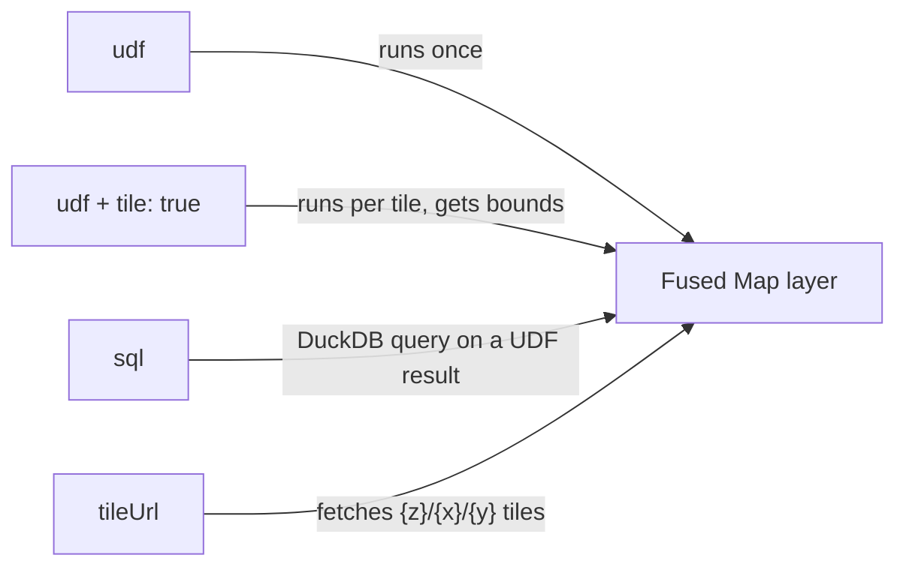

# Fused Map

Fused Map is the map widget of Fused. It draws geospatial data from a UDF, a SQL query, or a tile URL: points, polygons, H3 hexagons, and raster tiles, with many layers on one map.

Its type is `fused-map`. It works like any other [widget](/guide/data-input-outputs/import-connection/widgets): configure it in JSON, connect UDFs with edges, and share it as a URL. To see working examples, open the [Fused Map example canvas](https://www.fused.io/canvas/fc_fused/map_widget_canvas). For the props, see the [Fused Map API reference](/widget-api/fused-map).

This live map draws a Bay Area seismic hazard raster under the San Francisco Airbnb listings. The first layer in `layers` is drawn at the bottom.

<iframe
  src="https://www.fused.io/share/fc_fused%2Fmap_widget_canvas/combined_layers_map"
  width="100%"
  height="500px"
  loading="lazy"
  style={{border: 'none', borderRadius: '8px'}}
  title="Fused Map with a raster layer and a point layer"
/>

<details>
<summary>Show the widget JSON</summary>

```json
{
  "type": "fused-map",
  "props": {
    "basemap": "mapbox://styles/mapbox/dark-v11",
    "centerLng": -122.3,
    "centerLat": 37.7,
    "zoom": 9.5,
    "autoFit": false,
    "layers": [
      {
        "id": "seismic",
        "name": "Bay Area seismic hazard (raster)",
        "type": "raster",
        "udf": "{{bay_area_seismic_raster}}",
        "tile": true,
        "minZoom": 0,
        "maxZoom": 19,
        "style": { "opacity": 0.6 }
      },
      {
        "id": "sf_listings",
        "name": "SF Airbnb listings",
        "type": "geojson",
        "udf": "{{sf_listings}}",
        "latColumn": "latitude",
        "lngColumn": "longitude",
        "tooltip": ["name", "price_in_dollar", "room_type"],
        "legend": true,
        "style": {
          "fillColor": { "type": "categorical", "attr": "room_type", "palette": "Bold" },
          "pointRadius": 4,
          "opacity": 0.85
        }
      }
    ]
  }
}
```

</details>

## Add a Fused Map widget

1. In the Workbench canvas, select the **Widget** icon in the toolbar.
2. In the **Widget configuration** panel, select **Preset**, then **Maps and geo**, then **Fused map**.
3. Connect the UDF node to the widget node with an edge.
4. In the JSON, set `udf` to the name of the UDF in double braces, for example `{{my_udf}}`.

The smallest Fused Map widget has one layer.

<details>
<summary>Show the widget JSON</summary>

```json
{
  "type": "fused-map",
  "props": {
    "layers": [
      { "id": "my_layer", "type": "geojson", "udf": "{{my_udf}}", "tooltip": true }
    ]
  }
}
```

</details>

:::note
The UDF must be on the same canvas. The name in `{{ }}` must match the UDF name exactly, with the same case.
:::

## Layer types and data sources

Set the `type` of each layer to `geojson`, `h3`, `raster`, `mvt`, `heatmap`, `scatterplot`, `arc`, or `deck-geojson`. Each layer reads its data in one of four ways:



| Property | What the map does |
|---|---|
| `udf` | Runs the UDF one time and draws the whole result. |
| `udf` and `tile: true` | Runs the UDF for each map tile. The UDF gets the tile `bounds`. |
| `sql` | Runs a DuckDB query on a UDF result, then draws the rows. |
| `tileUrl` | Reads tiles from a URL with `{z}`, `{x}`, and `{y}` placeholders. |

The UDF returns a GeoDataFrame for `geojson` layers, a DataFrame with an H3 column for `h3` layers, and an image array for `raster` layers. A DataFrame with latitude and longitude columns also works for `geojson` layers: set `latColumn` and `lngColumn`. Every other column is a property of the feature. The tooltip, the filters, and the data-driven colors use these properties.

If `tile` is `true`, the map sends the tile area to the UDF in the `bounds` argument, as `[west, south, east, north]` in `EPSG:4326`. Add `bounds: fused.types.Bounds` to the UDF and return only the rows inside `bounds`.

:::warning
If the UDF has no `bounds` argument, every tile gets the same result.
:::

## What you can render

- **H3 hexagons** — an `h3` layer with a column of H3 cell IDs as hex strings, for example `872830828ffffff`. Return a rolled-up overview without tiles, or full-resolution cells with `tile: true`.
- **Vectors** — a `geojson` layer from a GeoDataFrame, or from a DataFrame with `latColumn` and `lngColumn`. Add `tile: true` for large datasets, or use an `mvt` layer with a `tileUrl`.
- **Rasters** — a `raster` layer from a UDF that returns an image array. Return a fourth band as alpha to make pixels without data transparent.
- **SQL results** — a `sql` layer runs a DuckDB query on a UDF result in the browser.

The [Fused Map example canvas](https://www.fused.io/canvas/fc_fused/map_widget_canvas) has a UDF and a widget for each of these. For the style, tooltip, legend, and filter props, see the [Fused Map API reference](/widget-api/fused-map).

## Sync maps with `stateParam`

Set `stateParam` to the name of a canvas parameter, and the map writes its state to that parameter: the camera, and the style, filter, and SQL changes from the sidebar. Maps with the same `stateParam` read the same state, so they move together.

These three maps show [VIIRS](https://eogdata.mines.edu/products/vnl/) night lights over India for 2010, 2016, and 2018, and all set `"stateParam": "nl_view"`. Pan one map and the others follow.

<iframe
  src="https://www.fused.io/share/fc_fused%2Fmap_widget_canvas/nightlights_compare"
  width="100%"
  height="500px"
  loading="lazy"
  style={{border: 'none', borderRadius: '8px'}}
  title="VIIRS night lights over India for three years, in synced maps"
/>

Each map calls the `nightlights` UDF with a different `year`, set in the layer as `{{nightlights?year=2010}}`.

<details>
<summary>Show the widget JSON</summary>

```json
{
  "type": "div",
  "props": { "style": "display:flex;flex-direction:row;gap:12px;height:100%" },
  "children": [
    {
      "type": "fused-map",
      "props": {
        "centerLng": 79,
        "centerLat": 22,
        "zoom": 4.2,
        "autoFit": false,
        "stateParam": "nl_view",
        "style": "flex:1;min-width:0",
        "layers": [
          { "id": "nl_2010", "name": "Night lights 2010", "type": "raster", "udf": "{{nightlights?year=2010}}", "tile": true, "minZoom": 2, "maxZoom": 12 }
        ]
      }
    },
    {
      "type": "fused-map",
      "props": {
        "centerLng": 79,
        "centerLat": 22,
        "zoom": 4.2,
        "autoFit": false,
        "stateParam": "nl_view",
        "style": "flex:1;min-width:0",
        "layers": [
          { "id": "nl_2016", "name": "Night lights 2016", "type": "raster", "udf": "{{nightlights?year=2016}}", "tile": true, "minZoom": 2, "maxZoom": 12 }
        ]
      }
    },
    {
      "type": "fused-map",
      "props": {
        "centerLng": 79,
        "centerLat": 22,
        "zoom": 4.2,
        "autoFit": false,
        "stateParam": "nl_view",
        "style": "flex:1;min-width:0",
        "layers": [
          { "id": "nl_2018", "name": "Night lights 2018", "type": "raster", "udf": "{{nightlights?year=2018}}", "tile": true, "minZoom": 2, "maxZoom": 12 }
        ]
      }
    }
  ]
}
```

</details>

The state is saved with the canvas. Two other props send map events to the canvas: `param` writes the viewport bounds, and `clickParam` writes the properties of the last clicked feature.

## The sidebar

The sidebar lets the viewer change the style, the filters, and the SQL of each layer in the browser. These changes are temporary. To keep them, use the copy action in the sidebar and paste the result into the widget configuration.
