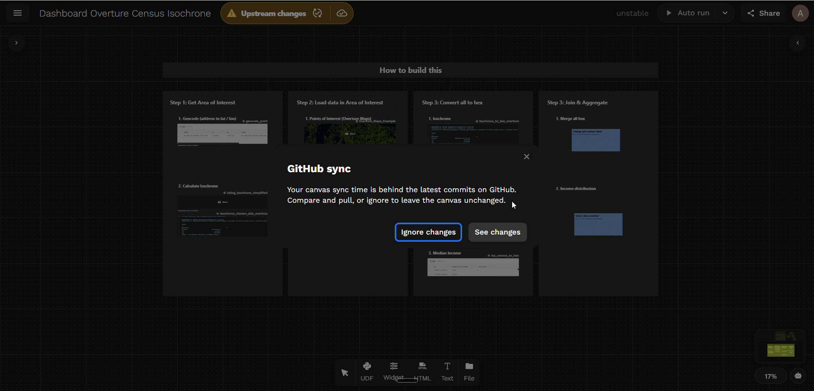
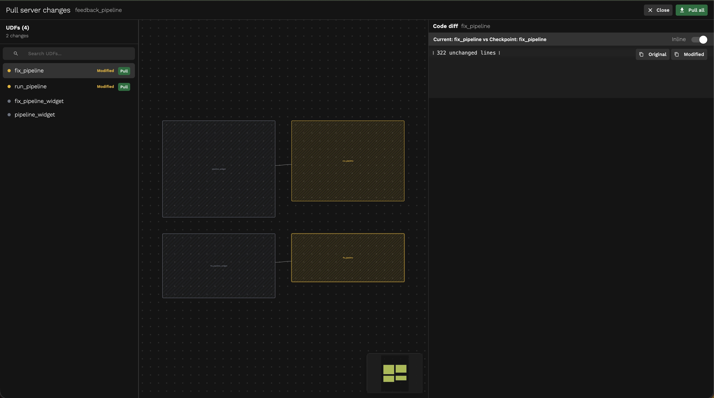

Fused publishes a [skills plugin](https://github.com/fusedio/skills) that teaches AI coding tools the Fused-specific formats they need to author canvases and write UDFs. Once installed, the AI understands how to create and modify Fused canvases, call integrations, and use the CLI without you having to explain the format every time.

The plugin covers five skill areas:

| Skill | What it teaches |
|---|---|
| `canvas-toml` | `canvas.toml` format — nodes, edges, viewport, folder layout |
| `fused-cli` | `fused` CLI — push, run, share, and manage UDFs from the terminal |
| `fused-integrations` | Built-in integration helpers — Snowflake, BigQuery, GCS, S3, Airtable, Notion, Google Drive |
| `fused-udfs` | Writing Fused UDFs — structure, parameters, return types, caching, agent-friendly design |
| `json-ui-schemas` | Widget JSON schemas — text inputs, dropdowns, charts, maps, SQL tables |

---

## Fused CLI

Install the `fused` Python package to get the CLI:

```bash
pip install --upgrade fused
```

The CLI covers running UDFs, managing canvases, uploading files, handling secrets and integrations, and more. See the [CLI Reference](/cli/overview) for the full command reference.

---

## Claude Code

Claude Code supports the Fused plugin natively via its plugin marketplace. Once installed, Claude Code automatically applies the Fused skills whenever you work on canvas files.

**Via the `fused` CLI (recommended):**

```bash
fused claude plugin add
```

**Via Claude Code directly:**

```bash
claude plugin marketplace add fusedio/claude-plugins
claude plugin install fused@fused-marketplace
```

To update or remove later:

```bash
claude plugin update fused@fused-marketplace
claude plugin remove fused
```

---

## Editing canvases locally with Claude

Once Claude Code is set up, the typical workflow is:

**1. Pull your canvas to a local folder**

```bash
fused canvas pull <canvas_name>
```

This downloads the canvas — UDF `.py` files, `canvas.toml`, and widget JSON — into a local directory. Claude Code can then read and edit those files directly.

**2. Ask Claude to make changes**

With the canvas pulled locally, you can ask Claude to modify UDFs, wire new nodes, update widget configs, or restructure the canvas. Claude edits the files in place — no copy-pasting required.

**3. Push changes back to Fused**

```bash
fused canvas push <canvas_dir>
```

This replaces the remote canvas with your local state. Any UDFs missing from the local folder are removed from the remote canvas.

**4. Review and pull changes in Workbench**

Once you push, Fused Workbench detects that the server has a newer version and shows a prompt:



Click **Compare** to review the diff against the current canvas state, or **Later** to dismiss and pull manually. When you're ready, the **Pull server changes** panel lets you pull all UDFs at once or cherry-pick individual ones:



See [Versioning](/workbench/versions/) for more on checkpoints, diffs, and restoring previous states.

---

## See also

- [Connect an AI agent](/examples/google-calendar-meetings#4-connect-an-ai-agent) — step-by-step walkthrough of connecting Claude Code to a canvas
- [Building for Agents](/guide/working-with-udfs/udf-best-practices/agents) — expose your canvas as an MCP endpoint for AI agents to query
- [Working as a Team](/guide/working-with-udfs/udf-best-practices/version-control) — GitHub integration for canvas version control
- [Versioning](/workbench/versions/) — checkpoints, diffs, and restoring canvas state
