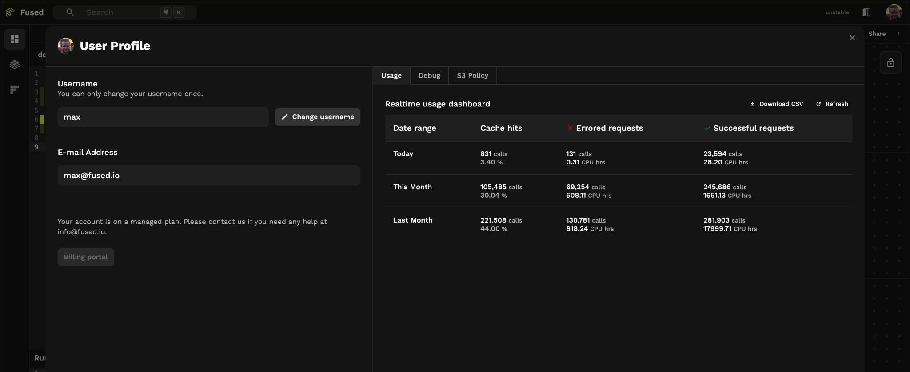

Fused caches UDF results automatically to make repeated calls faster. Cached calls return instantly and **don't consume Fused Credit Units**—you only pay for compute once, then reuse the result for free.

## Two types of cache

| Type | When it applies | Storage | Default Duration | Speed |
|------|-----------------|---------|-------------|-------|
| [UDF cache](#udf-cache) | UDF call results | [S3](/guide/data-input-outputs/import-connection/cloud-storage) | 90 days | Good |
| [`@fused.cache`](#fusedcache) | Functions inside UDFs | [mount](/guide/data-input-outputs/import-connection/cloud-storage#mntcache-disk) | 12 hours | Fast |

Both work the same way: store the result of [function + inputs], return cached result on repeat calls. Change the function or inputs → cache miss → recompute.

## UDF cache

Every UDF call is cached automatically. No configuration needed.

```python
my_udf()  # First call: runs UDF
my_udf()  # Second call: returns cached result
```

**Disable caching** when you need fresh results:

```python
@fused.udf(cache_max_age=0)
def my_udf():
    ...

# Or at call time
my_udf(cache_max_age=0)
# or
my_udf(cache=False)
```

## @fused.cache

Use `@fused.cache` for expensive operations *inside* a UDF—loading slow file formats, heavy computations that repeat across runs.

```python
@fused.udf
def udf(ship_length: int = 100):
    
    @fused.cache
    def load_data(path):
        import pandas as pd
        return pd.read_csv(path)  # Slow format, cache it
    
    df = load_data("s3://bucket/large_file.csv")
    return df[df.Length > ship_length]
```

The CSV loads once and caches. Changing `ship_length` doesn't reload the file—only changing the `path` would.

**When to use it:**
- Loading CSV, Shapefile, or other slow formats
- Expensive computations that don't depend on all UDF parameters
- API calls you don't want to repeat

**When NOT to use it:**
- Very large datasets (>10GB)—consider [ingesting to cloud-native formats](/guide/data-input-outputs/read-write/geospatial/ingestion) instead

## `cache_max_age` reference

Control how long cached results stay valid.

**Format:** `30s` (seconds), `10m` (minutes), `24h` (hours), `7d` (days)

**Where you can set it:**

| Context | Example |
|---------|---------|
| UDF definition | `@fused.udf(cache_max_age="24h")` |
| Direct call | `my_udf(cache_max_age="1h")` |
| @fused.cache | `@fused.cache(cache_max_age="30m")` |
| [HTTPs endpoint](/guide/working-with-udfs/run-udfs-as-api) | `udf.fused.io/token?cache_max_age=0` |

**Priority:** Call-time param > `@fused.udf()` > default (90 days)

## Common gotchas

### Parent/child UDF changes

When calling one UDF from another, the child won't automatically refresh when the parent changes:

```python
@fused.udf
def child_udf():
    parent = fused.load("parent_udf")
    data = parent()  # Won't re-fetch if parent changes
    return data
```

Fix: disable cache on the child so it always calls the parent:

```python
@fused.udf(cache_max_age=0)
def child_udf():
    parent = fused.load("parent_udf")
    data = parent()  # Always gets latest from parent
    return data
```

### Realtime vs dedicated instance have separate caches

```python
my_udf()                     # realtime cache
my_udf(engine="small")       # different cache (dedicated instance)
```

### Caching with `bounds` in Tile UDFs

When using [Tile UDFs](/guide/working-with-udfs/udf-best-practices/geospatial-single-vs-tile#tile-udf), panning the map triggers new UDF calls with different `bounds`. If you cache a function that takes `bounds` as input, each tile creates a separate cache entry.

**This can be useful:** Pan back to a previously viewed area and the cached tiles load instantly.

**Watch out for:** If you're iterating on code, you may accumulate many cache entries. Consider what actually needs to vary with `bounds`:

```python
# Caches per tile - good for expensive tile-specific operations
@fused.cache
def process_tile(bounds):
    ...

# Caches once - better when data doesn't depend on bounds
@fused.cache
def load_data(path):
    return gpd.read_file(path)

gdf = load_data(path)
return gdf[gdf.geometry.intersects(bounds_geom)]  # Filter after
```

## Monitor your cache usage

See how much caching is saving you in the **[Account](/workbench/account)** page in Workbench. The usage dashboard shows cache hits vs actual compute across different time ranges.



## See also

- [Data ingestion](/guide/data-input-outputs/read-write/geospatial/ingestion) — for large datasets, ingest to Parquet/GeoParquet instead of caching
- [Running UDFs](/guide/working-with-udfs/fused-run) — calling UDFs
- [`Udf` API reference](/python-sdk/api-reference/udf) — full API details
