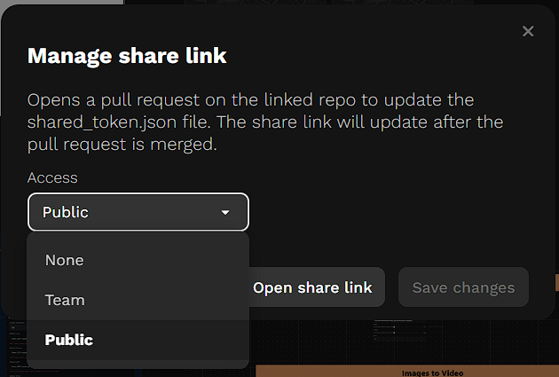
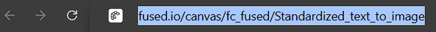

# Working with Teams

Teams make it easier to collaborate on canvases across an organization. Team-owned resources allow multiple users to work together while maintaining shared ownership and controlled access.

This guide explains how to:

* share canvases with a team
* configure access control settings
* make resources public
* understand the generated pull request workflow
* use team-owned canvas URLs

---

# Sharing Canvases

Canvases can be shared using the Share dialog available in the fused workbench UI.

The Share dialog supports multiple access control options:

* None
* Team
* Public

---

## Step 1: Open the Share Dialog

Open the canvas you want to share and click the **Share** button in the fused workbench UI.

### Share Dialog



---

## Step 2: Select an Access Control Option

The following access levels are available:

| Option | Description                                     |
| ------ | ----------------------------------------------- |
| None   | Nullify access                                  |
| Team   | Accessible only to members of the selected team |
| Public | Accessible to anyone with the link              |

---

# Team Access

Use **Team** access when you want to share resources internally within your organization or workspace.

When a canvas is shared with a team, only authenticated members of that team can access the resource.

Example teams:

* `fc_fused`
* `fc_BCG`

Team-only resources:

* are accessible only to members of the selected team
* do not work for users outside the team
* do not work in incognito mode unless the user is authenticated as a team member
* are intended for internal collaboration workflows

This access mode is useful for:

* internal dashboards
* shared team workflows
* collaborative development
* private organizational tools

---

## Step 3: Save the Team Access Setting

After selecting **Team** access:

1. Confirm the sharing change
2. The system automatically generates a pull request
3. Merge the generated PR for the access change to take effect

---

# Team-Owned Canvas URLs

Team-shared canvases use team-owned namespaces in the URL structure.

Example:

```text id="1h8wpr"
fused.io/canvas/fc_fused/my-canvas
```

instead of:

```text id="6u2xzc"
fused.io/canvas/username/my-canvas
```

The `fc_fused` namespace indicates that the canvas is owned by the team rather than an individual user.

Using team-owned namespaces prevents canvases from becoming orphaned if the original creator leaves the team.

All new documentation examples should use team-owned canvas URLs whenever possible.

### Team URL Example




Suggested annotation:

* Highlight the `fc_fused` namespace
* Add note: "Team-owned canvas namespace"

---

# Public Access

Use **Public** access when you want anyone with the link to access the resource.

Public canvases:

* work in incognito mode
* do not require team membership
* can be shared externally
* are useful for demos, tutorials, and public-facing workflows

This access mode is useful for:

* documentation examples
* external sharing
* tutorials
* reproducible public workflows

Example public URL:

```text id="4r6dpt"
fused.io/canvas/fc_public/public-example
```

---

## Step 4: Make a Resource Public

To make a canvas public:

1. Open the Share dialog
2. Select **Public**
3. Confirm the change
4. A pull request is automatically generated
5. Merge the generated PR
6. The resource becomes publicly accessible

Public resources are accessible even in incognito mode.

---

# Null Access (`None`)

Use **None** access when you want to revoke canvas access.

Selecting **None** opens a pull request. The share link stops working after the pull request is merged.

This option is useful for:

* expiring canvas access

---

## Step 5: Review and Merge the Generated PR

After changing the access setting:

1. A pull request is automatically generated
2. Review the access control change
3. Merge the PR
4. The updated permissions become active

---

# Complete Share Workflow

Typical sharing workflow:

1. Open the Share dialog
2. Select an access control option:

   * None
   * Team
   * Public
3. Confirm the change
4. A pull request is automatically generated
5. Review the generated PR
6. Merge the PR
7. Updated access permissions become active

---

# Recommended Best Practices

## Use Team-Owned URLs

Use team-owned namespaces such as:

```text id="8j4nqw"
fused.io/canvas/fc_fused/...
```

instead of user-owned URLs whenever possible.

This ensures:

* shared ownership
* long-term accessibility
* consistent documentation examples

---

## Use Team Access for Internal Work

Use Team access for:

* internal tools
* collaborative workflows
* organization-specific canvases
* shared development environments

---

## Use Public Access for External Sharing

Use Public access when:

* sharing demos externally
* publishing tutorials
* creating publicly accessible examples
* linking resources in documentation

---

## Review Access Changes Carefully

Because access changes generate pull requests, review all generated PRs before merging to ensure the intended permissions are applied.
