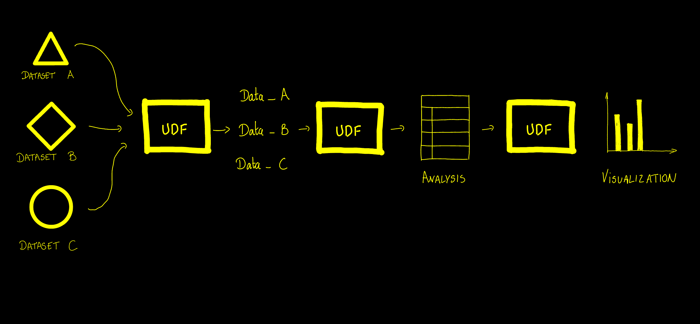

# Why Fused

At Fused, our mission is to help get things done, fast. We want every team to be able to get from **Analytics to Action** as quickly as they can. 

We also deeply believe AI is changing the way we work. So here's [Notebook LLM](https://notebooklm.google/) telling you all about Fused in 5min:

<video 
    style={{
        width: "100%",
        maxWidth: "800px", 
        aspectRatio: "16/9",
        height: "auto",
        margin: "0 auto",
        display: "block"
    }}
    controls>
    <source src="https://fused-magic.s3.us-west-2.amazonaws.com/workbench-walkthrough-videos/docs_rewrite/tutorials/Fused_In_a_nutshell_notebookllm_compressed.mp4" type="video/mp4" />
    Your browser does not support the video tag.
</video>

## Our core beliefs

We believe every Analytics team should have the tools to:
- 🌍 Answer the big picture problems first;
- 💡 Iterate on their analysis when new data & algorithms becomes available;
- 🏃 Ship a first version rather than getting it perfect;
- 📊 Visualize & report their work to anyone in their team.

## User Defined Functions

A lot of the tools Analytics teams have today slow the process down:
- Python dependency management gets in the way of getting work done.
- A lot of the scientific Python tooling focused more on getting the result down to 10 decimal places rather than answering the big picture

That's why we built Fused around User Defined Functions (UDFs). 

UDFs are the DNA of analytics. They are Python functions that can be called from anywhere:
- 🐍 No environment setup: Just start writing Python immediately.
- 🔗 Shareable as [HTTPS endpoints](/guide/data-input-outputs/export-api/tokens-endpoints) in 2 clicks: Ship your work to the rest of the team
- 🔄 Iterable: Edit your code, Save, and see the results downstream immediately.
- 🚀 Scales with your hardware requirements: From running a subset of data to analyzing the entire world.

## UDFs are the DNA of analytics

Making every process of your Analytics a UDF makes it faster:

- **Data needs to be ingested constantly**: UDFs can be edited as datasets change & evolve. They get updated when you save them. 
- **New algorithms come and go**: UDFs allow you to iterate on existing data and swap out just what you need.
- **Reporting & Visualization evolve**: UDFs can take your analysis and render it in dynamic ways.

## From your laptop to the World

Look, we know that many Analytics projects start in a notebook on a laptop. 

- 💻 Start by running UDFs locally, then in 2 lines of code scale to datasets the size of the world
- 🌍 UDFs can be called from anywhere: From a notebook, a [frontend application](/examples/sharing-canvas-dashboards) or integration platforms
- 🔀 Work locally or in [Workbench](/workbench/overview), our browser based IDE interchangeably  

## Efficiently Scaling

Because Fused is built for scale:
- ☁️ [Serverless computing](/guide/working-with-udfs/udf-best-practices/realtime): No servers to provision or keep running — Fused spins up compute when your code runs and shuts it down when it's done, so you only pay for the processing you actually use
- ⚡️ [Caching](/guide/working-with-udfs/udf-best-practices/caching) makes recurring calls faster & cheaper

## Get started using UDFs right now

Check out:
- ⚡️ The [Getting Started guide](/guide/getting-started/first-udf-basics): Learn how to use UDFs in 5 minutes
- 📚 [Writing UDFs](/guide/working-with-udfs/writing-udfs): Everything you need to know about building UDFs
- 🎓 Our [Examples](/examples/zonal-stats): Real world examples of how to use UDFs
