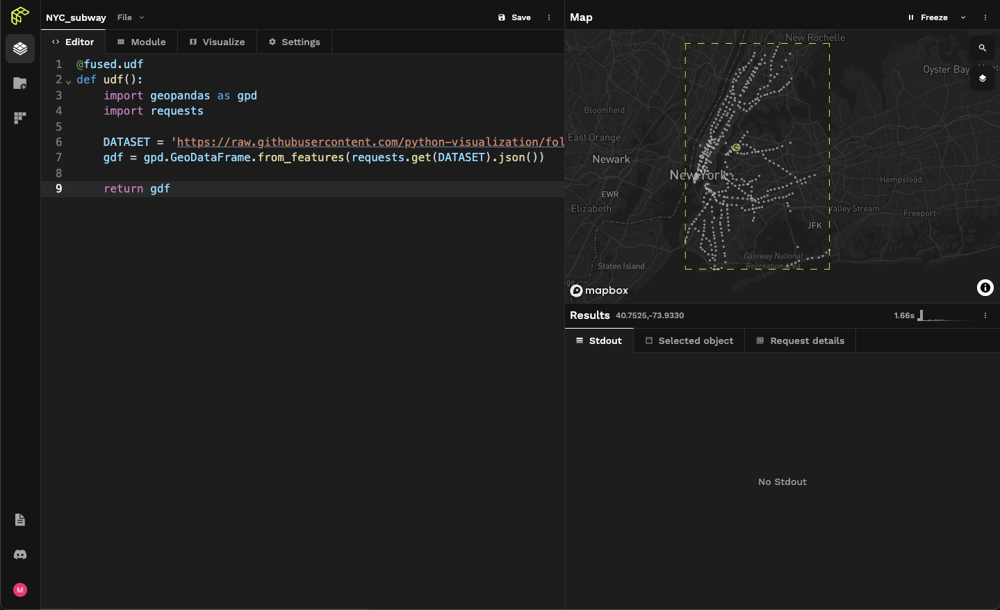

# Meet Fused

Fused Workbench is an end-to-end cloud platform for data analytics. Fused revolves around Python functions that can be called via HTTP requests, called User Defined Functions ([UDFs](/core-concepts/why/)).

<!--


-->

## First look

User Defined Functions are Python functions that run on the Fused backend with a HTTP endpoint. Here's an example:

```python showLineNumbers
@fused.udf
def udf():
    import geopandas as gpd
    import requests
    
    DATASET = 'https://raw.githubusercontent.com/python-visualization/folium-example-data/main/subway_stations.geojson'
    return gpd.GeoDataFrame.from_features(requests.get(DATASET).json())
```

### Running a User Defined Function

The simplest place to edit a User Defined Function is on [the Fused workbench](https://www.fused.io/workbench), a browser based IDE:

:::info

You can also write & run any UDF locally, you don't _need_ the Fused Workbench IDE

:::

 


### Share your User Defined Function

```python showLineNumbers
import fused
fused.run("YOUR_HASH") # Can we get this from fused-py directly, or do we need to use workbench?
```

import ReactPlayer from 'react-player'

<ReactPlayer className="video__player" playing={true} muted={true} controls height="100%" url="https://fused-magic.s3.us-west-2.amazonaws.com/workbench-walkthrough-videos/docs_rewrite/share_udf_to_sheets.mp4" width="100%" />


## Connect with the community

Find inspiration for your next project, ask questions, or share your work with the Fused community.

- [__GitHub__](https://github.com/fusedio/udfs/tree/main)
- [__Discord__](https://bit.ly/fusedslack)
- [__LinkedIn__](https://www.linkedin.com/company/fusedio/)
- [__Twitter__](https://twitter.com/Fused_io)
