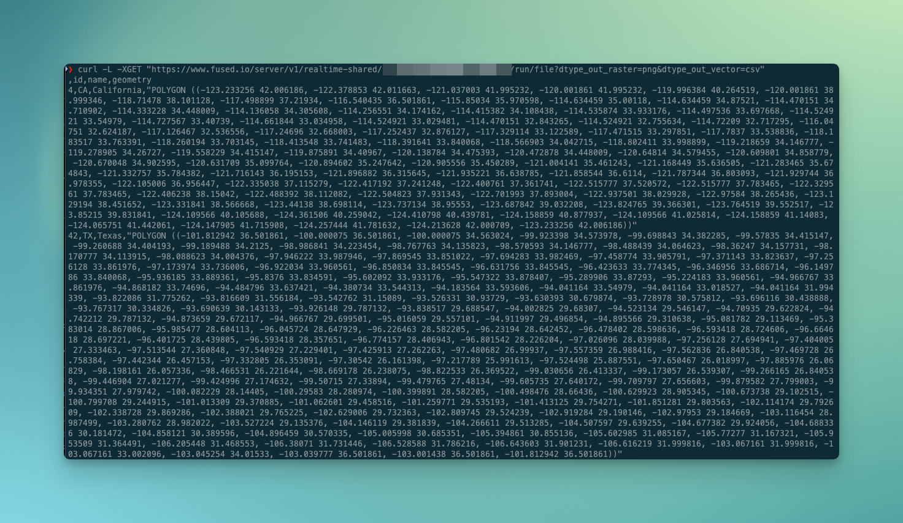
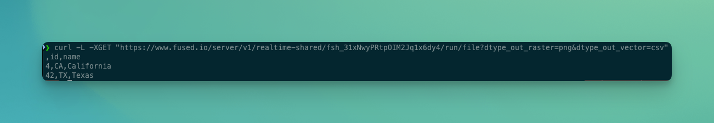

# Get started with Fused! 🚀

Learn the fundamental concepts of working with Fused.

This guide is an introduction to Fused Workbench. It covers the concepts and terminology you will come across as you work with data using the web-based IDE. After reading this page you should have an understanding of the fundamentals to build Fused UDFs and apps.

- [Create a simple UDF](/quickstart/#create-your-first-udf)
- [Edit a UDF](/quickstart/#edit-a-udf)
- [Share data from your UDF anywhere using HTTP](/quickstart/#get-your-data-from-a-http-endpoint)
- [Create a Fused app](/quickstart/#create-an-app)  

If you get stuck, please ask for help in the [Fused Discord](https://discord.com/invite/BxS5wMzdRk). 😊

## Introduction

A Fused User Defined Function ([UDF](/core-concepts/why/)) is a Python function that interacts with your data and can be called via HTTP requests. You can create UDFs from cloud storage files with the [File Explorer](/workbench/file-explorer/) or clone existing UDFs from the [UDF Catalog](/workbench/udf-catalog/). You edit UDFs in the [UDF Builder](/workbench/udf-builder/) and create & share apps that interact with your UDFs in the [App Builder](/workbench/app-builder/).

:::note
You'll need to be [logged in](/user-guide/login/) with an account to be able to follow this Quickstart guide

Without having an environment you can still access [Workbench](/workbench/), [install](/python-sdk/#install) `fused` locally and [run Public UDFs](/core-concepts/run-udfs/run-small-udfs/#public-udf-name) (in Workbench & locally). You can also run any UDF you want locally with `fused.run(my_udf, engine='local')`.
:::

## Create your first UDF

import Tabs from '@theme/Tabs';
import TabItem from '@theme/TabItem';
import ReactPlayer from 'react-player';

<Tabs className="unique-tabs">
  <TabItem value="workbench" label="In Workbench" default>

    Workbench is Fused browser-based IDE. We have a [whole detailed section](/workbench) about it, but we'll take you through the basics here.

    You can start by opening [Fused Workbench](https://www.fused.io/workbench) in another tab.

    Choose `Add UDF` and then `+ New UDF`, which will start creating a new UDF:

    <ReactPlayer className="video__player" playing={false} muted={true} controls height="100%" url="https://fused-magic.s3.us-west-2.amazonaws.com/workbench-walkthrough-videos/docs_rewrite/add_new_udf_edit.mp4" width="100%" />

    Welcome to workbench! 🛠️

    You now have access to a full Python development environment directly in your browser, where you can
    - Edit your UDFs in real time
    - See the geospatial output in the map view
    - Debug & explore data in the `Stdout` tab of the Results page

    :::info

      You can still use Workbench as a read-only user if you aren't signed-up, but to use the full benefit of workbench, [login](https://www.fused.io/workbench/preferences) or [join our waitlist](https://docs.google.com/forms/d/1NVzMjc2tXxlIgnFrxqQPM_NtG1B2AQ0En_pAbZHYSK0)

    :::

    <ReactPlayer className="video__player" playing={false} muted={true} controls height="100%" url="https://fused-magic.s3.us-west-2.amazonaws.com/workbench-walkthrough-videos/docs_rewrite/demo_workbench_edit.mp4" width="100%" />

  </TabItem>
  <TabItem value="local" label="Locally">

    You can also do everything from your local machine (or anywhere else!) using `fused`. To use `fused` locally you first need to [install it](/python-sdk/#install):

    ```python showLineNumbers
    pip install fused
    ```

    :::info

    We recommend you use a virtual environment to work with `fused` and you'll need `python >=3.11`. Read more in the dedicated [Install Fused section](/python-sdk/#install)

    :::

    We recommend using [jupyter notebooks](https://jupyter.org/) as these allow you to run cell by cell and see output directly under code blocks. In a new notebook we can define our first UDF. Here's the default "New UDF" in Workbench:

    ```python showLineNumbers
    @fused.udf
    def udf(message: str = "Hello World!"):
        return message
    ```

    You can now run this UDF from your notebook:
    
    ```python showLineNumbers
    msg = fused.run(udf)
    ```

    :::note
    You'll need to be [logged in](/user-guide/login/) to be able to run a UDF on our Fused server. 

    If you either don't have an account or only have a free account without any environment you can still run UDF, but locally on your device:

    ```python showLineNumbers
    msg = fused.run(udf, engine='local')
    ```
    :::

    By default [`fused.run()`](/python-sdk/top-level-functions/#run) executes your UDFs, allowing you to write code locally and immediately execute it on our server without deploying anything!

    You can make changes in your notebook and directly run your UDF. This is powerful if you want to manipulate data on the cloud directly without having to pull all the data locally! 


  </TabItem>
</Tabs>

## Edit a UDF

The power of Fused is how quickly you can iterate and execute your code with little thought to deploying it 

We'll demo the rest of this section in [Workbench](/workbench/) but you can follow along in a notebook if you'd like to as well!

[Workbench](/workbench/) allows you to easily edit your code and it executes instantly without you having to hit "Run".
The UDF editor calls [`fused.run(udf)`](/python-sdk/top-level-functions/#run) under the hood for you upon updates to the code. 


Let's give it a try, replace the default UDF with this code into the UDF Builder to render subway stations on a map:

```python showLineNumbers
@fused.udf
def udf():
    import geopandas as gpd
    DATASET = 'https://raw.githubusercontent.com/python-visualization/folium-example-data/main/subway_stations.geojson'
    gdf = gpd.read_file(DATASET)
    return gdf
```

You don't need to move your data to a Fused bucket to access it, so we can easily change the input data. Let's do just that:
Change line 6 to a completely different dataset:

```python showLineNumbers
@fused.udf
def udf():
    import geopandas as gpd
    # highlight-next-line
    DATASET = "https://raw.githubusercontent.com/python-visualization/folium-example-data/main/us_states.json"
    gdf = gpd.read_file(DATASET)
    return gdf
```

<ReactPlayer className="video__player" playing={false} muted={true} controls height="100%" url="https://fused-magic.s3.us-west-2.amazonaws.com/workbench-walkthrough-videos/docs_rewrite/edit_simple_udf_edit.mp4" width="100%" />

  :::info

  The map updates automatically using from the geospatial information returned by `udf()`. 
  This interaction goes both ways as the map can [pass coordinates](/core-concepts/filetile/#tile) into the UDF with `bounds` or XYZ indices, allowing Fused to spatially filter data.

  :::

Let's explore this data a bit more, the map shows us we have US states, let's print out some more info about it, just before the `return`:

```python showLineNumbers
@fused.udf
def udf():
    import geopandas as gpd
    DATASET = "https://raw.githubusercontent.com/python-visualization/folium-example-data/main/us_states.json"
    gdf = gpd.read_file(DATASET)
    # highlight-next-line
    print(gdf)
    return gdf
```

<ReactPlayer className="video__player" playing={false} muted={true} controls height="100%" url="https://fused-magic.s3.us-west-2.amazonaws.com/workbench-walkthrough-videos/docs_rewrite/print_udf_edit.mp4" width="100%" />

The `stdout` view shows us we have a `name` column in our `GeoDataFrame`, so we can leverage `geopandas` to filter only a few states:

```python showLineNumbers
@fused.udf
def udf():
    import geopandas as gpd
    DATASET = "https://raw.githubusercontent.com/python-visualization/folium-example-data/main/us_states.json"
    gdf = gpd.read_file(DATASET)
    # highlight-next-line
    gdf = gdf[gdf['name'].isin(['California', 'Texas'])]
    print(gdf)
    return gdf
```

<ReactPlayer className="video__player" playing={false} muted={true} controls height="100%" url="https://fused-magic.s3.us-west-2.amazonaws.com/workbench-walkthrough-videos/docs_rewrite/filter_states_edit.mp4" width="100%" />

You can notice this change in 2 places:
1. The map view only shows 2 states now
2. The `stdout` only has 2 rows

All that, without having to ever press "Run"! 

  :::note

  If you move `print(gdf)` _before_ `gdf = gdf[gdf['name'].isin(['California', 'Texas'])]` you will still see 50 lines in `stdout` and 2 in the map view, because the print statement happens before filtering
  
  Keep this in mind when using `print` to debug

  :::

## Get your data from a HTTP endpoint


The UDF we now have returns a `GeoDataFrame` with 2 rows, that's what we see in the map view. 

We can edit this UDF as much as we want but for now we're going to get this data out of Fused. You might expect us to hit a "Download" button somewhere and save this as a `GeoJSON`, but while you can do this, we're going to do something better: Call this UDF from a HTTP endpoint:
- Make sure to save your UDF by either clicking `💾 Save` or pressing `Ctrl + S` on Windows / Linux or `Cmd + S` on MacOS
- Click `Share`
- In the `Share modal` click `Share` to view all available sharing options.

<ReactPlayer className="video__player" playing={false} muted={true} controls height="100%" url="https://fused-magic.s3.us-west-2.amazonaws.com/workbench-walkthrough-videos/docs_rewrite/new_share_edit.mp4" width="100%" />

We've pre-populated a few examples of ways to share these Fused UDFs, but at its core you can *call these UDFs as HTTP endpoints*

UDFs aren't just Python functions you can run in Workbench, they're fully deployed functions that you can call from anywhere. 

To keep it simple to start, we can use the `cURL` option. Open a terminal and the `cURL` command, you'll get something like:

```bash
curl -L -XGET "https://www.fused.io/server/v1/realtime-shared/<YOUR_UDF_ID>/run/file?dtype_out_raster=png&dtype_out_vector=csv"
```

Let's break that down:
- `curl -L XGET` ->  `curl` syntax to GET and automatically follow a redirect
- `https://www.fused.io/server/v1/realtime-shared/` -> When you call a UDF, Fused automatically creates a file from the `return` of the UDF, this is where we host it
- `<YOUR_UDF_ID>` -> Your unique UDF ID. Fused handles this for you
- `run/file?dtype_out_raster=png&dtype_out_vector=csv` -> Tells Fused we want a `file` (more about this in future sections) and what data type. Fused can return Rasters or Vectors, we're telling it give us either here, with rasters as PNG files and vector as CSV

So, if you run this, you'll get something like this:

 

That's a CSV, with 2 rows and a lot of coordinates, our geometry! 

This is nice, but these geometries are quite verbose in CSV format. 

Let's go back to our UDF and remove `geometry` from our return:

```python showLineNumbers
@fused.udf
def udf():
    import geopandas as gpd
    DATASET = "https://raw.githubusercontent.com/python-visualization/folium-example-data/main/us_states.json"
    gdf = gpd.read_file(DATASET)
    gdf = gdf[gdf['name'].isin(['California', 'Texas'])]
    print(gdf)
    # highlight-next-line
    return gdf[['id', 'name']]
```

Remember to save, and notice how the geometries disappear from our map view: there's nothing to display anymore. 

Now, in your terminal, rerun the _same_ `curl` request:

 

No more geometry, just 2 rows with `id` and `name`, exactly as we had in our UDF `return` !

That's the real power of Fused: you don't have to deploy anything. Just edit your code, save it and then next time your UDF is called through HTTP, the data created will reflect your UDF!

## Create an app

Sometimes we simply want to show the results of our analysis to someone else, which is what Fused Apps are for.

You can use Streamlit components to create an app in the [App Builder](/workbench/app-builder/), found on the sidebar. You can then move from UDF builder to App Builder. 

Here's a basic example to show our dataframe:

```python
import fused
import streamlit as st

st.write("# Hello World! 👋")
st.write(fused.run("fsh_2kTEwnRARTd9gdDGUbH6ll"))

```

<ReactPlayer className="video__player" playing={false} muted={true} controls height="100%" url="https://fused-magic.s3.us-west-2.amazonaws.com/workbench-walkthrough-videos/docs_rewrite/share_udf_in_app2_edit.mp4" width="100%" />

As we change our UDF, the output will also change in the app directly, just like we saw with `curl`

You can then share your Fused app to anyone simply by sharing the link at the top of the App Builder:

<ReactPlayer className="video__player" playing={false} muted={true} controls height="100%" url="https://fused-magic.s3.us-west-2.amazonaws.com/workbench-walkthrough-videos/docs_rewrite/share_app_edit.mp4" width="100%" />

These links work without needing a Fused account or the need to install anything, allowing you to share your work easily to anyone!

## Next steps

Congratulations, you've touched on all the core features of Fused. 🎉

Now you can dive deeper into more advanced topics:
- Learn more about [UDFs](/core-concepts/why/) (We showed how to return static vector files, but we can do a lot more!)
- Take a deeper look at [Workbench](/workbench/overview/)
- Play around with the [Examples](/user-guide/examples) to Fused in action
- Look into the [UDF Catalog](/workbench/udf-catalog/) to find UDFs from the community you could leverage
- Dive into the `fused` [Python SDK](/python-sdk/)
- Learn about how [Fused handles caching](/core-concepts/cache/)
- Join [Discord](https://bit.ly/fused-discord) to connect with the community and discover what's possible

Welcome aboard! 🚢
