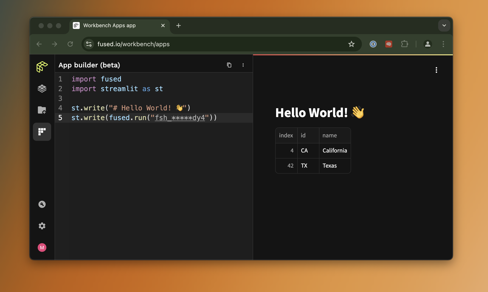

# Get started with Fused! 🚀

Learn the fundamental concepts of working with Fused.

This guide is an introduction to Fused Workbench. It covers the concepts and terminology you will come across as you work with data using the web-based IDE. After reading this page you should have an understanding of the fundamentals to build Fused UDFs and apps.

{/* This needs to be updated! */}
- [Create an account](/quickstart/#create-an-account)
- [Create UDF to read your data](/quickstart/#create-udf-to-read-your-data)
- [Open a UDF from the Catalog](/quickstart/#open-a-udf-from-the-catalog)
- [Edit a UDF](/quickstart/#edit-a-udf)
{/* - [Create an app](/quickstart/#create-an-app)  # Commenting this out for now, as app building might be something else */}
- [Share your UDF to use anywhere](/quickstart/#share) {/*Need to actually add this*/}

If you get stuck, please ask for help in the [Fused Discord](https://discord.com/invite/BxS5wMzdRk). 😊

## Introduction

A Fused User Defined Function ([UDF](/core-concepts/why/)) is a Python function that interacts with your data and can be called via HTTP requests. You can create UDFs from cloud storage files with the [File Explorer](/workbench/file-explorer/) or clone existing UDFs from the [UDF Catalog](/workbench/udf-catalog/). You edit UDFs in the [UDF Builder](/workbench/udf-builder/) and create & share apps that interact with your UDFs in the [App Builder](/workbench/app-builder/).

## Create an account

{/* Add here link to login page */}
Sign up for a Fused account at [fused.io/workbench](https://www.fused.io/workbench/preferences).


## Create UDF to read your data

import Tabs from '@theme/Tabs';
import TabItem from '@theme/TabItem';
import ReactPlayer from 'react-player';

<Tabs className="unique-tabs">
  <TabItem value="workbench" label="Workbench" default>

    ### Option 1: Use the Fused Workbench

    Workbench is Fused browser-based IDE. We have a [whole detailed section](/workbench) about it, but we'll take you through the basics here.

    You can start by opening [Fused Workbench](https://www.fused.io/workbench) in another tab.

    Choose `+ New UDF`, will start creating a new UDF:

    <ReactPlayer className="video__player" playing={true} muted={true} controls height="100%" url="https://fused-magic.s3.us-west-2.amazonaws.com/workbench-walkthrough-videos/docs_rewrite/getting-started/Create_new_UDF_in_workbench.mp4" width="100%" />

    Welcome to workbench! 🛠️

    You now have access to a full Python development enviroment directly in your browser, where you can
    - Edit your UDFs in real time
    - See the geospatial output in the map view
    - Debug & explore data in the `Stdout` tab of the Results page

    <ReactPlayer className="video__player" playing={true} muted={true} controls height="100%" url="https://fused-magic.s3.us-west-2.amazonaws.com/workbench-walkthrough-videos/docs_rewrite/getting-started/simple_demo_workbench.mp4" width="100%" />

  </TabItem>
  <TabItem value="locally" label="Local">

    ### Option 2: Use `fused` locally (🚧 Docs under construction)

    🚧 This section is under construction 🚧

    You can also do everything from your local machine (or anywhere else!) using `fused`. To use `fused` locally you first need to install it:

    ```python showLineNumbers
    pip install fused
    ```

    :::info

    We recommend you use a virtual environment to work with `fused` and you'll need `python >=3.9`

    :::

  </TabItem>
</Tabs>

## Edit a UDF

The power of Fused Workbench is the ability to easily edit your code and it executes instantly without you having to hit "Run"

Let's give it a try, replace the default UDF with this code into the UDF Builder to render subway stations on a map:

```python showLineNumbers
@fused.udf
def udf():
    import geopandas as gpd
    DATASET = 'https://raw.githubusercontent.com/python-visualization/folium-example-data/main/subway_stations.geojson'
    gdf = gpd.read_file(DATASET)
    return gdf
```

You don't need to move your data to a Fused bucket to access it, so we can easily change the input data. Let's do just that:
Change line 6 to a completely different dataset:

```python showLineNumbers
@fused.udf
def udf():
    import geopandas as gpd
    # highlight-next-line
    DATASET = "https://raw.githubusercontent.com/python-visualization/folium-example-data/main/us_states.json"
    gdf = gpd.read_file(DATASET)
    return gdf
```

<ReactPlayer className="video__player" playing={true} muted={true} controls height="100%" url="https://fused-magic.s3.us-west-2.amazonaws.com/workbench-walkthrough-videos/docs_rewrite/getting-started/Getting_Started_Changing_dataset.mp4" width="100%" />

Let's explore this data a bit more, the map shows us we have US states, let's print out some more info about it, just before the `return`:

```python showLineNumbers
@fused.udf
def udf():
    import geopandas as gpd
    DATASET = "https://raw.githubusercontent.com/python-visualization/folium-example-data/main/us_states.json"
    gdf = gpd.read_file(DATASET)
    # highlight-next-line
    print(gdf)
    return gdf
```

<ReactPlayer className="video__player" playing={true} muted={true} controls height="100%" url="https://fused-magic.s3.us-west-2.amazonaws.com/workbench-walkthrough-videos/docs_rewrite/getting-started/Getting_Started_print.mp4" width="100%" />

The `stdout` view shows us we have a `name` column in our `GeoDataFrame`, so we can leverage `geopandas` to filter only a few states:

```python showLineNumbers
@fused.udf
def udf():
    import geopandas as gpd
    DATASET = "https://raw.githubusercontent.com/python-visualization/folium-example-data/main/us_states.json"
    gdf = gpd.read_file(DATASET)
    # highlight-next-line
    gdf = gdf[gdf['name'].isin(['California', 'Texas'])]
    print(gdf)
    return gdf
```

<ReactPlayer className="video__player" playing={true} muted={true} controls height="100%" url="https://fused-magic.s3.us-west-2.amazonaws.com/workbench-walkthrough-videos/docs_rewrite/getting-started/Getting_Started_filter_states.mp4" width="100%" />

You can notice this change in 2 places:
1. The map view only shows 2 states now
2. The `stdout` only has 2 rows

All that, without having to ever press "Run"! 

  :::note

  If you move `print(gdf)` _before_ `gdf = gdf[gdf['name'].isin(['California', 'Texas'])]` you will still see 50 lines in `stdout` and 2 in the map view, because the print statement happens before filtering
  
  Keep this in mind when using `print` to debug

  :::

## Get your data from a HTTP endpoint


The UDF we now have returns a `GeoDataFrame` with 2 rows, that's what we see in the map view. 

We can edit this UDF as much as we want but for now we're going to get this data out of Fused. You migth expect us to hit a "Download" button somewhere and save this as a `GeoJSON`, but while you can do this, we're going to do something better: Call this UDF from a HTTP endpoint:
- Make sure to save your UDF by either clicking `💾 Save` or Doing `Ctrl + S` on Windows / Linux or `Cmd + S` on MacOS
- Go to the `⚙ Settings` Tab
- Under `Share` click `Sharing` to see all the sharing operations

<ReactPlayer className="video__player" playing={true} muted={true} controls height="100%" url="https://fused-magic.s3.us-west-2.amazonaws.com/workbench-walkthrough-videos/docs_rewrite/getting-started/Getting_Started_save_and_share.mp4" width="100%" />

We've pre-populated a few examples of ways to share these Fused UDFs, but at its core you can *call these UDFs as HTTP endpoints*

UDFs aren't just Python functions you can run in Workbench, they're fully deployed functions that you can call from anywhere. 

To keep it simple to start first, we can use the `cURL` option. Open a terminal and the `cURL` command, you'll get something like:

```bash
curl -L -XGET "https://www.fused.io/server/v1/realtime-shared/<YOUR_UDF_ID>/run/file?dtype_out_raster=png&dtype_out_vector=csv"
```

Let's break that down:
- `curl -L XGET` ->  `curl` syntax to GET and automatically follow a redirect
- `https://www.fused.io/server/v1/realtime-shared/` -> When you call a UDF, Fused automatically creates a file from the `return` of the UDF, this is where we host it
- `<YOUR_UDF_ID>` -> Your unique UDF ID. Fused handles this for you
- `run/file?dtype_out_raster=png&dtype_out_vector=csv` -> Tells Fused we want a `file` (more about this in future sections) and what data type. Fused can return Rasters or Vectors, we're telling it give us either here, with rasters as PNG files and vector as CSV

So, if you run this, you'll get something like this:

 

That's a CSV, with 2 rows and a lot of coordinates, our geometry! 

This is nice, but these geometries are quite verbose in CSV format. 

Let's go back to our UDF and remove `geometry` from our return:

```python showLineNumbers
@fused.udf
def udf():
    import geopandas as gpd
    DATASET = "https://raw.githubusercontent.com/python-visualization/folium-example-data/main/us_states.json"
    gdf = gpd.read_file(DATASET)
    gdf = gdf[gdf['name'].isin(['California', 'Texas'])]
    print(gdf)
    # highlight-next-line
    return gdf[['id', 'name']]
```

{/* Add video not saving geometry */}

Remember to save, and notive how the geometries dissapear from our map view: there's nothing to display anymore. 

Now, in your terminal, rerun the _same_ `curl` request:

 

No more geometry, just 2 rows with `id` and `name`, exactly as we had in our UDF `return` !

That's the real power of Fused: you don't have to deploy anything. Just edit your code, save it and then next time your UDF is called through HTTP, the data created will reflect your UDF!

## Create an app [Beta]

Sometimes we simply want to show the results of our analysis to someone else, which is what Fused Apps are for, which 

You can use Streamlit components to create an app in the [App Builder](/workbench/app-builder/), found on the sidebar:

<ReactPlayer className="video__player" playing={true} muted={true} controls height="100%" url="https://fused-magic.s3.us-west-2.amazonaws.com/workbench-walkthrough-videos/docs_rewrite/getting-started/showcase_sidebar.mp4" width="100%" />

Here's a basic example to show our dataframe:

```python
import fused
import streamlit as st

st.write("# Hello World! 👋")
st.write(fused.run("fsh_31xNwyPRtpOIM2Jq1x6dy4"))

```

<ReactPlayer className="video__player" playing={true} muted={true} controls height="100%" url="https://fused-magic.s3.us-west-2.amazonaws.com/workbench-walkthrough-videos/docs_rewrite/getting-started/Getting_started_sharing_fused_udf_in_app.mp4" width="100%" />

It should look like this: 

 

As we change our UDF, the output will also change in the app directly, just like we saw with `curl`

You can then share your Fused app to anyone simply by sharing the link at the top of the App Builder:

<ReactPlayer className="video__player" playing={true} muted={true} controls height="100%" url="https://fused-magic.s3.us-west-2.amazonaws.com/workbench-walkthrough-videos/docs_rewrite/getting-started/Getting_started_sharing_app.mp4" width="100%" />

These links work without needing a Fused account or the need to install anything, allowing you to share your work easily to anyone!

## Next steps

Congratulations, you've touched on all the core features of Fused. 🎉

Now you can dive deeper into more advanced topics:
- Learn more about [UDFs](/core-concepts/why/) (We showed how to return static vector files, but we can do a lot more!)
- Take a deeper look at [Workbench](/workbench/overview/)
- Look into the [UDF Catalog](/workbench/udf-catalog/) to find UDFs from the community you could leverage
- Browse through some of the [Use Cases](/user-guide/use-cases/) examples we have
- Dive into the `fused` [Python SDK](/python-sdk/)
- Learn about how [Fused handles caching](/core-concepts/content-management/cache/)
- Join [Discord](https://bit.ly/fused-discord) to connect with the community and discover what's possible

Welcome aboard! 🚢
