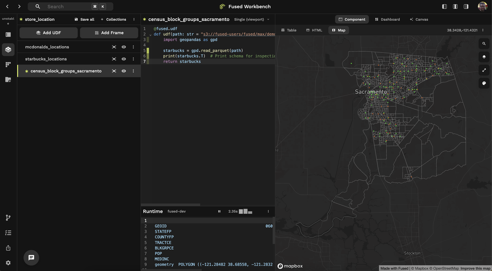
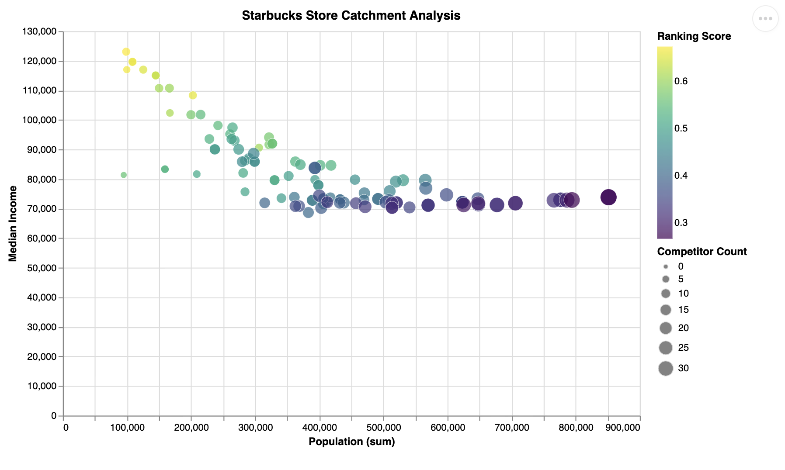

This tutorial will:
- Explore 2 store chains in Sacramento, CA
- Create drive-time catchments around each store
- Join catchments with census data (population, income)
- Determine which stores best reach target populations with minimal competition 

:::info Using AI prompts as a starting point

This tutorial shows the prompts we use to build this analysis.

Since AI is non-deterministic, prompts may not always work identically. You might need to manually adjust prompts or code.

Consider prompts as starting points, not final answers.
:::

## Getting Data

We'll use these online datasets for this analysis:
- Starbucks point locations as our target stores. [Available on Kaggle](https://www.kaggle.com/datasets/starbucks/store-locations)
- McDonald's point locations as our competitor stores. [Available on Kaggle](https://www.kaggle.com/datasets/ben1989/mcdonalds-locations)
- Census Data to get population and average income of the area around each store.

### Starbucks & McDonald's locations

Ask the AI to write a UDF loading data from the Kaggle cURL API:


```text
Open this specific dataset and return points as a dataframe based on this Kaggle curl request:

#!/bin/bash
curl -L -o ~/Downloads/store-locations.zip\
  https://www.kaggle.com/api/v1/datasets/download/starbucks/store-locations
```

To simplify this tutorial, we've pre-downloaded the data:

- Starbucks: `s3://fused-sample/demo_data/catchment_analysis/starbucks_location.pq`
- McDonald's: `s3://fused-sample/demo_data/catchment_analysis/mcdonalds_location.pq`

### Census Data

Get Census data from the official [US Census website](https://www.census.gov/geographies/mapping-files/time-series/geo/tiger-line-file.html).

For simplicity, we've pre-downloaded [Census Block Groups](https://en.wikipedia.org/wiki/Census_block_group) (BG) data:

- Sacramento, CA Census Block Groups: `s3://fused-users/fused/max/demos/california_population/acs_bg_ca_2022_sacramento_geoparquet.parquet`

## Exploring Data in Fused

Create 1 UDF per dataset to explore them as individual layers on the [Map View](/workbench/udf-builder/map/). 

### Starbucks

Create a new UDF and ask the AI:

```text
can you open this starbucks location file (s3://fused-users/fused/max/demos/catchment_analysis/starbucks_sacramento.pq) and return as geodataframe 
```

### McDonald's

Create another UDF and ask the AI:

```text
can you open this macdonalds location file (s3://fused-users/fused/max/demos/catchment_analysis/mcdonalds_sacramento.pq) and return as geodataframe 
```

### Census Data

Create another UDF and ask the AI:

```text
Can you open this file using geopandas as return df s3://fused-users/fused/max/demos/california_population/acs_bg_ca_2022_sacramento_geoparquet.parquet
```

After renaming each UDF and changing store colors in the [Visualization Tab](/workbench/udf-builder/styling/):

<details>
<summary>Visualization JSONs</summary>

You can copy paste these JSONs into the [Visualization Tab](/workbench/udf-builder/styling/) to have similar colored stores:

**Starbucks**

```
{
  "vectorLayer": {
    "@@type": "GeoJsonLayer",
    "stroked": true,
    "filled": false,
    "pickable": true,
    "lineWidthMinPixels": 1,
    "pointRadiusMinPixels": 1,
    "getLineColor": {
      "@@function": "colorContinuous",
      "attr": "value",
      "domain": [
        0,
        10
      ],
      "steps": 20,
      "colors": "Mint",
      "nullColor": [
        2,
        250,
        1
      ]
    },
    "getFillColor": [
      208,
      208,
      208,
      40
    ]
  }
}
```

**McDonalds**

```
{
  "vectorLayer": {
    "@@type": "GeoJsonLayer",
    "stroked": true,
    "filled": false,
    "pickable": true,
    "lineWidthMinPixels": 1,
    "pointRadiusMinPixels": 1,
    "getLineColor": {
      "@@function": "colorContinuous",
      "attr": "value",
      "domain": [
        0,
        10
      ],
      "steps": 20,
      "colors": "Burg",
      "nullColor": [
        250,
        100,
        1
      ]
    },
    "getFillColor": [
      208,
      208,
      208,
      40
    ]
  }
}
```

</details>




## Creating isochrones

The Fused [AI Assistant](/workbench/ai-assistant/) uses other UDFs as inspiration to adapt existing code for new use cases.

We'll use the [Get Isochrone UDF](https://www.fused.io/workbench/udf/catalog/Get_Isochrone-15dcecd8-c401-42a8-b9f0-a9dac3d7ddc3) as AI inspiration. This UDF:
- Uses the [Valhalla API](https://valhalla.github.io/valhalla/api/isochrone/api-reference/) to create drive-time isochrones around points
- Returns a GeoDataFrame with isochrone polygons

Perfect for our Starbucks analysis! We need:
- 15-minute drive time (`auto` [costing mode](https://valhalla.github.io/valhalla/api/turn-by-turn/api-reference/#costing-models))

Since this API is slow, we'll break down the problem:
1. Use `Get_Isochrone` UDF for 3 points first
2. Validate isochrones look correct
3. Manually increase API calls

Steps:
- Open the [`Get_Isochrone` UDF](https://www.fused.io/workbench/udf/catalog/Get_Isochrone-15dcecd8-c401-42a8-b9f0-a9dac3d7ddc3) in Workbench (no copy needed)
- Go to your `starbucks_location` UDF chat
- Include `@Get_Isochrone` in your AI request for context

Ask the AI (in the chat for your `starbucks_location` UDF):
```text
Use @Get_Isochrone to create 15-minute driving isochrones around each starbucks location. 

Test this out with just 3 points first so we make sure this is working correctly at first
```

You'll see 3 isochrones on the map:

import LazyReactPlayer from '@site/src/components/LazyReactPlayer'

<LazyReactPlayer
  url="https://fused-magic.s3.us-west-2.amazonaws.com/workbench-walkthrough-videos/docs_rewrite/tutorials/catchments_from_get_isochrone_compressed.mp4"
  width="100%"
  height="100%"
  controls={true}
  playing={false}
/>


You can manually increase the API calls if desired. For simplicity, we provide the output file:

`s3://fused-users/fused/max/demos/catchment_analysis/starbucks_isochrones_15min.pq`

## Joining catchments & census data

Next, we'll:
- Take each store's **15-minute catchment polygon** and find intersecting **block groups**
- From intersecting BGs, compute catchment metrics:
    - **Population** sum inside catchment
    - **Median income**
    - **Block group count** (number of intersecting BGs)

In a new UDF, ask the AI:

```text
Write a UDF that intersects each store’s 15-minute catchment polygon (from catchment_udf) with Sacramento block groups.  
For each store, use gpd.overlay to compute:  
- Total population (sum across intersecting block groups)  
- Median household income (median of intersecting block groups)  
- Block group count (distinct GEOIDs touched)  
Aggregate results per store into a clean summary table and return that.

The block groups for sacramento are here: `s3://fused-users/fused/max/demos/catchment_analysis/sacramento_block_groups.pq`

The starbucks catchments are here: `'s3://fused-users/fused/max/demos/catchment_analysis/starbucks_isochrones_15min.pq'`

use 4326 projection for all
Return the catchment geometries so I can still visualize the gdf on a map
```

## Competitor Analysis

In the same UDF, ask the AI for competitor analysis:

```text
Enhance the catchment UDF to measure competition:  
- Load McDonald’s store locations from  
  `s3://fused-users/fused/max/demos/catchment_analysis/mcdonalds_sacramento.pq`.  
- For each Starbucks 15-minute catchment polygon, count how many McDonald’s points fall inside (point-in-polygon).  
- Add this as a new column `Competition` to the per-store summary table.  
How many mcdonalds (competitor to starbucks in this case) are present in each catchment?
```

Track how many of *our own stores* are in each catchment:

```text
Enhance the catchment UDF to measure cannibalization:  
- Load Starbucks store locations from  
  `s3://fused-users/fused/max/demos/catchment_analysis/starbucks_sacramento.pq`.  
- For each Starbucks 15-minute catchment polygon, count how many *other* Starbucks points fall inside (exclude the store itself).  
- Add this as a new column `Cannibalization` to the per-store summary table.  
```

## Ranking stores

Rank stores based on:
- Highest catchment population
- Highest median income
- Lowest competition
- Lowest cannibalization (i.e. number of our own stores)

So let's ask the AI:

```text
Based on all the info here, give me a ranking of which stores I should invest in the most. I care about starbucks stores that have:
- The highest income 
- Highest population
- Least amount of competitors
- Least amount of cannibilization

Create a ranking formula for Starbucks stores based on these criteria
```

Ask the AI to plot a chart. When your UDF returns a dataframe, AI chat suggests chart creation:


This visualizes the results:



The AI ranking shows top stores have:
- Highest income
- Lowest population

Since all AI output is Python code, you can examine and fine-tune the ranking logic!

## Next Steps

Improvement ideas:
- Fine-tune ranking, drive times, etc.
- Add more data sources
- Scale to entire US using [`fused.submit()`](/core-concepts/run-udfs/run-small-udfs/#running-jobs-in-parallel-fusedsubmit)
