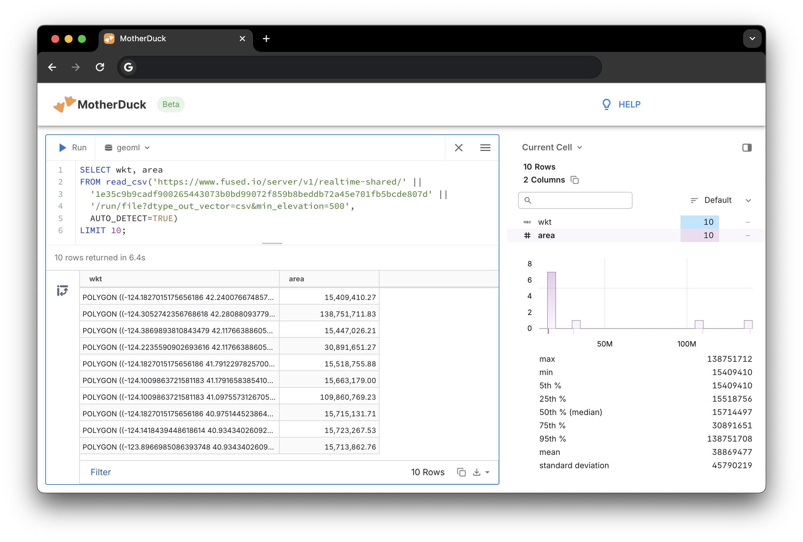

[MotherDuck](https://motherduck.com/) is a serverless SQL analytics platform. It's popular for its hybrid DuckDB execution engine, simplified database sharing, a diverse integrations ecosystem, and a SQL notebook-like UI. It runs DuckDB, so it supports several of the table output formats that Fused can serve - particularly Parquet files.

To follow along, you'll need a Motherduck account - which you can [create for free](https://motherduck.com/docs/getting-started/).


## 1. Generate a signed URL for a UDF

First generate an [HTTP endpoint](/core-concepts/run/#http-requests) for a UDF. Set [`dtype_out_vector`](/core-concepts/run/#http-requests) to `parquet`. You can optionally pass UDF parameters as URL-encoded strings, which can be configured to change based on query input.

This example uses an instance of the [DEM Raster to Vector](https://github.com/fusedio/udfs/blob/main/public/DEM_Raster_to_Vector_Example/DEM_Raster_to_Vector_Example.py) public UDF.

## 2. Run a query

Now you can make a query using the UDF URL.



### Parquet

With the `dtype_out_vector` query paramater set to `parquet`:

```sql
SELECT wkt, area
FROM read_parquet('https://www.fused.io/server/v1/realtime-shared/' ||
  '1e35c9b9cadf900265443073b0bd99072f859b8beddb72a45e701fb5bcde807d' ||
  '/run/file?dtype_out_vector=parquet&min_elevation=500')
LIMIT 10;
```

### CSV

With the `dtype_out_vector` query parameter set to `csv`:

```sql
SELECT wkt, area
FROM read_csv('https://www.fused.io/server/v1/realtime-shared/' ||
  '1e35c9b9cadf900265443073b0bd99072f859b8beddb72a45e701fb5bcde807d' ||
  '/run/file?dtype_out_vector=csv&min_elevation=500',
  AUTO_DETECT=TRUE)
LIMIT 10;
```
