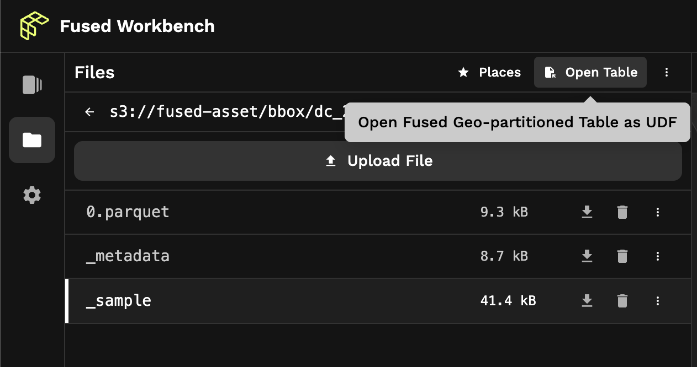

# File explorer

The Fused File Explorer is an intuitive tool to browse and manage files stored in an S3 bucket. Use it to quickly list file contents and preview them on a map, and automatically create Fused UDFs from Parquet tables & individual files.

Just paste an S3 path to a publicly accessible bucket, and start exploring your data! It's well suited for quick data exploration and to get a jumpstart on your analysis.  

## Key features

- Browse S3 Buckets: Easily navigate through your S3 bucket to locate and manage files.
- Preview Content: Quickly preview the contents of your files on a map, enabling rapid data inspection.
- Rapid Access: Open Parquet tables and individual files directly as Fused UDFs for immediate analysis and processing.

## Core functionality

### Browse

Browse through directories and files of S3 buckets linked to your account. Use the search bar and filter options to find specific files quickly.

### Preview

The Fused File Explorer allows you to preview the contents of your files on a map. Simply click on a file to display its content, and use the map controls to zoom, pan, and explore the data.

Note: The preview feature is currently available for Parquet files only.

### Open as Fused UDF

Open Parquet tables and individual files directly as Fused UDFs. 

Simply click the "Open Table" button, double click on a file, or find template options in the file's menu. The file will be opened as a UDF. 

