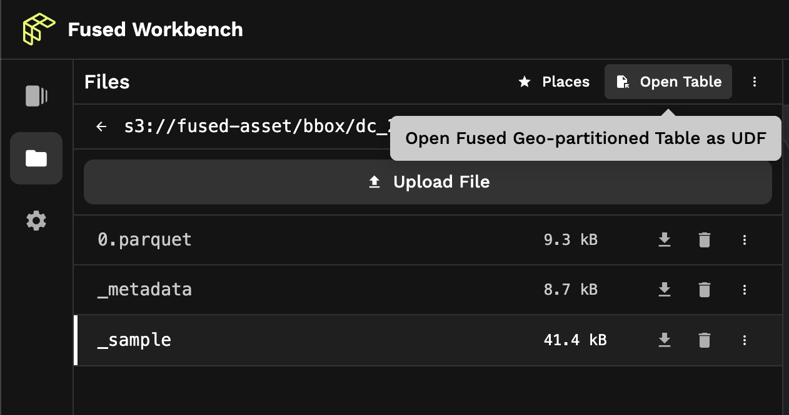

# UDF Editor

## Code Editor

The UDF Editor is where developers author UDFs. They can write Python to explore and analyze geospatial data of any size interactively.


### Auto, Tile, and File

A UDF can set to render its outputs on Workbench as a Tile or File - or autodetect between the two based on parameters. The choice depends on the nature of data the UDF will return. New UDFs are set to autodetect by default, and the kind can be changed in the top-right dropdown of the code editor.

<!-- You can read more about the difference between the two types of outputs in the [core concepts section](/core_concepts/#tile-vs-file-udfs). -->

<!--  -->

:::note
Because a UDF can be called as either File or Tile, Workbench must explicitly know how to render their output. When a UDF is configured as "Auto", Workbench automatically handles the output as Tile if it statically checks that the types `fused.types.TileXYZ`, `fused.types.TileGDF`, or `fused.types.Bbox` are used in the UDF. Otherwise, it assumes File.

Note that the "Auto" setting is specific and applicable only to the Workbench UI. UDFs called via `fused-py` or HTTP requests run as Tile only if a parameter specifies the Tile geometry. 

:::

### Toolbar

The toolbar atop the editor is where buttons to configure, save, duplicate, download, and delete UDFs are located. Clicking “Download” saves the present state of the UDF code and module locally as a `.zip` file that can be loaded with the Python SDK or shared with others so they can import into their workbench.


### Error indicator

Sifting through error logs to debug failed multi-hour jobs is a persistent and recurring annoyance of working with large datasets and data orchestrators. The Fused Workbench is desiged with sound developer experience in mind. As such, the UDF code editor immediately highlights errors in the code, so developers can flow and focus on what matters.


## Module


As UDFs grow in complexity, it's useful to modularize the code to make it reusable and composable. It's also a good practice to keep only the essential "business logic" in the decorated UDF function - this makes it easy to know what a UDF does at a glance.

With this in mind, a Fused UDF can optionally import Python objects from its acompanying module, with an import statement as if importing from a Python package. In the Workbench, the "module" code editor tab is the place for helper functions and other associated Python objects for the UDF to import. Keep in mind that the module's name is configurable in order to avoid naming collisions.

In this example, UDF imports the function `arr_to_plasma` from its module, which is named `utils`. The function contains support logic the UDF uses it to transform an array.

```python
@fused.udf
def udf(bbox):
    from utils import arr_to_plasma
    ...
    return arr_to_plasma(arr.values, min_max=(0, .8))
```


### Exporting modules

A module goes wherever its UDF goes.

This means that when a user saves, exports, shares, or uploads a UDF, the code for the module and for the UDF stays together and the import statement works the same. For example, clicking "Download" on a UDF downloads a `.zip` file containing a `.py` file for each with both the module and the UDF code.

> 💡 Note: At the moment, UDFs in the Workbench have a single module. To support advanced use cases, the Python SDK support multiple modules per UDF.


## Visualization


A layer is a geo visualization that made up of the UDF's Python code, the output of its execution, and associated visual configurations like color, line width, etc. In the Workbench, layers have a 1:1 relationship with UDFs.

### Powered by deck.gl

Fused maps data (a vector or raster output from a UDF) as a stack of visual layers. To display it, Fused uses the industry standard [deck.gl TileLayer](https://deck.gl/docs/api-reference/geo-layers/tile-layer) - an open source, high-performance data visualization framework. This means users can feel right at home with programmatic control of each aspect of rendering.


### Style layers

Layers are highly customizable. Developers can edit the code to transform the underlying data to show on the map, then edit what it looks like.

The visualization configuration uses **[@deck.gl/json](https://deck.gl/docs/api-reference/json/conversion-reference)** to implement a **[TileLayer](https://deck.gl/docs/api-reference/geo-layers/tile-layer)** with a **[GeoJsonLayer](https://deck.gl/docs/api-reference/layers/geojson-layer)** sublayer.

For example, the visualization json for a vector tile layer that dynamically sets `LineColor` properties from a GeoDataFrame (line `18`), might look like this.


## Settings


The settings tab is where each UDF can be configured. This section provides quick access to caching and to metadata associated with discoverability and the UDF's profile card.


### Cache

UDFs run code remotely and return outputs to the browser over the network. Consequently, the map may feel sloggy if UDFs return a large data volume. To resolve this, users can enable caching to store the UDF's returned data in S3.

> 💡 Note that when a UDF's cache is enabled, its output data is stored by default in a Fused-managed S3 bucket. Fused is serious about giving users full control over where their data is stored. Get in touch to set your own bucket.


### Snippets

Once a user creates a UDF in the Workbench, they can use snippets to call it and load its output it into other workflows. The "Snippets" section shows copyable commands to trigger the UDF from within a Python environment or bash.

By default, UDFs can only be called by user account that creates them. This can be done with the snippets below.


It's also possible to generate signed tokens that allow anyone with the token to call the UDF. These tokens can be revoked.


### Default parameter values

UDFs can be called with the parameters they explicitly define. Typed parameters can be set manually or automatically inferred within workbench, then used to trigger parametrized UDF runs via API. It's also possible to set predefined values that appear as options.


### Default view state

Setting a default view state on a published or shared UDF helps users navigate to a default viewport. That viewport can optionally be enabled and configured in this section. These values can be set manually or automatically by clicking "Set current map view".


UDFs with the default view state enabled show a "Zoom to layer" button. Clicking it sets the viewport to the preconfigured state.


### Image preview

A URL of the image to show for the UDF preview thumbnail. This can be set to any remote address that is open to the public. Fused recommends S3.


### Tags

Tags relevant to the UDF to make it easy to find in the Explorer search.


### Description

It's good practice to document UDFs with a brief description of their purpose, code, and datasets they import Markdown text box to include general information about the UDF. The markdown supports links, code blocks, and headers.


