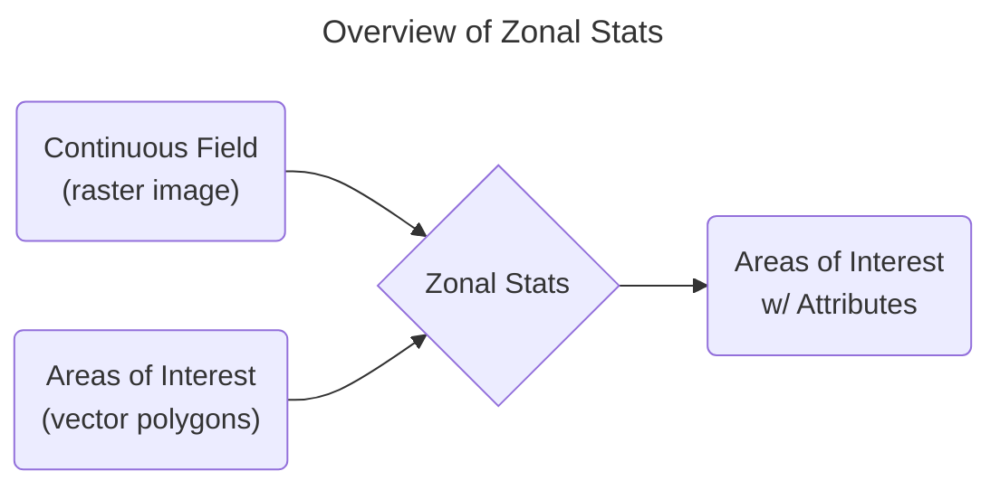

{/* TODO:
- Rename this example as it's not very clear it's a zonal stats, uses parallelization
- Intro doesn't need to explain FUsed workbench, already done in other sections. Should demo what we're going to build in this doc
*/}

_A step-by-step guide for data scientists._


### Requirements

- [access to Fused](/python-sdk/authentication/)
- [access to a Jupyter Notebook](https://jupyter.org/)
- the following Python packages installed locally:
  - [`fused`](/python-sdk/#python-install)
  - [`pandas`](https://pandas.pydata.org/)
  - [`geopandas`](https://geopandas.org/en/stable/index.html)


## 1. Using Fused for a Zonal Statistics Example

In this guide, we'll estimate how much alfalfa grows in zones defined by polygon geometries.
This will show you how to:
- Bring in your data
- Write a UDF to process the data
- Run the UDF remotely & in parallel
- Create an app that shows your results and can be shared with anyone




## 2. Bring in your data

{/* TODO:
- This doesn't explain _why_ we need to use `fused.ingest` -> What if my vector file is already on a S3 bucket?
- We should also provide users with some sample data so they can replicate the whole process. Then explain how to reproduce with their own data
*/}

You'll first upload your own vector table with `fused.ingest`. This spatially partitions the table and writes it in your specified S3 bucket as a [GeoParquet](/tutorials/Geospatial%20with%20Fused/geospatial-data-ingestion/geospatial-file-formats#for-vectors-tables-geoparquet) file. You'll then calculate zonal stats over a raster array of alfalfa crops in the [USDA Cropland Data Layer](https://catalog.data.gov/dataset/cropscape-cropland-data-layer) (CDL) dataset.

This example shows how to geo partition polygons of [Census Block Groups](https://www.census.gov/geographies/mapping-files/time-series/geo/tiger-line-file.html) for Utah, which is a Parquet table with a `geometry` column. You can follow along with this file or any vector table you'd like. Read about other supported formats in [Ingest your own data](/tutorials/Geospatial%20with%20Fused/geospatial-data-ingestion/).

First, set up a local Python environment, install the latest Fused SDK with `pip install fused`, and [authenticate](/python-sdk/authentication/).

Now, write the following script to geo partition your data. Pass the URL of the table to `fused.ingest`. When you kick off an ingest job with `run_batch`, Fused spins up a server to geo partition your table and writes the output to the path specified by the `output` parameter. In the codeblock below, `fd://tl_2023_49_bg/` is the base path to your account's S3 bucket.

```python showLineNumbers
  import fused

  job = fused.ingest(
    input="https://www2.census.gov/geo/tiger/TIGER2023/BG/tl_2023_49_bg.zip",
    output="fd://tl_2023_49_bg/"
  )
  job_id = job.run_batch()
  ```

{/* TODO: Needs visuals / screenshots. Tell people, and show them. */}
After running the preceeding code, open [fused.io/jobs](https://www.fused.io/jobs) to view the job status and logs.

Once the job is complete, you can preview the output dataset in the [File Explorer](/workbench/file-explorer/).

:::note

You can also ingest data without installing anything by using this [Fused App](https://www.fused.io/workbench#app/s/i/fa_6XEw7ACaNo7Qtxggt6Cm9e).

:::

For the next step you can use the path to the data you just ingested or, if you prefer, this public sample table: `s3://fused-asset/data/tl_2023_49_bg/`.


## 3. Write a UDF to process the data

To see the data as we process it, we will write a UDF in the [Fused Workbench](https://www.fused.io/workbench). As you write code in the [UDF Builder](/workbench/udf-builder/) you'll see how visualization results, logs, and errors show up immediately.

To [write a UDF](/core-concepts/write/) simply wrap a Python function with the decorator `@fused.udf`.

The first parameter of this UDF, `bounds`. It is reserved for Fused to pass a `GeoDataFrame` which the UDF may use to spatially filter datasets, and usually corresponds to a web map [tile](/tutorials/Geospatial%20with%20Fused/filetile/). This enables Fused to run the UDF for each tile in the viewport to distribute processing across multiple workers.

The `year` parameter is used to structure the S3 path of the CDL GeoTiff which the utility function `read_tiff` reads for the area defined by `bounds`. The `crop_id` parameter 36 corresponds to alfalfa the CDL [colormap](https://storage.googleapis.com/earthengine-stac/catalog/USDA/USDA_NASS_CDL.json), which the UDF uses to mask the raster array.

Fused lets you import utility Modules from other UDFs with `fused.load`. Their code lives in the [public UDFs repo](https://github.com/fusedio/udfs/blob/main/public/common).

- `read_tiff` loads an array of the CDL dataset for the specified `bounds` extent and `year`
- `table_to_tile` loads the table you geo partitioned for the specified `bounds` extent
- `geom_stats` calculates zonal statistics by aggregating the `arr` variable over the geometries specified by the `gdf`


```python showLineNumbers
@fused.udf
def udf(
    bounds: fused.types.Bounds = None,
    year: int = 2020,
    crop_id: int = 36
):
    import numpy as np

    # Convert bounds to tile
    common = fused.load("https://github.com/fusedio/udfs/tree/fbf5682/public/common/")
    zoom = common.estimate_zoom(bounds)
    tile = common.get_tiles(bounds, zoom=zoom)

    # Load CDLS data
    arr = common.read_tiff(
      tile,
      input_tiff_path=f"s3://fused-asset/data/cdls/{year}_30m_cdls.tif"
    )

    # Mask for crop
    arr = np.where(np.isin(arr, [crop_id]), 1, 0)

    # Load polygons
    gdf = common.table_to_tile(
      bounds,
      table='s3://fused-asset/data/tl_2023_49_bg/',
      min_zoom=5,
      use_columns=['NAMELSAD', 'GEOID', 'MTFCC', 'FUNCSTAT', 'geometry']
    )
    gdf.crs = 4326

    # Calculate zonal stats
    return common.geom_stats(gdf, arr)
```

Try running the UDF in the [UDF Builder](/workbench/udf-builder/) and visually inspect the output on the map. See what happens when you change `year`. Try introducing print statements such as `print(arr)` and `print(gdf)` to show logs in the console.


:::note

You might receive a [timeout error](/core-concepts/run-udfs/run-small-udfs/#defining-small-job) in the `Results` tab. Try zooming into Utah on the map where the zonal areas are highlighted, to reduce the [size of the tile](/tutorials/Geospatial%20with%20Fused/filetile/#tile) being passed into the UDF from the map.

:::


import Details from '@theme/MDXComponents/Details';

<details>
  <summary>You can also [style the map layer](/workbench/udf-builder/styling/) by setting this JSON in the [Visualization tab](/workbench/udf-builder/styling/)</summary>

```json showLineNumbers
{
  "tileLayer": {
    "@@type": "TileLayer",
    "minZoom": 0,
    "maxZoom": 19,
    "tileSize": 256,
    "pickable": true
  },
  "rasterLayer": {
    "@@type": "BitmapLayer",
    "pickable": true
  },
  "vectorLayer": {
    "@@type": "GeoJsonLayer",
    "stroked": true,
    "filled": true,
    "pickable": true,
    "lineWidthMinPixels": 1,
    "pointRadiusMinPixels": 1,
    "getFillColor": {
      "@@function": "colorContinuous",
      "attr": "count",
      "domain": [
        0,
        100
      ],
      "colors": "Tropic",
      "nullColor": [
        184,
        14,
        184
      ]
    },
    "getLineColor": [
      208,
      208,
      208,
      40
    ]
  }
}
```
</details>

## 4. Run the UDF remotely and in parallel

Now that you have a UDF, let's see three ways you can [Run UDFs](/core-concepts/run-udfs/) remotely:
- via an HTTPS endpoint,
- in a Python application,
- in parallel.

### a. HTTPS endpoint
Save the UDF, then click the 'Share' button located below the UDF name on the left side. In the dialog, click 'Share' again to generate a [token](/core-concepts/run-udfs/run-small-udfs/#token). Once the token is created, you'll see an [HTTPS endpoint](/core-concepts/run-udfs/run-small-udfs/) that you can use to call the UDF from anywhere. Try it out by changing the endpoint's query parameters — notice here `?format=geojson`, meaning the output will be a GeoJSON file.

```javascript
https://www.fused.io/server/v1/realtime-shared/fsh_46eSFZaR3q3SnoVB28pN0g/run/tiles/12/778/1548?format=geojson&crop_id=36&year=2020
```

#### What just happened?

When you called the HTTPS endpoint, Fused ran the UDF then sent back the output table and [debug logs](/core-concepts/write/#https-requests). In the URL above, `/12/778/1548` specifies the ZXY tile index to structure `bounds` and `format=geojson` specifies the output format. Fused passes the `year` & `crop_type` parameters to the UDF as `int` based on their types in the function definition.

#### Why does this matter?

You called the HTTPS endpoint with a shared token, which means any application may call the UDF and get data back without needing to configure credentials. You also passed parameters to the UDF, which enables you to dynamically generate data and define its output format.

To start seeing the full power of Fused, change the UDF code, save it, and call the endpoint again. You'll see the UDF automatically updates. When you call the UDF again it should run even faster.

### b. Python SDK

The share token also enables you to run the UDF in a Python environment. You can specify `bounds` as the same map tile as above by passing `x`, `y`, and `z` parameters.

```python showLineNumbers
import fused
fused.run("fsh_46eSFZaR3q3SnoVB28pN0g", x=778, y=1548, z=12)
```

:::note

If you haven't installed GeoPandas at this point, the data in the `geometries` column may appear as unparsed binary values from the GeoParquet file.

:::

You can also pass a `GeoDataFrame` to explicitly define a custom `bounds` and other parameters specific to the UDF.

```python showLineNumbers
import geopandas as gpd

# Square AOI near Utah Lake
bounds = gpd.GeoDataFrame.from_features({"type":"FeatureCollection","features":[{"type":"Feature","properties":{"shape":"Rectangle"},"geometry":{"type":"Polygon","coordinates":[[[-112.01315665811222,40.13628586159681],[-111.89330615564467,40.13628586159681],[-111.89330615564467,40.004073791892196],[-112.01315665811222,40.004073791892196],[-112.01315665811222,40.13628586159681]]]}}]})
fused.run("fsh_46eSFZaR3q3SnoVB28pN0g", bounds=bounds, year=2020, crop_id=36)
```

### c. Parallelization

Invoke the UDF in parallel with `run_pool` to increase performance when you want to run it repeatedly with different input parameters. In this case, we'll use it to call the UDF across a set of years. For a deeper dive, read how to [Call UDFs asynchronously](/core-concepts/async/).

```python showLineNumbers
import pandas as pd

def run_udf(year):
    gdf = fused.run("fsh_46eSFZaR3q3SnoVB28pN0g", bounds=bounds, year=year, crop_id=36)
    gdf['year'] = year
    return gdf

common = fused.load("https://github.com/fusedio/udfs/tree/fbf5682/public/common/")  
gdfs = common.run_pool(run_udf, [2019, 2020, 2021])
gdf_final = pd.concat(gdfs)
gdf_final
```

These examples show how you can easily integrate Fused into your analytics workflows. For example, you can group `gdf_final` by `GEOID` and `year` and calculate aggregates of the `count` and `stats` columns.

```python showLineNumbers
gdfs.groupby(['GEOID', 'year']).agg({'count':'sum', 'stats': 'mean'}).reset_index()
```

## 5. Create an app

Now that you've created a UDF and explored different ways to invoke it, you can create a data app to share your results. We'll structure the HTTPS endpoint you created above to act as a Tile server (with `/run/tiles/{z}/{x}/{y}`), allowing it to be called from a [pydeck](https://deckgl.readthedocs.io/en/latest/index.html) `TileLayer` within the Fused App Builder. We'll also create a [Streamlit dropdown](https://docs.streamlit.io/develop/api-reference/widgets/st.selectbox) for users to set the year parameter.

import Iframe from "@site/src/components/Iframe";
import CODE from "@site/src/app-iframe/python/example_zstats.py";

<div style={{marginTop: '2rem'}}>
<Iframe
  id="iframe-1"
  code={CODE}
  requirements={[
    "/pyarrow/pyarrow-17.0.0-cp312-cp312-pyodide_2024_0_wasm32.whl",
    "micropip",
    "pyodide-unix-timezones", // needed by pyarrow
    "geopandas",
    "requests",
    "xarray",
    "yarl",
    // Commonly used in product:
    "pydeck",
  ]}
>
</Iframe>
</div>

\
Click "Copy shareable link" to share the app with others!

## 6. Conclusion and next steps

We've shown how you can use Fused to develop a distributed Python workflow to power an app. Through a simple sequence of steps we loaded data, wrote analytics code, and created an app to interact with the data. With a single click you went from experimental development code to a live application.

We hope this overview gives you a glimpse of what you can build with Fused. You can continue to learn how to [read data](/tutorials/Geospatial%20with%20Fused/read-data/), [process data](/tutorials/Geospatial%20with%20Fused/processing-statistics/), and [integrate](/tutorials/Geospatial%20with%20Fused/other-integrations/) with other applications.

Find inspiration for your next project, ask questions, or share your work with the Fused community.

- [GitHub](https://github.com/fusedio/udfs/tree/main)
- [Discord](https://bit.ly/fusedslack)
- [LinkedIn](https://www.linkedin.com/company/fusedio/)
- [Twitter](https://twitter.com/Fused_io)
